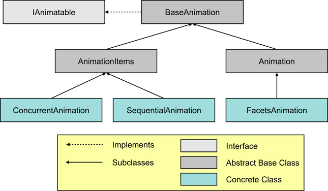

.. _animation_objects:

Animation Objects
=================

The core set of animation classes which actually perform animation of facet
values are organized as shown below:

Each of these classes is defined in the *facets.animation* package:

==================== ===================================================================================
Class                Module
==================== ===================================================================================
IAnimatable          :doc:`facet.animation.i_animatable <src/i_animatable>`
BaseAnimation        :doc:`facets.animation.base_animation <src/base_animation>`
Animation            :doc:`facets.animation.animation <src/animation>`
FacetAnimation       :doc:`facets.animation.facet_animation <src/facet_animation>`
AnimationItems       :doc:`facets.animation.animation_items <src/animation_items>`
ConcurrentAnimation  :doc:`facets.animation.concurrent_animation <src/concurrent_animation>`
SequentialAnimation  :doc:`facets.animation.sequential_animation <src/sequential_animation>`
==================== ===================================================================================

IAnimatable
-----------

The **IAnimatable** class defines an *interface* that all animation classes
must implement. It consists of the following facet definitions:

start: Event( Bool )
  The event to fire when the animation should start.

stop: Event( Bool )
  The event to fire when the animation should stop.

stopped: Event( Bool )
  The event fired when the animation completes or is stopped.

running: Bool
  **True** if the animation is running and **False** if it is not.

repeat: Range( 0, None, 1 )
  The number of times the animation should repeat (0 = repeat indefinitely).

reverse: Bool
  **True** if alternating repetitions of the animation should be reversed and
  **False** if they should start over from the *begin* value.

BaseAnimation
-------------

**BaseAnimation** provides an implementation of the **IAnimatable** interface
and serves as the base class for all other animation classes. It also adds the
following two convenience methods:

run()
  Starts the animation running. Returns the object as the result. Calling this
  method is the same as setting the *start* facet to **True**.

halt()
  Stops the animation if it is running. Returns the object as the result.
  Calling this method is the same as setting the *stop* facet to **True**.

Animation
---------

The **Animation** class derives from **BaseAnimation** and provides an abstract
base class for animating some kind of **HasFacets** object. Beyond the core
facets implemented by **BaseAnimation**, it defines the following additional
facets:

time: Range( 0.0, None, 1.0 )
  The time, in seconds, that one cycle of the animation lasts.

path: APath
  The *path* to follow during the animation. Note that this can be either a
  single path object or an iterable that returns a series of path objects.

tweener: ATweener
  The *tweener* to use during the animation. Note that this can be either a
  single tweener object or an iterable that returns a series of tweener objects.

The **Animation** class also provides stub definitions for the following two
facets which each concrete subclass should provide overriding implementations
for:

begin: Any
  The begin value for the animation.

end: Any
  The end value for the animation.

Both the *begin* and *end* facets must have the same number of elements, which
can either be a single value or an iterable.

FacetAnimation
---------------

The **FacetAnimation** class is a concrete subclass of **Animation** that
allows any object facet to be animated and is the type of animation object
created when using the *animate_facet* method of the **HasFacets** base class.
It adds the following two facets:

object: Instance( HasFacets )
  The **HasFacets** object whose facet is being animated.

name: Str
  The name of the object facet being animated.

AnimationItems
--------------

**AnimationItems** is an abstract base class that extends **BaseAnimation** and
is used to help define concrete subclassess, like **ConcurrentAnimation** and
**SequentialAnimation**, that manage collections of animatable items. It defines
a single new facet:

items: List( IAnimatable )
  The collection of animatable items being managed.

ConcurrentAnimation
-------------------

**ConcurrentAnimation** is a concrete subclass of **AnimationItems** that
manages a collection of animation objects that all run concurrently. Its *items*
facet defines the set of animation objects it manages.

When a **ConcurrentAnimation** object is started, all animations it manages are
started. When the object is stopped, all its managed animations are also
stopped. If left to run to completion, a **ConcurrentAnimation** object does not
stop until all its managed component animations have all stopped.

The following code shows an example using **ConcurrentAnimation**::

    class ComponentColor ( HasFacets ):
        red   = Range( 0, 255 )
        green = Range( 0, 255 )
        blue  = Range( 0, 255 )
        color = Property

        @property_depends_on( 'red, green, blue' )
        def _get_color ( self ):
            return ((65536 * red) + (256 * green) + blue)

    color = ComponentColor()
    ca    = ConcurrentAnimation( items = [
        color.animate_facet( 'red',   5.0, 255, start = False ),
        color.animate_facet( 'green', 6.0, 255, start = False ),
        color.animate_facet( 'blue',  7.0, 255, start = False )
    ] )
    ca.run()

In the example we create a **ConcurrentAnimation** object called *ca* to manage
three separate animations for the *red*, *green* and *blue* facets of a
**ComponentColor** object. We then start all three animations running by calling
the *run* method on the *ca* object.

Note the use of the *start = False* argument to the *animate_facet* method. We
do not want the **FacetAnimation** object it creates to be started immediately
or managed by the *animate_facet* method. Instead we want the
**ConcurrentAnimation** object we are creating to handle all of the animation
management tasks for us.

If later some event happens that requires us to stop all of the animations
early, we can do this as follows::

    ca.halt()

If we want to know when all of the animations are complete, we could add the
following code::

    ...
    def animation_done ( ):
        print 'The animation is complete!'

    ca.on_facet_change( animation_done, 'stopped' )

Note that the *animation_done* function is called either when all of the
animations end normally or are stopped early by calling *ca.halt()*.

SequentialAnimation
-------------------

**SequentialAnimation** is a concrete subclass of **AnimationItems** that
manages a collection of animation objects that run sequentially, one after the
other. Its *items* facet defines the set of animation objects it manages.

When a **SequentialAnimation** object is started, the first animation in its
*items* list is started. When that animation completes, the next animation in
the list is started, and so on, until all animations in the list have run to
completion. If a **SequentialAnimation** object is stopped, then whatever
animation item in its *items* list is currently running is stopped. If left to
run to completion, a **SequentialAnimation** object does not stop until the last
of the animations in its *items* list has been run and stopped.

Note that if all you want to do is animate a sequence of changes on a single
object facet, you can just use several calls to the *animate_facet* method
instead, since the *animate_facet* method automatically runs a series of
animation requests on the same facet in sequential order. You only need to
create a **SequentialAnimation** object in cases where the animations to be run
sequentially are on different objects or different facets of the same object.

The following code shows an example using **SequentialAnimation** for the same
**ComponentColor** class from our previous **ConcurrentAnimation** example::

    ...
    color = ComponentColor()
    ca    = SequentialAnimation( items = [
        color.animate_facet( 'red',   5.0, 255, start = False ),
        color.animate_facet( 'green', 6.0, 255, start = False ),
        color.animate_facet( 'blue',  7.0, 255, start = False )
    ] )
    ca.run()

The difference here is that now the *green* facet animation will not run until
the *red* facet animation completes, and the *blue* facet animation will not run
until the *green* facet animation completes. Other than that difference, all of
the comments we made before about stopping the animation early or being notified
when it completes are exactly the same.

It should probably go without saying that **ConcurrentAnimation** and
**SequentialAnimation** objects can also be composed together. Thus you can
write code such as::

    sa = SequentialAnimation( items = [
        ConcurrentAnimation( items = [ ... ] ),
        ConcurrentAnimation( items = [ ... ] ),
        ...
    ] )
    sa.run()

to create a series of animations that run sequentially, and where each item in
the series is actually a group of animations that all run concurrently. In this
case, none of the items in the second concurrent animation run until all of the
items in the first concurrent animation have completed, and so on.

