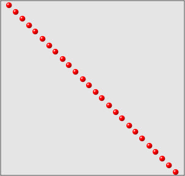
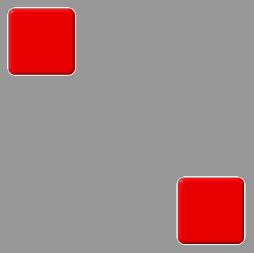
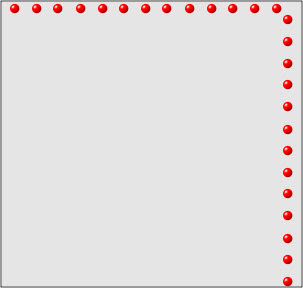
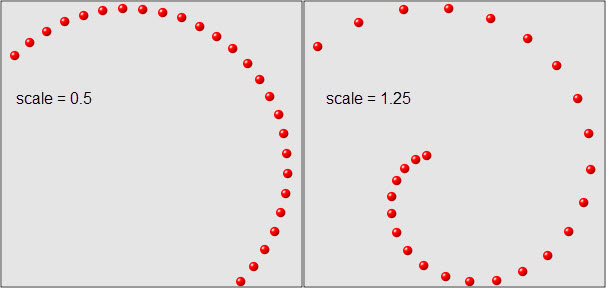
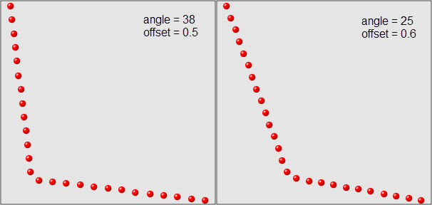
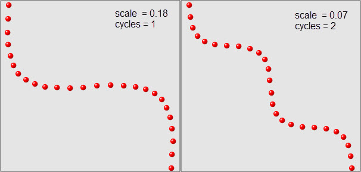
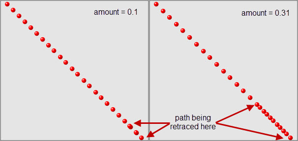

.. _animation_path_objects:

Path Objects
============

As previously described, a *path* object defines or computes all of the
intermediate values of an animation between its begin and end values. The
Facets animation system includes the following predefined path classes and
objects:

======================== =============================================
Class or object          Module
======================== =============================================
Path                     :doc:`facets.animation.path <src/path>`
LinearPath               :doc:`facets.animation.path <src/path>`
Linear                   :doc:`facets.animation.path <src/path>`
LinearIntPath            :doc:`facets.animation.linear_int_path <src/linear_int_path>`
LinearInt                :doc:`facets.animation.linear_int_path <src/linear_int_path>`
Linear2DIntPath          :doc:`facets.animation.linear_2d_int_path <src/linear_2d_int_path>`
Linear2DInt              :doc:`facets.animation.linear_2d_int_path <src/linear_2d_int_path>`
Manhattan2DIntPath       :doc:`facets.animation.manhattan_2d_int_path <src/manhattan_2d_int_path>`
Spiral2DIntPath          :doc:`facets.animation.spiral_2d_int_path <src/spiral_2d_int_path>`
Ricochet2DIntPath        :doc:`facets.animation.ricochet_2d_int_path <src/ricochet_2d_int_path>`
Snake2DIntPath           :doc:`facets.animation.snake_2d_int_path <src/snake_2d_int_path>`
Overshoot2DIntPath       :doc:`facets.animation.overshoot_2d_int_path <src/overshoot_2d_int_path>`
BoundsPath               :doc:`facets.animation.bounds_path <src/bounds_path>`
TextPath                 :doc:`facets.animation.text_path <src/text_path>`
Text                     :doc:`facets.animation.text_path <src/text_path>`
======================== =============================================

Path
----

**Path** is the base class from which all other path types derive. It is a
concrete class that implements a simple linearly interpolated path between a
start floating point value and an end floating point value. To emphasize this,
**LinearPath** is provided as a synonym for **Path**. The same module also
defines a **Linear** attribute which is a predefined and reusable instance of
**LinearPath**.

The only facet defined by **Path** is:

modified: Event
  The event fired when one of the parameters defining the path is modified. This
  facet is not used by the **Path** base class, since it has no parameters, but
  is provided for use by subclasses.

The only public method defined by the class is:

at( v0, v1, t )
  Returns the value along the path at time *t* for a path whose start value is
  *v0*, and whose end value is *v1*.

The *at* method is the function that computes all of the intermediate values
that form the path and so should always be overridden in any subclass. As with
*tweener* classes, the value for the time *t* is always in the range from 0.0 to
1.0, with 0.0 representing the start of the animation, and 1.0 representing the
end. The time range is indpendent of the actual length of time of any animation
using the path because the animation system handles any necessary conversion
between the normalized *[ 0.0, 1.0 ]* time range and the animation time.

The type of value passed for *v0* and *v1* and returned by the *at* method vary
from one path class to the next, depending upon the type of data the path is
intended to work with. The only requirement is that *v0*, *v1* and the result
all be of the same type. In the case of the base **Path** class, all of the
values are expected to be floating point values.

LinearIntPath
-------------

**LinearIntPath** is similar to the base **Path** class but performs linear
interpolation on integer, not floating point, values. The main difference is
that **LinearIntPath** uses rounding instead of truncation in its calculations.
The same module also defines a **LinearInt** attribute which contains a
predefined and reusable instance of **LinearIntPath** for your convenience.

Linear2DIntPath
---------------

The **Linear2DIntPath** class performs linear interpolation on tuples with two
integer values, which are commonly used to represent the position or size of 2D
objects on a display. The same module also defines a **Linear2DInt** attribute
containing a predefined and reusable instance of **Linear2DIntPath**.

For this class, and all of the 2D related path classes that follow, we
illustrate the type of path each class creates using a plot showing various
points along the computed path. For a **Linear2DIntPath** object, the plot is:

The plots are all screen shots captured from the *Animation Lab* demo in the
*Graphics and Animation* section of the Facets UI demo using the setup shown
below:

We also encourage you to try the demo to become more familiar with how paths
work. Using the demo you can try all of the 2D related path classes as well as
create your own custom 2D paths.

Manhattan2DIntPath
------------------

The **Manhattan2DIntPath** is another 2D integer tuple path. It computes its
path like a car traveling the streets of Manhattan. That is, it first travels
horizontally from its start point until it is vertically above or below its end
point, and then travels vertically to reach its final destination, as
illustrated in the following plot:

Spiral2DIntPath
---------------

A **Spiral2DIntPath** is a 2D integer tuple path that follows a *spiral* path
between its start and end points. The shape of the spiral path is controlled by
a single facet:

scale: Range( 0.0, 1.25, 0.5 )
  The scaling factor used to calculate the center point of the spiral path.

A sample of the type of paths it can generate are shown in the following
figure, which shows plots for two different values of *scale*:

Ricochet2DIntPath
-----------------

A **Ricochet2DIntPath** is another 2D integer tuple path. In this case it is one
that attempts to simulate an object *ricocheting* off of an imaginary obstacle.
The two facets that control its behavior are:

angle: Range( 0, 45, 38 )
  The angle (in degrees) of the ricochet, with 0 meaning no ricochet.

offset: Range( 0.2, 0.8, 0.5 )
  The fraction of the distance along the path the ricochet point is at right
  angles to.

Some sample plots showing the paths it can generate are shown below:

Snake2DIntPath
--------------

A **Snake2DIntPath** path is a 2D integer tuple path that tries to mimic sinuous
(actually sinusoidal) movement between its start and end points. The following
two facets control its behavior:

scale: Range( 0.0, 1.0, 0.18 )
  The scaling factor used to scale the snake path width (i.e. amplitude).

cycles: Range( 1, 5, 1 )
  The number of cycles to create in moving from the start to end points.

Some sample plots using different facet values are shown below:

Overshoot2DIntPath
------------------

The **Overshoot2DIntPath** path is a 2D integer tuple path that tries to
simulate a moving object that overshoots its target and has to travel back along
its original path to reach its final destination. It has a single control facet:

amount: Range( 0.0, 1.0, 0.10 )
  The amount of *overshoot* as a fraction of the distance between the start and
  end point.

The following shows some sample plots created using different values for
*amount*:

BoundsPath
----------

The **BoundsPath** class is a path that performs linear interpolation on a tuple
of four integers, often used to represent the *(x,y,dx,dy)* bounds (i.e.
position and size) of a **Control** object.

TextPath
--------

A **TextPath** class performs a simple string transform from its start string
value to its end string value. The transform is performed by first deleting all
of the characters in the start string, working from last to first, and once the
start string has been deleted, adds the characters in the end string from first
to last. The net effect is intended to simulate a user at a keyboard deleting
their current text and then typing something new.

