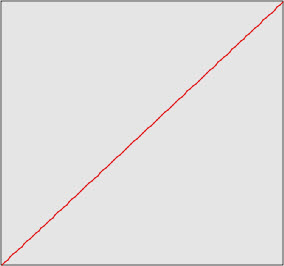
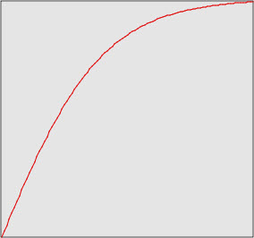
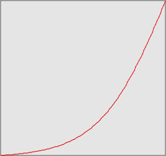
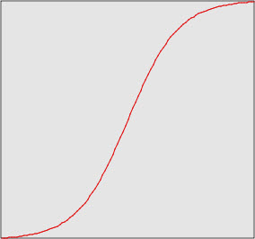
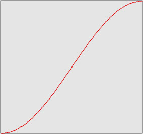
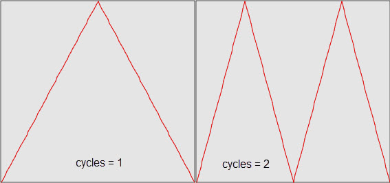
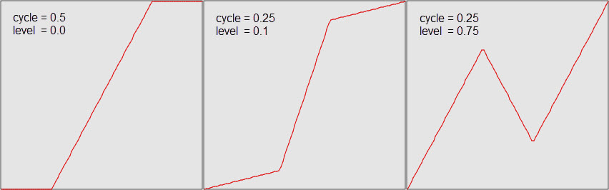
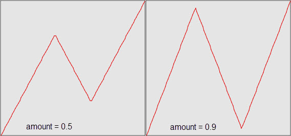
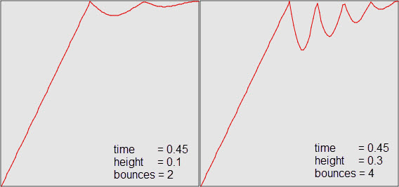

.. _animation_tweener_objects:

Tweener Objects
===============

As previously described, a *tweener* object manipulates the flow of time during
an animation. The Facets animation system includes the following predefined set
of tweener classes and objects:

===================== =========================================
Class or object       Module
===================== =========================================
Tweener               :doc:`facet.animation.tweener <src/tweener>`
LinearTweener         :doc:`facet.animation.tweener <src/tweener>`
NoEasing              :doc:`facet.animation.tweener <src/tweener>`
EaseInTweener         :doc:`facets.animation.ease_in_tweener <src/ease_in_tweener>`
EaseIn                :doc:`facets.animation.ease_in_tweener <src/ease_in_tweener>`
EaseOutTweener        :doc:`facets.animation.ease_out_tweener <src/ease_out_tweener>`
EaseOut               :doc:`facets.animation.ease_out_tweener <src/ease_out_tweener>`
EaseOutEaseInTweener  :doc:`facets.animation.ease_out_ease_in_tweener <src/ease_out_ease_in_tweener>`
EaseOutEaseIn         :doc:`facets.animation.ease_out_ease_in_tweener <src/ease_out_ease_in_tweener>`
EasyTweener           :doc:`facets.animation.easy_tweener <src/easy_tweener>`
CycleTweener          :doc:`facets.animation.cycle_tweener <src/cycle_tweener>`
RampTweener           :doc:`facets.animation.ramp_tweener <src/ramp_tweener>`
RetrogradeTweener     :doc:`facets.animation.retrograde_tweener <src/retrograde_tweener>`
BounceTweener         :doc:`facets.animation.bounce_tweener <src/bounce_tweener>`
===================== =========================================

Tweener
-------

The **Tweener** class defines the base class from which all other tweener
classes derive. The **Tweener** class is a concrete class that implements a
basic *linear* tween, which performs no time manipulation at all. To emphasize
this, **LinearTweener** is provided as a synonym you can use instead of
**Tweener**. The same module also defines a **NoEasing** attribute, which is
simply a predefined and reusable **Tweener** instance.

The **Tweener** class defines the following two facets:

compose: Callable( identity )
  The tweener this one is composed with. Since tweener objects are basically
  functions of the form: t' = tweener(t), which map a time *t* to a new time
  *t'* in the same range, tweener objects can be composed to create new
  composite tweeners: t' = tweener_1(tweener_2(...tweener_n(t)...)). You can use
  the *compose* facet to perform such tweener composition without actually
  having to write it out in its functional form. This allows you to create a
  tweener composition without having to create a new subclass of tweener that
  explicitly implements the composition. The default value for *compose* is the
  identity function where *t'* == *t*.

modified: Event
  The event fired when one of the parameters defining the tweener is modified.
  This is not used by the **Tweener** class, since it has no pamaters, but is
  provided for use by subclasses.

The **Tweener** class also implements the single public method:

at( t )
  Returns the tween mapped time t' for time t, where t is between 0.0 and 1.0.
  The result must be in the range from 0.0 to 1.0. This method must be
  overridden by any subclass to implement a new tweening function. The
  implementation for the **Tweener** class simply returns *t* unchanged.

The *at* method defines the tweening function described above. Note that it is
always a mapping of a time value between 0.0 and 1.0 to another time value
between 0.0 and 1.0, where 0.0 corresponds to the start time of the animation
and 1.0 corresponds to the end time of the animation. This is true no matter how
long the animation runs. The animation system handles the conversion of time
from the normalized *[0.0, 1.0]* time range to actual animation time, thus
simplifying the task of creating new tweening functions.

Basically, creating a new tweener class boils down to implementing a new *at*
method that implements the desired tweening function. As a result, tweener
subclasses typically do not implement any new public methods, and only define
new facets used as parameters in computing the function defined by the *at*
method.

As mentioned previously, a tweener manipulates the flow of time in an animation.
The default *at* method defined by the **Tweener** class simply returns the
input time unchanged::

    def at ( self, t ):
        return t

If you want to implement a simple tweener that makes time run backwards (like
playing a movie in reverse) you could do so using the following *at* method
definition::

    def at ( self, t ):
        return (1.0 - t)

In essence, such a tweener would make any animation it was applied to run from
its end value to its start value without otherwise affecting the flow of time
(i.e. without adding any slow motion or fast forward effects).

To help illustrate what effect a tweener has on an animation, we provide a plot
of the tweener function over the time range from 0.0 to 1.0 as shown in the
following figure for the base **Tweener** class:

All of these plots are taken directly from the *Animation Lab* demo in the
*Graphics and Animation* section of the Facets UI demo. We highly recommend
trying the demo for yourself to become more familiar with the effect that each
tweener type has on an animation. You can even compose tweeners and create and
try your own tweening classes directly within the demo.

EaseInTweener
-------------

The **EaseInTweener** class defines a classic animation *ease-in* effect, where
an animation starts out relatively fast and then slows down as it nears the end
of the animation, as illustrated in the following plot:

The same module also defines an **EaseIn** attribute containing a predefined and
reusable instance of **EaseInTweener**.

EaseOutTweener
--------------

The **EaseOutTweener** class defines a classic animation *ease-out* effect,
where an animation starts out relatively slow and then speeds up as it nears the
end of the animation, as illustrated in the following plot:

The same module also defines an **EaseOut** attribute containing a predefined
and reusable instance of **EaseOutTweener**.

EaseOutEaseInTweener
--------------------

The **EaseOutEaseInTweener** class defines a classic animation
*ease-out/ease-in* effect, where an animation starts out relatively slow, speeds
up, and then slows down again as it nears the end of the animation, as
illustrated in the following plot:

The same module also defines an **EaseOutEaseIn** attribute containing a
predefined and reusable instance of **EaseOutEaseInTweener**.

EasyTweener
-----------

The **EasyTweener** is a variation on the **EaseOutEaseIn** tweener that uses
a different easing function, as illustrated in the following plot:

CycleTweener
------------

The **CycleTweener** basically makes an animation play forward linearly, then
backward linearly, the number of times specified by its *cycles* facet. This is
illustrated in the following plot which shows the tweener function for *cycles*
values of 1 and 2:

RampTweener
-----------

The **RampTweener** divides the animation cycle into three phases defined using
the following two facets:

cycle: Range( 0.0, 1.0, 0.5 )
  The fraction of the time cycle spent in the *ramp*.

level: Range( 0.0, 1.0, 0.0 )
  The maximum level reached before starting the *ramp*.

The middle (or *ramp*) phase lasts for a time specified by *cycle*. The
beginning and ending phases last for an amount of time specified by *(1.0 -
cycle)/2.0*. The first phase starts with an output value of 0.0 and moves
linearly to the output value specified by *level*. The ending phase does the
converse, starting with an output value of *1.0 - level* and moving linearly to
1.0 at time 1.0. The middle phase also moves linearly, starting with an output
value of *level* and moving to *1.0 - level*.

This is more easily understood looking at the following plot, which shows the
function for several different values of *cycle* and *level*:

RetrogradeTweener
-----------------

The **Retrograde** tweener does a simple linear animation from its start value
to its end value, but reverses the flow of time for a while during the middle
part of the animation. The only control facet provided is:

amount: Range( 0.0, 1.0, 0.5 )
  The amount of retrograde movement.

The following plots illustrate the type of effect that results for different
values of *amount*:

BounceTweener
-------------

The **BounceTweener** attempts to provide a *bouncing ball* type effect by
appearing to bounce one or more times upon reaching its end value. The bounce
is controlled by the following three facets:

time: Range( 0.1, 1.0, 0.45 )
  The time at which the first bounce begins.

height: Range( 0.0, 1.0, 0.1 )
  The maximum height of the bounce.

bounces: Range( 1, 5, 2 )
  The number of bounces.

The effect is illustrated in the following plots, which show the results for
different facet settings:

