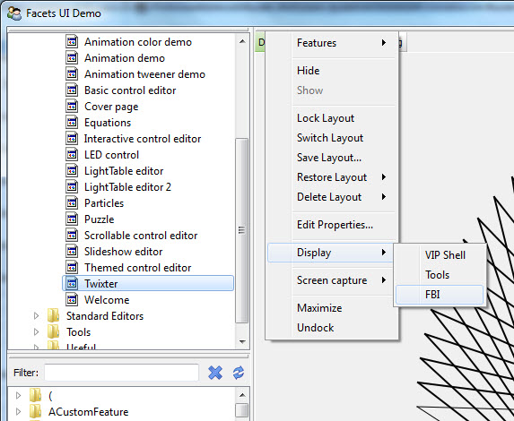
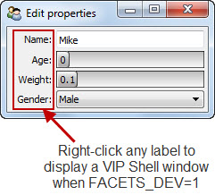
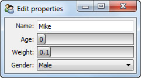
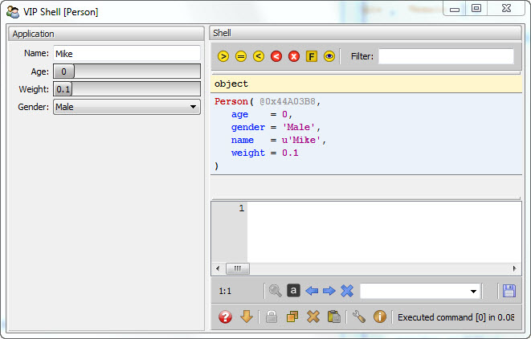
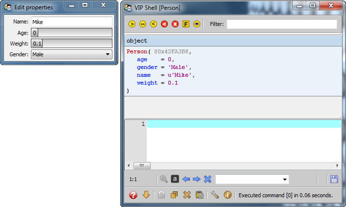
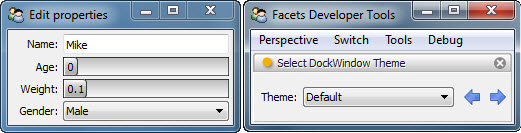

Facets Environment Variables
============================

Facets defines a number of environment variables that control various aspects of
the Facets run-time environment. The next few sections cover the name, value and
usage of each of these variables.

FACETS_BP
---------

Defines the name of the file containing the persistent breakpoints set using the
Facets *FBI* debugger. If not defined, it defaults to a file called *fbi.bp*
located in the Facets configuration directory.

Setting this variable is useful if you are debugging multiple Facets
applications and do or do not want them to share the same set of saved
breakpoints.

FACETS_CONFIG
-------------

Defines the directory where Facets configuration information, such as the Facets
UI database and default persistent breakpoint file, is located. If not defined,
Facets uses the following platform specific directory location:

**Windows**
    *APPDATA*\\Facets (e.g. *C:\\Users\\dmorrill\\AppData\\Roaming\\Facets*)

**Other (OS X, Linux, etc.)**
    *HOME*/.facets (e.g. */home/dmorrill/.facets*)

You only need to set this environment variable if you want to keep your
application's Facets configuration data separate from other Facets-based
applications on your system.

If you do specify a directory, and it does not exist, Facets automatically
creates it when needed. If it exists, but is a file rather than a directory,
Facets displays an error message.

FACETS_DEBUG
------------

Defines the integer valued debug level for application execution. If not
defined, the debug level is 0, meaning no debug information is logged. To
log debug information, a non-zero value must be set.

The debug level affects the *log*, *log_if*, *called_from*, *created_from*,
*object_info*, *wdump* and *wdump_if* functions defined by the
*facets.extra.debug* module.

The *log_if* and *wdump_if* functions define a *mask* argument which, when
logically ANDed with the debug level, must be non- zero for the debug
information to be logged, allowing you to conditionally control what information
is logged based on the value of FACETS_DEBUG.

FACETS_DEV
----------

Defines a boolean (i.e. 0 or 1) valued flag specifying whether or not developer
features are enabled. If not defined, it defaults to 0 (False), indicating
developer features are not enabled.

If developer features are enabled, right clicking any DockWindow tab or
splitter bar to display its context menu will include a *Display* sub-menu with
options to:

- Display a VIP Shell window.
- Display a Facets tools window.
- Display an FBI (Frame Based Inspector) debugger window.

Each of these windows can display additional information about the running state
of your application.

In addition, you can also right-click any label in a Facets user interface to
display the same VIP Shell window available through the DockWindow context menu:

FACETS_FBI
----------

Defines an integer value specifying if, or how, the Facets *FBI* (Frame Based
Inspector) debugger should be invoked when an application is started. The
possible values are:

**0**
    The FBI debugger should not be invoked when the application starts.

**>0**
    The FBI debugger is started with the application in a suspended state just
    prior to displaying its initial user interface.

**<0**
    The FBI debugger window is created and displayed, but not enabled. The
    application user interface is created and displayed normally. You can then
    use the FBI debugger window to set breakpoints in your already running
    application.

If not defined, FACETS_FBI defaults to *0*, so your application starts normally
with no FBI debugger window created.

Note that you can also insert explicit breakpoints into you code using the *bp*
function defined in the *facets.extra.helper.fbi* module. In this case, the
value of the FACETS_FBI variable determines whether or not the FBI debugger is
invoked when a breakpoint is encountered.

If FACETS_FBI is *0*, any breakpoint encountered is ignored; otherwise the
breakpoint suspends execution of the current function and invokes the debugger.
This allows you to leave breakpoints in your program code without always
invoking the FBI debugger simply by leaving the FACETS_FBI environment variable
undefined or set to *0*. Setting FACETS_FBI to any non- zero value allows
breakpoints to interrupt program execution.

FACETS_IMAGES
-------------

Defines a list of directory paths appended to the default list of paths used  by
the Facets *ImageLibrary*. If multiple paths are specified, they must be
separated by the standard platform path separator (i.e. ';' on Windows and ':'
on Linux and OS X).

The *ImageLibrary* is a resource manager that helps locate image assets at run-
time. Images can be stored in directories or .zip files and their directories
added to the ImageLibrary search path to simplify application image retrieval
and loading.

FACETS_INIT
-----------

Defines how a Facets application's initial user interface is created. The
possible values are:

**app**
    Runs the application normally.

**shell**
    Create's the application's user interface embedded as a tab in a window
    along with a second tab containing a VIPShell whose namespace is initially
    populated with all of the values contained in the application object view's
    *context* dictionary. You can use the VIPShell's Python environment to
    interactively explore the state of your application while it runs.

    This is similar to *shell_app*, but can reduce screen clutter in cases where
    your application has a very simple user interface.

**shell_app**
     Creates the application's user interface and a separate VIPShell window
     whose namespace is initially populated with all of the values contained in
     the application object view's *context* dictionary. You can use the
     VIPShell's Python environment to interactively explore the state of your
     application while it runs.

**tools**
     Creates the application's user interface view and a separate *tools* window
     whose *object* facet is set to the application object. You can configure
     the tools window with your favorite Facets tools and use it to display
     information about your application.

If FACETS_INIT is not defined, it defaults to *app*, which runs your application
normally. If the value is not in the above list, an error message is displayed
and no application user interface is displayed.

FACETS_THEME
------------

Defines the name of the DockWindow's theme used for all DockWindows created
without specifying an explicit theme. DockWindows manage the tabs and splitter
bars used within an application, so setting a theme affects the appearance of
those user interface elements within your application.

If FACETS_THEME is not defined, *default* is used, which is the name of the
default DockWindows theme. If an unrecognized theme name is specified, an error
message is diplayed, along with a list of all valid DockWindow theme names. If
you are not familiar with the available themes, you can also start your
application with the FACETS_INIT environment variable set to *tools*, then
create an instance of the *Select DockWindow Theme* tool and use it to explore
how the various available themes look with your application.

FACETS_UI
---------

Defines the GUI toolkit Facets uses to create all user interface views. The
possible values are:

**qt**
    Use the PyQt4/Qt toolkit.

**side**
    Use the PySide/Qt toolkit.

**wx**
    Use the wxPython/wxWindows toolit.

**null**
    Use the *null* toolkit (no user interfaces are created).

If the environment variable is not defined, Facets automatically searches for
the PyQt4, PySide, wxPython or null toolkit, in that order, and uses the first
one found. Since the null toolkit is included with the Facets package, the
search always succeeds.

You normally only need to set FACETS_UI if more than one GUI toolkit is, or
might be, installed and you want to explicitly specify which toolkit to use.
