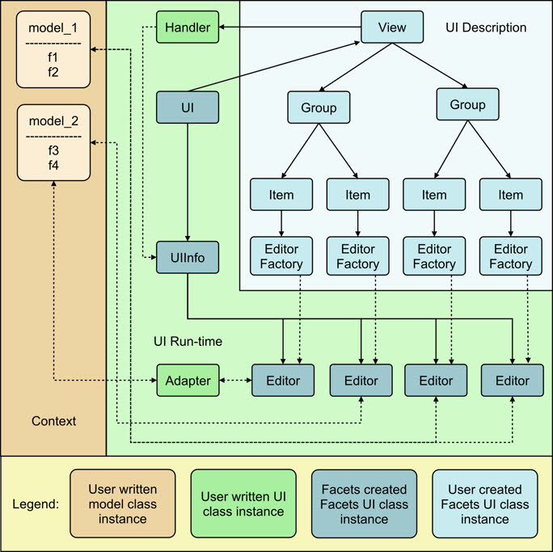
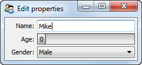
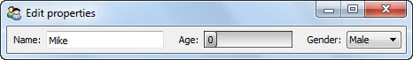
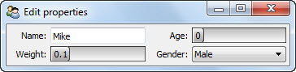
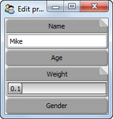
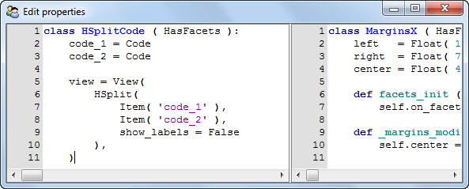
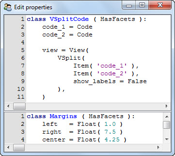
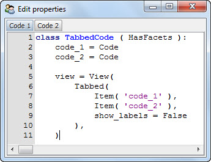
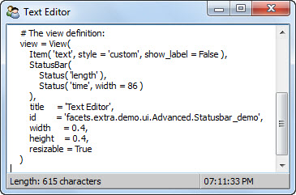
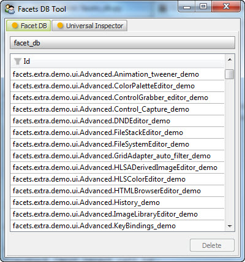

Facets UI
=========

Facets UI (User Interface) is the part of the Facets framework that allows you
to convert your Facets models into interactive, graphical user interfaces (often
called GUI's). Taken together, the many varied components of Facets UI form the
*visualize* part of the Facets *tao*.

UI Elements
-----------

Let's start our exploration of the Facets UI by taking a quick tour of its major
functional elements:

**View**
    View objects contain or reference all of the other Facets UI elements, and
    are the top-level, or root, element of every Facets user interface. You can
    think of them as defining the windows and dialogs of the user interfaces you
    create.

**Group**
    Views contain Groups, which act as containers for other Groups and Items
    (described next). The main purpose of Groups is visual layout and
    organization.

**Item**
    Each Item describes an association between one of your model facets and an
    editor that displays or modifies the facet.

**EditorFactory**
    EditorFactory objects are referenced by Item objects and define all of the
    options needed to instantiate the Editor object which performs the actual
    facet editing.

**Editor**
    An Editor creates and manages the user interface controls used to display or
    manipulate the value of a facet.

**Handler**
    A Handler object controls and mediates the interaction between the various
    parts of a user interface (i.e. View).

**UIInfo**
    A UIInfo object contains information about the Editor objects instantiated
    when a Facets user interface is created. It is typically passed as input to
    a Handler object to allow it to monitor and control the behavior of the UI.

**UI**
    A UI object contains all of the information about a Facets user interface
    that is being displayed. You can think of a View and its related objects
    (Groups, Items, EditorFactories, etc.) as being a blueprint or description
    of a user interface, while a UI object is the result of creating a user interface from that blueprint.

**adapter**
    Adapters help bridge the gap between the data contained in a model and the
    kind of data that a particular editor knows how to manipulate. They are more
    of a design pattern used thoughout the Facets UI as opposed to an abstract
    or concrete base class. Adapters are typically used in conjunction with
    Editor classes that perform more complex types of data editing and
    presentation.

    For example, the GridAdapter is an adapter that works with the GridEditor to
    allow you to map nearly any type of model data into a form that can be
    displayed and edited using a tabular grid.

.. note::

   There is a strong connection between EditorFactory and Editor classes. A
   particular EditorFactory class is used to create instances of a related set
   of Editor classes.

   As a result, the distinction between the two sometimes get blurred. For the
   most part, as a Facets developer you will be using EditorFactory classes. In
   some cases, when you are writing a custom Handler subclass, you may have
   occasion to deal directly with the Editor instances created by an
   EditorFactory instance.

   The blurring between the two types of classes is further aggravated by the
   fact that all standard Facets EditorFactory classes have names that end in
   *Editor* rather than *EditorFactory* (e.g. *TextEditor* and *GridEditor*).
   This is done intentionally, to simplify reading program code and because as a
   developer you never need to directly refer to an Editor class by name (unless
   you are defining a custom EditorFactory/Editor of your own).

   That is, Facets chooses to allow you to write::

       Item( 'name', editor = TextEditor() )

   rather than the more technically correct (but illegal)::

       Item( 'name', editor_factory = TextEditorFactory() )

   Please keep this distinction in mind while reading through this section.

UI Object Relationships
-----------------------

The relationship between the various Facets UI classes just described can be
shown graphically as follows:



As you can see, the figure is divided into three main sections:

**Context**
    The *context* is a dictionary of objects specifying a named set of models
    (i.e. objects) a particular View operates on.

**UI Description**
    A Facets *View* is really an object hierarchy describing what application
    models and facets to view or edit, what editors to use for viewing or
    editing those items, and how to arrange those editors visually.

**UI Run-time**
    When an application requests that a particular View be displayed, the Facets
    run-time converts the user interface described by the View into a
    corresponding collection of GUI widgets, managed by Editor instances, and UI
    and UIInfo control objects. These are used, in conjunction with additional
    user-defined Handler and adapter instances, to manage the user interface
    while it is active.

Creating User Interface Views
-----------------------------

Creating user interfaces in Facets is a matter of creating and displaying Views.
If you read the introductory section on *visualize*, then you've seen several
examples of this already. In this section we'll introduce you to the most common
techniques used.

Creating Views
^^^^^^^^^^^^^^

Let's start with how to define a View. For many Views, the simplest approach is
to define them statically as part of a class definition::

    class MyGame ( HasFacets ):
        player = Str
        score  = Int

        status = View( 'player', 'score' )

Here we've defined a class MyGame containing two facets, *player* and *score*,
as well as a View called *status* for displaying them. The *status* View becomes
part of the class definition and is available to client code through a number of
mechanisms we'll be exploring in the following sections.

A variation on the above approach is the define a method that returns the View::

    class MyGame ( HasFacets ):
        player = Str
        score  = Int

        def status ( self ):
            return View( 'player', 'score' )

From the point of view of Facets, these two techniques are nearly identical as
we shall see. The second technique is slightly longer than the first, but is
useful in cases where the View returned contains dynamic content which may not
be available until the View is displayed::

    class MyGame ( HasFacets ):
        player = Str
        score  = Int

        def status ( self ):
            return View( 'player', 'score', title = 'Player: ' + self.name )

In this example, we've included the name of the player in the View's title.
Since this is usually not known until the program is running, it make's since to
define the View using a method.

Another less commonly used design is to define the View at the point of use::

    class MyGame ( HasFacets ):
        player = Str
        score  = Int

    game = MyGame( player = 'Tom', score = 100 )
    game.edit_facets( view = View( 'player', 'score' ) )

The *edit_facets* method displays a View, which in this example we create and
pass as a argument to the method. In general this is a less flexible technique
since it does not allow the View to be reused in other contexts very easily.

Displaying Views
^^^^^^^^^^^^^^^^

Facets provides two methods for displaying Views: *edit_facets* and
*configure_facets*. Of these, *edit_facets* is by far the one most frequently
used, and is the one we'll describe in this section.

The *edit_facets* method accepts the following list of optional keyword
arguments:

**view**
    Specifies the View to display. This can either be the name of the view or
    an actual View instance. The default value is *None*, which means that the
    *default* view for the object should be displayed. We'll discuss default
    views in more detail shortly.

**parent**
    Specifies the parent control for the View. The default value is *None*,
    meaning that the View has no parent. If a View has no parent, it is a
    top-level window for the application; otherwise it is a *child* window of
    its parent control.

**kind**
    Specifies the *kind* of View to display. The possible values are:

    * live
    * panel
    * subpanel
    * modal
    * nonmodal
    * livemodal
    * popup
    * popout
    * popover
    * info
    * editor
    * wizard

    We'll be describing these different View kinds in the section on View
    objects. The default value is *None*, which means the value of the View's
    *kind* facet should be used. Specifying *kind* as an argument to
    *edit_facets* allows you to override the View's *kind* if necessary.

**context**
    Specifies the *context* dictionary for the View. Every View edits or
    displays the values of facets from a set of one or more named objects that
    form the View's *context*. The default value is *None*, which means the
    context is determined through other means we'll describe in a later section.

**handler**
    Specifies the *handler* object or class used to mediate the behavior of the
    View being displayed. In the MVC (Model, View, Controller) design pattern,
    the handler would be considered to be the *controller* for the View. The
    default value is *None*, which means the View's *handler* facet value should
    be used. Specifying *handler* as an argument allows you to override the
    default handler associated with the View.

**id**
    Specifies the user preference *id* to use when displaying the View. Each
    Facets View can automatically save and restore user preference information
    based on the id associated with the View. Refer to the
    :ref:`managing_user_preferences` section for more information. The default
    value is the empty string, which means the View's *id* facet should be used.
    Specifying the *id* as an argument allows you to override the key used for
    saving and restoring user preference data, which can be useful in cases
    where the same View might be used in multiple application contexts which are
    logically different to the user.

**scrollable**
    Specifies whether or not the View being displayed is scrollable. A value of
    True means the View should support a vertical scroll bar that allows the
    contents of the View to be scrolled. A False value indicates the View should
    be large enough to display the entire contents of the View without
    scrolling.

    The default value is *None*, which means that the View's *scrollable* facet
    should be used to determine whether a scroll bar should be added. Again,
    specifying *scrollable* as an argument allows you to override the View's
    value if necessary.

Default View
------------

Every Facet's object has a View associated with it called its *default* view.
This is the View displayed when no explicit view is specified with an
*edit_facets* or *configure_facets* method call. The rules used to define the
default view are as follows:

* If the object's class has a statically defined View called *facets_view*, then
  that is the default view.
* If the object's class only has a single statically defined View, then that is
  the default view, even if it is not called *facets_view*.
* If the object's class has more than one statically defined View, and none of
  them are called *facets_view*, then the default view is dynamically
  synthesized using all *editable* facets for the object. The View contains a
  single vertical Group containing all of the editable facets in alphabetical
  order and using the default Editor associated with each facet. Note that
  *editable* facets refers to the list of facet names returned by the object's
  *editable_facets* method, which you can override to return a list different
  than the default implementation if necessary.

It is very common to define a class with only a single statically defined View.
That View then becomes the *default* view for the class, no matter what its name
is. This fact is reflected in many examples in this guide, where you will see
code like::

    class DieRoll ( HasFacets ):
        die_1 = Int
        die_2 = Int

        view = View(
            Item( 'die_1', style = 'readonly' ),
            Item( 'die_2', style = 'readonly' )
        )

        def _die_1_default ( self ): return randint( 1, 6 )
        def _die_2_default ( self ): return randint( 1, 6 )

    DieRoll().edit_facets()

This code displays the View called *view* even though it is not explicity
referenced in the *edit_facets* call, since it is the default view for the
class.

Group
-----

There are a number of different Group subtypes that support
various layout styles and approaches:

**VGroup**
    Organizes its contents vertically. For example:



**HGroup**
    Organizes its contents horizontally. For example:



**VGrid**
    Organizes its contents using a grid-based layout. For example:



**HFlow**
    Organizes its contents horizontally with support for wrapping elements
    vertically when the horizontal space required exceeds the space
    available.

**VFlow**
    Organizes its contents vertically with support for wrapping elements
    horizontally when the vertical space required exceeds the space
    available.

**VFold**
    Organizes its contents vertically using a series of tabs that allow the user
    to open and close individual elements. For example:



**HSplit**
    Organizes its contents horizontally with user adjustable splitter bars
    provided to control the size of each element. For example:



**VSplit**
    Organizes its contents vertically with user adjustable splitter bars
    provided to control the size of each element. For example:



**Tabbed**
    Organizes its contents into a series of tabbed notebook pages. For example:



**StatusBar**
    Organizes its contents horizontally using a visual style typically
    associated with application status bars or tool bars. For example:



.. _managing_user_preferences:

Managing User Preferences
-------------------------

One hallmark of a well-designed and user-friendly application is its ability to
customise its behavior to fit each user. While this customisation can taken many
forms, we'll mention a few typical examples:

* Remembering each application window's or dialog's most recent size and
  position and restoring that size and position the next time the window or
  dialog is needed.
* Remembering and restoring the arrangement of tabbed views and splitter bars
  contained within a window across application sessions.
* Remembering and restoring the order and widths of columns displayed in a
  particular tabular grid from one use to the next.
* Remembering the most recently used paths or files selected in a particular
  application context.

One important feature of the Facets UI system is that it makes implementing
these types of user preference behaviors very simple. In the remainder of this
section we'll explain the details of how to enable and use the Facets user
preference system when creating user interfaces.

View id
^^^^^^^

As we've already learned, each Facets user interface is created from a View
object. And each View instance has a string-valued *id* facet used to identify
the View to the Facets user preference system. If the value of *id* is the
empty string, then no user preference information is saved or restored for the
View.

However, if *id* is non-empty, its value is used as a *key* for saving and
restoring all user preference information for the View in the user specific
Facets data base. Thus all you need to do to enable Facets user preference
management system is to make sure that your View instances have non-empty *id*
facet values.

In addition to enabling user preference management, you automatically also get
one of the user preference items we mentioned earlier, namely that of saving and
restoring an application window's or dialog's size and position from one use to
the next.

That is, if a View's id is non-empty, then each time the View is displayed,
Facets checks to see if it has size and position information for the View in its
data base, using the View's *id* facet as the data base key. If it does,the
saved preference information is used to size and position the View when
displayed to the user. If it does not, then the size and position information
specified by the View object itself is used instead.

Similarly, when a View is closed, Facets checks the View's *id* facet. If it is
non-empty, the size and position of the View's window or dialog is used to
update (or create) the user preference information saved in the Facets data base
under the View's *id* facet's value. If the View's *id* is empty, the data base
is not updated.

.. note::
   Facets never deletes user preference information from the data base. If you
   use a non-empty View id for a while, and later decide not to use it (i.e.
   make it the empty string), then any existing Facets data bases containing
   user preference data saved under the original View id will not be affected.
   The user preference information will simply sit there unused until it is
   explicitly deleted.

So, now that you've learned about saving user preference information by
setting a View's *id* facet to a non-empty value, what should you set the value
to? Good question!

Since all user preference information gets saved into each user's personal
Facets data base, we should try to avoid stepping on any other Facets
application's user preference data if at all possible. So using a View id of
```My View``` may not be a good choice.

The recommended convention for View id values is to use names of the form:
```package1.package2. ... .module.class``` to avoid accidental name collisions.
Of course, the string refers to the Python package, module and class where the
associated View is defined. For example::

    View(
        ...
        id = facets.extra.tools.image_knife.ImageKnife
    )

Since fully-qualified module and class names should normally be unique within
a user's Python path, following this convention should avoid most problems.

Of course, there are some additional cases to consider:

* Classes that define more than one View with user preference data.
* View's that are used in more than one context.

For the first case, appending the View's name to its id should be sufficient to
resolve the problem. For example::

    class MyApp ( HasFacets ):
        ...
        main_view = View(
            ...
            id = 'my_package.my_app.MyApp:main_view'
        )

        options_view = View(
            ...
            id = 'my_package.my_app.MyApp:options_view'
        )

The second case can arise when you create some kind of reusable component with
a View that might be used in different applications or contexts. In cases like
this, even though it is the exact same View, the user may want to have
different preference settings saved from one application or context to the next.

In this case, you should probably include some information in the View's *id*
that identifies the application context as well as your View. For example, you
might add an application settable *id* or *name* facet to your component the
application can use to identify itself. For example::

    class MyComponent ( HasFacets ):
        ...
        name = Str( 'default' )
        ...
        def default_facets_view ( self ):
            return View(
                ...
                id = 'my_package.my_component.MyComponent:' + self.name
            )

In this case we've qualified our unique View class name with our (hopefully)
unique application context *name* to create a composite id that allows it to be
used by multiple applications with both application and user specific preference
settings. Note also how we have dynamically created the View in order to set the
*id* facet using the application provided name information.

The conventions outlined above are also the ones used by Facets itself, as shown
by the following screen shot, which shows the FacetDB tool displaying some of
the user preference View id keys saved on the author's system:



Group id
^^^^^^^^

Views contain Groups used to organize the appearance of a user interface is
various ways, such as by using notebook tabs (Tabbed) or horizontal and vertical
splitter bars (HSplit and VSplit). Using groups like these give users the
ability to organize and adjust a window or dialog's content to their liking. In
such cases, users probably will also want to be able to persist their tab
organization and splitter bar settings from one session to the next.

You can accomodate this in your application simply by setting the *id* facet of
any Group (such as a Tabbed, HSPlit or VSplit instance) to a non-empty string,
just as you did for the View instance. For example::

    class MyApp ( HasFacets ):
        ...
        view = View(
            Tabbed(
                Item( ... ),
                Item( ... ),
                Item( ''' ),
                id = 'tabbed'
            ),
            ...
            id = 'my_package.my_app.MyApp'
        )

Setting the Group's *id* to a non-empty string saves and restores the tab and
splitter bar position information for the Group as part of the user preference
data for the containing View.

There are a few additional items worth noting:

* Unlike the View *id*, which should be unique for a given user, the Group *id*
  value only needs to be unique within its containing View. This was illustrated
  by the Group id value of *tabbed* used in our preceding example.

  The reason for this is simple. All of the user preference data for a given
  View is stored in the Facets data base under the key given by the View's *id*
  value. The user preference data stored in the data base is actually a
  dictionary of values whose keys are the Group and Item *id* values contained
  in the View. When the View is created or closed, Facets associates each part
  of the user preference data for the View with each Group or Item it contains
  using its corresponding *id* value. For this reason, the Group (and Item) *id*
  values only need to be unique with their View.

* Another important point is that it is only necessary to assign a non-empty
  Group id to the outermost Group in a nested series of Tabbed, HSplit and
  VSplit groups. The reason is that internally Facets collapses all nested
  Tabbed, HSplit and VSplit groups into a single control called a DockWindow.
  The DockWindow manages all items contained within the nested series of groups
  as a single entity. Consequently you only have provide a Group id for the
  outermost such group, which is where the corresponding DockWindow is defined.
  At run-time the DockWindow saves or restores all of the tab and splitter bar
  information it maintains for all of the nested groups as a single entity under
  the outermost Group's id.

  Note that this applies as long as the nested groups consist only of Tabbed,
  HSplit or VSplit instances. Introducing Groups of other types into the
  hierarchy breaks the chain. If this situation occurs, you will have to define
  another unique Group id for the outermost Tabbed, HSplit, or VSplit group in
  the *inner chain*.

  The next two examples illustrate these scenarios::

      view = View(
          Tabbed(
                HSplit(
                    VSplit(
                         Item( ... ),
                         Item( ... )
                    ),
                    VSplit(
                        Item( ... ),
                        Item( ... )
                    )
                ),
                VGroup(
                    Item( ... ),
                    Item( ... )
                ),
                id = 'tabbed'
          )
      )

  In this case, only the outer Tabbed group needs a non-empty *id* value, since
  the nested HSplit and VSplit groups form an unbroken chain. The VGroup
  instance does not break the chain because it does not contain any additional
  groups that start a new chain:

  ::

      view = View(
          HSplit(
              VGroup(
                  HSplit(
                      Item( ... ),
                      Item( ... ),
                      id = 'hsplit2'
                  ),
                  HSplit(
                      Item( ... ),
                      Item( ... ),
                      id = 'hsplit3'
                  )
              ),
              VGroup(
                  Item( ... )
                  Item( ... )
              ),
              id = 'hsplit1'
          )
      )

  In this example, the situation has changed. The two inner HSplit groups are
  separated from the outermost HSplit group by a VGroup, which is not a Tabbed,
  HSplit or VSplit group. Internally, Facets creates three independent
  DockWindow controls to manage the various UI elements and each requires a
  unique Group id to save its user preference layout information under.

* Setting a non-empty Group id on a non-Tabbed, HSplit or VSplit group has no
  effect since no other Group types currently have user preference data to save
  or restore.

Item id
^^^^^^^

You can also save and restore user preference data for any of the Item instances
in a View. Follow the same procedure as before: simply assign a non-empty value
to the Item's *id* facet. As with a Group *id*, the value only needs to be
unique within the View the Item is contained in.

The user preference data for an Item is actually associated with the Editor used
by the Item. Some Editors have user preference data that can be saved and
restored, and others do not. Assigning a non-empty id to an Item with an Editor
that does not have any user preference data has no effect.

The following is a list of standard Facets editors that support saving and
restoring user preference data:

**ColorPaletteEditor**
    Saves and restores the user's color palette changes.

**GridEditor**
    Saves and restores user adjusted column width information.

**HistoryEditor**
    Saves and restores the most recently selected items in the user's history
    list.

**InstanceEditor**
    Saves and restores the user preference data for the View associated with the
    most recently edited instance value.

**NotebookEditor**
    Saves and restores the DockWindow user preference data associated with the
    editor. A NotebookEditor uses a DockWindow in its implementation and allows
    the DockWindow's user preference data concerning tab organization and
    splitter bar positions to be saved and restored as the NotebookEditor's user
    preference data. This is the same kind of preference data supported by the
    Tabbed, HSplit and VSplit groups.

**VipShellEditor**
    Saves and restores all of the user preference data settable using the
    VIP Shell's options dialog.

**CodeEditor**
    Saves and restores any user modified key bindings.

**FileEditor**
    Saves and restores the user's file selection history.

User Preference Pitfalls and Advice
^^^^^^^^^^^^^^^^^^^^^^^^^^^^^^^^^^^

Here are a few final words of warning and advice on using the Facets user
preference management system:

* To save *any* user preference information at all for a particular View, you
  *must* set its id to a non-empty value. It won't matter how many Group or
  Item id values you set if you forget to set the View's id to a non-empty
  value.

* Remember to set the Group or Item id values for all user interface elements
  that have user interface data you want saved. Any Group or Item with an empty
  id will not have user preference data saved for it, even if its View and other
  sibling Groups and Items have non-empty ids.

* The above rule is very important to remember when using Items with
  associated InstanceEditors. Editing an Instance facet  often results in
  displaying a nested View of the instance object. That View may have a unique
  id used for saving its user preference data, but it will have no effect if the
  Item or containing View used to display the sub-view has no id. Forgetting
  to assign an Item id for an instance facet is a common mistake that trips up
  new and experienced Facets users alike.

* Just because you can easily save user preference data for each View in your
  application doesn't mean that you must save it. Users may want some Views to
  never save user preference data. Other Views may work better if only some
  of the available user preference data is saved. It's really a design decision
  you have to make. Facets just tries to make the process of saving the data is
  simple as possible once you've determined what needs to be saved.
