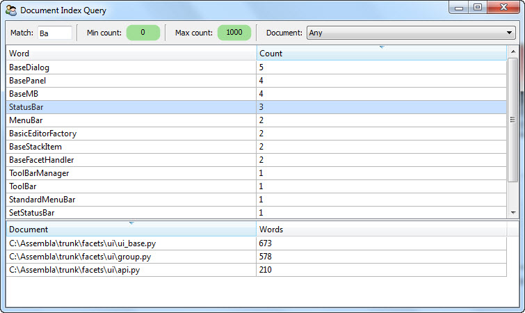

.. _mongodb_complete_example:

A Complete MongoDB OML Example
==============================

Hopefully the previous sections have whet your appetite for learning more about
using the MongoDB OML. So in this section we're going to attempt to appease your
hunger for knowledge with a working example of a complete MongoDB-based
application.

Of course, creating a relatively short but effective example can be a bit of a
challenge, but we're optimistic that you will find the example both illustrative
and motivating. Since the example comes before you have learned any of the
details of using the MongoDB OML, we suggest reading through the example code a
couple of times, starting with a quick run through now to get a feeling for what
the code looks like, and again later after having read through some of the
programming detail sections that follow.

The application is a simple document indexing system that indexes all of the
words and their frequency of occurence within a collection of documents. As an
added bonus, the system indexes both regular text documents and Python source
files. In the case of Python source files, only the non-language keyword symbols
are indexed. We threw in Python source file indexing because developers tend
to have more Python code lying around than they do copies of *War and Peace*.

The application is further divided into a command-line program for indexing
one or more documents and a Facets UI-based interactive application for
querying and browsing the contents of the document index.

The application is spread across three source files:

**document_classes.py**
    Defines the MongoDB OML classes used to define the document index data
    model.

**document_index.py**
    The command line document indexing tool.

**document_query.py**
    The interactive Facets UI based query tool.

One of the things that we hope you will see when studying the example
application code is how little *database programming* is involved. For the most
part, the code is nearly all related to indexing and UI presentation. Since
we assume that you are already familar with this type of code, we will only
provide additional commentary on the parts of the code specifically related to
using the MongoDB OML.

document_classes.py
-------------------

So with all that said, let's get started with the file that defines our
indexing application data model, **document_classes.py**::

    #-------------------------------------------------------------------------------
    #  Imports:
    #-------------------------------------------------------------------------------

    from facets.extra.mongodb.api \
        import MongoDBObject, DBStr, DBInt, DBSet

    #-------------------------------------------------------------------------------
    #  'IndexDocument' class:
    #-------------------------------------------------------------------------------

    class IndexDocument ( MongoDBObject ):
        """ Represents a document in the document index.
        """

        # The name of the document:
        document = DBStr

        # The total number of words contained in the document:
        words = DBInt

    #-------------------------------------------------------------------------------
    #  'IndexWord' class:
    #-------------------------------------------------------------------------------

    class IndexWord ( MongoDBObject ):
        """ Represents the index information for a specific word.
        """

        # The word:
        word = DBStr( index = True )

        # The number of times the word is used in all documents:
        count = DBInt

        # The set of documents the word occurs in:
        documents = DBSet

One of the first things you'll note in reading through the example's code is
that this is the only file that actually imports any symbols from the MongoDB
OML package (i.e. *facets.extra.mongodb.api*). The remaining two files simply
import the two classes defined in this file: **IndexDocument** and
**IndexWord**. This should be fairly typical of any MongoDB OML-based
application. That is, the data model, defined as normal Facets-based classes,
encapsulates all of the database specific information, and the remaining
application code simply deals (for the most part) with data model classes and
instances.

The first thing to note in the above code are the symbols imported from the
MongoDB OML package::

    from facets.extra.mongodb.api \
        import MongoDBObject, DBStr, DBInt, DBSet

**MongoDBObject** is the base class for any persistable object that can be
stored or retrieved from a MongoDB database. One important thing to note is that
MongoDBObject derives from the **HasFacets** base class, and therefore the full
power and capability of the Facets package is at your disposal when defining a
class that can be stored in a MongoDB database.

The remaining three symbols: **DBStr**, **DBInt** and **DBSet** are special
MongoDB oriented facets with semantics identical to the standard **Str**,
**Int** and **Set** facets. The *DB* prefix simply signifies that the values
assigned to the corresponding object facets should be saved in the MongoDB
database. We'll cover all of the available MongoDB facets in a later section.

Another important thing to note is that not all facets defined within a
MongoDBObject subclass need to have the *DB* prefix. That is, you are free to
use standard facets such as **Str** or **Int** as well. The only difference is
that the values of standard, non-MongoDB facets are not saved to a MongoDB
database when an object is stored. You can use this to your advantage to
segregate the facets in a class into persistent (i.e. *DBxxx*) and
non-persistent (i.e. transient) facets. In the case of our example, all of the
defined facets are persistent facets that are stored in the MongoDB database.

A quick read through the rest of the source file reveals that it defines two
classes, **IndexDocument** and **IndexWord**, both of which are subclasses of
**MongoDBObject**, and so instances of these classes can be stored in a MongoDB
database. In essence, these two classes define the *data model* we are using for
the document index. An **IndexDocument** instance keeps track of the total
number of words a specific document contains, while an **IndexWord** document
keeps track of the number of times a specific word occurs within a document
collection, and which documents within the collection contain at least one
occurence of the word.

A careful reader will also have noted the metadata used in the declaration of
the *word* facet of the IndexWord class::

    word = DBStr( index = True )

In this case, the *index = True* metadata indicates that the value of the *word*
facet should be used as a MongoDB database index. This is mainly an application
performance enhancement for use by the document indexing application, which
needs to randomly retrieve existing IndexWord values from the document index
database in the process of indexing a document. Refer to the
:ref:`mongodb_indexes` section for more information about defining MongoDB
indexes.

The main thing to learn from this code is that defining a MongoDB-backed data
model is really no different than defining any other Facets-based model. Instead
of deriving subclasses from HasFacets, you derive from MongoDBObject, and in
addition to defining normal facets, you also define persistent facets using any
of the *DBxxx* facets provided by the MongoDB OML package. So there is really
very little difference from the standard Facets programming model. In
particular, this can make migrating an existing application to use a MongoDB
database a fairly simple task.

document_index.py
-----------------

Next up is the source code for the command line document indexing tool defined
in **document_index.py**::

    #-------------------------------------------------------------------------------
    #  Imports:
    #-------------------------------------------------------------------------------

    import sys

    from time \
        import time

    from os.path \
        import abspath, splitext

    from glob \
        import iglob

    from cStringIO \
        import StringIO

    from tokenize \
        import generate_tokens, ENDMARKER, NAME

    from facets.api \
        import HasFacets, Any

    from facets.core.facet_base \
        import read_file

    from document_classes \
        import IndexDocument, IndexWord

    #-------------------------------------------------------------------------------
    #  Constants:
    #-------------------------------------------------------------------------------

    # The correct command usage message:
    Usage = """
    The correct usage is:
        python document_index.py document [ document, ..., document ]
    where:
        document = The name of a text or Python (.py) source file to be indexed.
    """[1:-1]

    # The set of valid characters that can appear in a word:
    Letters = 'abcdefghijklmnopqrstuvwxuyABCDEFGHIJKLMNOPQRSTUVWXYZ'

    # The set of Python keywords:
    PythonKeywords = set( [
        'class', 'def', 'if', 'else', 'elif', 'for', 'in', 'try', 'except',
        'finally', 'from', 'import', 'return', 'break', 'continue', 'while', 'not',
        'and', 'or', 'assert', 'raise', 'del', 'print', 'yield', 'global', 'exec',
        'with', 'as', 'is'
    ] )

    #-------------------------------------------------------------------------------
    #  'DocumentIndex' class:
    #-------------------------------------------------------------------------------

    class DocumentIndexer ( HasFacets ):
        """ Allows new documents to be added to the document index database.
        """

        #-- Facet Definitions ------------------------------------------------------

        # A mapping from words we've already seen to IndexWord objects:
        all_words = Any( {} )

        #-- Public Methods ---------------------------------------------------------

        def add ( self, document ):
            """ Adds the document whose file name is specified by *document* to the
                document index database.
            """
            # Normalize the document path:
            document = abspath( document )

            # Only index documents that we have not already indexed previously:
            if IndexDocument( document = document ).load() is not None:
                print ("'%s' has already been indexed and is being ignored." %
                       document)

                return False

            # Read the contents of the document (if possible):
            text = read_file( document )
            if text is None:
                print "'%s' could not be read and is being ignored." % document

                return False

            # Select the parsing method to use (Python or normal text):
            if splitext( document )[1] == '.py':
                next_word = self.parse_python( text )
            else:
                next_word = self.parse_text( text )

            # Parse the document into words and add each valid word to the document
            # index, creating new entries in the index for newly encountered words:
            words     = 0
            all_words = self.all_words
            for word in next_word():
                index_word = all_words.get( word )
                if index_word is None:
                    all_words[ word ] = index_word = \
                        IndexWord( word = word ).load( add = True )

                index_word.documents.add( document )
                index_word.count += 1
                words            += 1

            # Add a new entry for the document to the index:
            IndexDocument( document = document, words = words ).save()

            # Indicate that the document was processed successfully:
            print "'%s' has been added to the document index." % document

            return True

        #-- Private Methods --------------------------------------------------------

        def parse_python ( self, source ):
            """ Sets up to parse the Python source whose contents are specified by
                *source* into a stream of words. Returns an iterator which returns
                the next word from the source on each call.
            """
            tokenizer = generate_tokens( StringIO( source ).readline )

            def parse ( ):
                try:
                    for type, token, first, last, line in tokenizer:
                        if type == ENDMARKER:
                            break

                        if (type == NAME) and (token not in PythonKeywords):
                            yield token
                except:
                    pass

            return parse

        def parse_text ( self, text ):
            """ Sets up to parse the text document whose contents are specified by
                *source* into a stream of words. Returns an iterator which returns
                the next word from the document on each call.
            """
            def parse ( ):
                for word in text.split():
                    word = (''.join( [ c for c in word if c in Letters ] ).lower())
                    if word != '':
                        yield word

            return parse

    #-- Run the command ------------------------------------------------------------

    if __name__ == '__main__':
        # Make sure the command usage is correct, otherwise print an error and exit:
        if len( sys.argv ) < 2:
            print Usage
            sys.exit( 1 )

        # Create a document indexer and use it to index each command line document:
        now       = time()
        documents = 0
        indexer   = DocumentIndexer()
        for pattern in sys.argv[1:]:
            for document in iglob( pattern ):
                documents += indexer.add( document )

        # Display a summary of the indexing results and execution time:
        print '-' * 79
        print '%d document%s processed in %.3f seconds.' % (
              documents, 's'[ documents == 1: ], time() - now )

Although this file is quite a bit longer than the previous file, nearly all of
the code has to do with the document indexing logic. The following list calls
out the MongoDB-related bits of code that merit additional explanation:

**from document_classes import IndexDocument, IndexWord**
    As mentioned previously, there are no explicit imports of symbols from the
    MongoDB OML package. The only imports are for the application specific data
    model classes we defined earlier.

**if IndexDocument( document = document ).load() is not None:**
    Here we are performing a simple MongoDB query to see whether a particular
    document has already been indexed, in which case there is no additional work
    that needs to be done.

    The query is broken into two parts. The
    *IndexDocument( document = document )* code creates a prototype
    IndexDoxument object which we want to see if the database contains a match
    for. This is just a standard Facets instance constructor used to construct
    a prototype object with a particular *document* value. The *.load()* method
    invoked on the prototype object then checks the MongoDB database to see if
    an IndexDocument object with a matching *document* value exists. If it does,
    the method returns a new IndexDocument object containing the full details of
    the object, including the correct value for the *words* facet. If no match
    is found, None is returned.

    This is just one possible form of database object query, one that is
    especially well suited for finding an object when a unique key value is
    available (in this case the *document* facet uniquely identifies a
    particular IndexDocument instance). We'll see additional query examples in
    several other parts of this example, with more details available in
    :ref:`mongodb_mongodbobject` section.

**all_words[ word ] = index_word = IndexWord( word = word ).load( add = True )**
    This line of code is executed when we have determined that we do not have
    any information available about a particular word in our in-memory cache
    (i.e. *all_words*), and so we want to check if there is any information
    about the word in the document index database. The
    *IndexWord( word = word ).load( add = True )* code performs a database query
    for the IndexWord instance matching the specified value of *word*. This is
    very similar to our previous IndexDocument query example, but with the
    addition of the *add = True* argument to the *load* method. This indicates
    that if no matching IndexWord instance is found, the object prototype
    should be added to the database and also returned as the value of the
    method. This allows us to both query and update the database in a single
    request, and is in some ways very similar to the use of the *setdefault*
    method on a standard Python *dict* instance.

**index_word.documents.add( document ); index_word.count += 1**
    These two lines are actually just standard Python/Facets code, but because
    they are operating on objects associated with a MongoDB database, they
    have the additional useful side effect of updating the database with the new
    facets values. Note that, in this example, the update is not immediate, but
    occurs later, when the application exits. We'll discuss database updates in
    more detail in :ref:`mongodb_mongodbobject` and :ref:`mongodb_mongodb`
    sections.

**IndexDocument( document = document, words = words ).save()**
    This line is executed at the end of the document indexing operation and adds
    a new IndexDocument object to the MongoDB database. The first part of the
    line simply creates a new IndexDocument instance, while the *.save()* method
    causes the object to be explicitly saved to the MongoDB database. The
    explicit save is necessary because not every new IndexDocument object should
    be saved to the database, so we have to add a new instance to the database
    explicitly. Once an object has been added to the database, subsequent
    changes to the object will automatically update the database.

The remainder of the code in the source file is simple standard Facets and
Python code related to command line processing, document parsing and indexing.
Overall, we had:

* Three lines of code explicitly related to database query and update.
* Two lines of code performing implicit database updates.
* No lines of code related to explicit database management (database schema
  definition, connection creation, connection closing, etc).

If you're not a big fan of the minutiae of database organization and management,
the last point may be particularly interesting. Of course, the MongoDB OML
package does provide some amount of control over database management, which
we'll cover in more detail in subsequent sections. But the overall design of the
package is such that it tries as much as possible to get out of your way and let
you focus on application design and logic without having to worry about the
underlying database details.

Finally, as an example of the document indexing tool in action, we present the
following command line invocation of the tool used to index all of the Python
source files contained in the facets.ui package::

    >python document_index.py C:\Assembla\trunk\facets\ui\*.py
    'C:\Assembla\trunk\facets\ui\action_controller.py' has been added to the document index.
    'C:\Assembla\trunk\facets\ui\api.py' has been added to the document index.
    'C:\Assembla\trunk\facets\ui\attr_list.py' has been added to the document index.
    .
    .
    .
    'C:\Assembla\trunk\facets\ui\view_element.py' has been added to the document index.
    'C:\Assembla\trunk\facets\ui\view_elements.py' has been added to the document index.
    'C:\Assembla\trunk\facets\ui\__init__.py' has been added to the document index.
    -------------------------------------------------------------------------------
    63 documents processed in 4.363 seconds.

We've elided some of the files processed to shorten the overall output. The
example was run on a Intel Core i3 based laptop running Windows 7 with 4 GB of
RAM. If you take the time to do the math, you can see that the average time to
index a single document was about 69 milliseconds.

document_query.py
-----------------

As the final chapter in our example trilogy, we'll now take a look at the
Facets UI-based document index query tool defined in **document_query.py**::

    #-------------------------------------------------------------------------------
    #  Imports:
    #-------------------------------------------------------------------------------

    from facets.api \
        import HasFacets, Str, Range, Enum, Instance, List, Theme, View, HGroup, \
               VSplit, Item, GridEditor, ScrubberEditor, on_facet_notify

    from facets.ui.grid_adapter \
        import GridAdapter

    from document_classes \
        import IndexDocument, IndexWord

    #-------------------------------------------------------------------------------
    #  'WordAdapter' class:
    #-------------------------------------------------------------------------------

    class WordAdapter ( GridAdapter ):
        """ Adapts IndexWord instances for use with the GridEditor.
        """
        columns = [ ( 'Word', 'word' ), ( 'Count', 'count' ) ]

    #-------------------------------------------------------------------------------
    #  'DocumentAdapter'
    #-------------------------------------------------------------------------------

    class DocumentAdapter ( GridAdapter ):
        """ Adapts IndexDocument instances for use with the GridEditor.
        """

        columns = [ ('Document', 'document' ), ( 'Words', 'words' ) ]

    #-------------------------------------------------------------------------------
    #  'DocumentQuery' class:
    #-------------------------------------------------------------------------------

    class DocumentQuery ( HasFacets ):
        """ Represents a query against the document index.
        """

        #-- Facet Definitions ------------------------------------------------------

        # The substring used to match a partial or complete word in the index:
        match = Str

        # The minimum word count to match:
        min_count = Range( 0, 1000000, 0 )

        # The maximum word count to match:
        max_count = Range( 0, 1000000, 0 )

        # The document to restrict the search to:
        document = Enum( 'Any', values = 'all_documents' )

        # The list of all documents in the document index:
        all_documents = List

        # The list of index words matching the current query values:
        words = List

        # The currently selected word:
        word = Instance( IndexWord )

        # The list of documents the currently selected word is contained in:
        documents = List

        #-- Facet View Definitions -------------------------------------------------

        view = View(
            HGroup(
                Item( 'match', springy = True ), '_',
                Item( 'min_count',
                      editor     = ScrubberEditor(),
                      width      = -50,
                      item_theme = Theme( '@std:LG' )
                ), '_',
                Item( 'max_count',
                      editor     = ScrubberEditor(),
                      width      = -50,
                      item_theme = Theme( '@std:LG' )
                ), '_',
                Item( 'document' )
            ),
            VSplit(
                Item( 'words',
                      editor = GridEditor( adapter    = WordAdapter,
                                           operations = [ 'sort' ],
                                           selected   = 'word' )
                ),
                Item( 'documents',
                      editor = GridEditor( adapter    = DocumentAdapter,
                                           operations = [ 'sort' ] )
                ),
                show_labels = False
            ),
            title     = 'Document Index Query',
            id        = 'facets.extra.mongodb.examples.document_query.'
                        'DocumentQuery',
            width     = 0.50,
            height    = 0.67,
            resizable = True
        )

        #-- Facet Default Values ---------------------------------------------------

        def _all_documents_default ( self ):
            return ([ 'Any' ] + [ id.document for id in IndexDocument().all() ])

        #-- Facet Event Handlers ---------------------------------------------------

        @on_facet_notify( 'match, min_count, max_count, document' )
        def _query_modified ( self ):
            """ Handles any facet affecting the current query being changed.
            """
            query = []
            if self.match != '':
                query.append( "(word == '/%s/')" % self.match )

            if self.min_count > 1:
                query.append( '(count >= %s)' % self.min_count )

            if self.max_count < 1000000:
                query.append( '(count <= %s)' % self.max_count )

            if self.document != 'Any':
                query.append( "(documents == ['%s'])" %
                              self.document.replace( '\\', '\\\\' ) )

            self.word  = None
            self.words = IndexWord().all( ' and '.join( query ) )

        def _word_changed ( self, word ):
            """ Handles the 'word' facet being changed.
            """
            documents = []
            if word is not None:
                documents = [ IndexDocument( document = document ).load()
                              for document in word.documents ]

            self.documents = documents

    #-- Run the program ------------------------------------------------------------

    if __name__ == '__main__':
        DocumentQuery().edit_facets()

As in the document indexer code, there is a fair amount of code here, but again
most of it is involved with the query presentation details, with only three
methods dealing specifically with the MongoDB database:

**_all_documents_default**
    This method handles returning the default value for the *all_documents*
    facet, which is used to define an enumeration of all possible indexed
    documents currently in the document index database. It creates this list
    using the code: *[ id.document for id in IndexDocument().all() ]*.

    This is an example of a database query using the MongoDBObject class's
    *all* method. With no arguments, the *all* method returns all instances
    of a particular object type within the database; in this case it returns all
    instances of the IndexDocument class, from which the document file name,
    represented by the *document* facet, is extracted.

    Note the *All* value prepended to the list is used to indicate that no
    particular document is being selected for the query.

**_word_changed**
    This Facets event handler is invoked whenever the user selects a particular
    IndexWord entry in the topmost query results table (see the application
    screenshot below). The selected IndexWord object contains a list of the
    documents containing that word. This method uses the code
    *[ IndexDocument( document = document ).load() for document in
    word.documents ]* to retrieve the matching set of IndexDocument objects for
    display in the document summary table shown in the bottom half of the
    application view. This is another example of using a prototype object based
    query to match and load uniquely matching object instances. Note also how
    easy it is to drive the query using the set-based *documents* facet defined
    by the IndexWord class.

**_query_modified**
    This method is the heart of the query application and is invoked whenever
    any facet related to forming a query changes value. The method works by
    building up a Python-based query string based upon the current values of the
    query items displayed on the top line of the application view. A typical
    query formed by this method might look something like::

        "(word == '/self/') and (count >= 5)"

    which can be read as: find any objects where *word* contains *self* and
    *count* is greater than or equal to *5*.

    The line: *self.words = IndexWord().all( ' and '.join( query ) )* then
    performs a query that returns all IndexWord instances matching the specified
    query string. In this case, the *all* method is passed an explicit query
    string and so only returns the objects matching the query rather than all
    possible objects. The resulting list of IndexWord objects is then assigned
    to *self.words*, causing the topmost table view to be updated with the
    query results.

Although this file contains more database related code, by far the largest part
is devoted to converting the various query UI values into an equivalent database
query string. Omitting that code, there are only three lines of code explicitly
related to database query logic.

A screen shot of the document query application in action is shown below:

This shot shows the query application being run after performing the document
indexing command shown at the end of the previous section. It shows the results
of querying for all words containing *Ba* with at most 1000 uses. In addition,
the *StatusBar* entry has been selected, resulting in the bottom half of the
view showing all documents *StatusBar* occurs in, along with the total number
of words indexed in each referenced document.

Well, that completes the tour of our complete sample MongoDB OML application. At
this point you're probably either totally pysched or completely baffled. In
either case, we hope you'll continue on to learn more about the details of using
the MongoDB OML package in your own applications.

