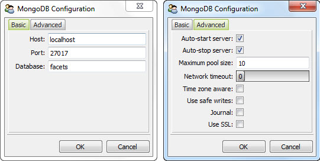

.. _mongodb_mongodb:

The MongoDB Class
=================

One of the goals of the MongoDB OML is to allow you to write applications using
a Facets-based, persistent, object oriented data model. At the core of this
model are MongoDBObject-based classes written using persistent *DBxxx* facets.

The attraction of such a model is that it allows you to focus your attention on
desiging and implementing your application data model and logic without having
to deal with the technical details involved with accessing the underlying
database storage layer.

That's the dream. But the reality is that there is an underlying database
storage layer, and sometimes you have to get your hands dirty grubbing around
with it. That's where the MongoDB class comes in.

A MongoDB instance is an object representing your application's connection to
a particular MongoDB server. In many cases, such as the example application we
looked at earlier, there are no direct references to a MongoDB object to be
found anywhere in the code. But you can rest assured that such an object exists,
managing the data flow between your application and the MongoDB server under the
covers.

If completely transparent access to a MongoDB object were always the case, then
we could end this discussion now. But there are many cases where you may need to
use a MongoDB object directly to manage some aspect of your application's
interaction with its associated MongoDB server. So we are going to spend the
rest of this section presenting the complete, public API exposed by the MongoDB
class.

Let's get started with the public facets exposed by a MongoDB object...

MongoDB Facets
--------------

With one exception, all of the public facets exposed by a MongoDB object are
used for configuring access to a particular MongoDB server. Since these are the
facets you are most likely to use, we'll start with them:

**host**
    A string specifying the name of the host the MongoDB server is running on.
    It defaults to *'localhost'*.

**port**
    An integer specifying the number of the port the MongoDB server is listening
    for connections on. It default to *27017*, the standard, default MongoDB 
    server port.

**database**
    A string specifying the name of the MongoDB database to use. Each MongoDB
    server can support one or more databases. It defaults to *'facets'*.

**max_pool_size**
    An integer specifying the maximum size limit for the connection pool. It
    defaults to 10.

**network_timeout**
    An integer specifying the timeout (in seconds) to use for socket operations. 
    It default to *0*, which means there is no timeout.

**tz_aware**
    A boolean value specifying whether or not datetime instances are timezone
    aware? If True, any datetime instances retrieved from the server will be 
    timezone aware. If False (the default), any retrieved datatime instances are 
    naive. 

**safe**
    A boolean value specifying whether a MongoDB *getlasterror* call should be
    made after each write operation. A True value helps ensure that database
    update operations have completed successfully before continuing, but does
    slow application performance somewhat. It defaults to *False*.

**journal**
    A boolean value specifying whether write operations should block until they
    have been commited to the journal. If True, write operations will block. The
    default is False. This option is ignored if the server is running without
    journaling. If True, it also implies that *safe* is True as well.

**ssl**
    A boolean value specifying whether or not to create the connection to the
    server using SSL. It defaults to False (i.e. SSL is not used).

**auto_start**
    A boolean specifying whether or not the application should automatically
    attempt to start a local MongoDB server if a server connection cannot be
    established and the value of *host* is *'localhost'*. The default value is
    True.
    
**auto_stop**
    A boolean value specifying whether or not the application should 
    automatically stop a local copy of the MongoDB server when the application
    terminates. This option only applies if the server was started by the
    application because *auto_start* is True. The default value is True.

The only other publically accessible facet provided by a MongoDB object is:

**connection**
    Once a connection to a MongoDB server has been established, it contains the
    PyMongo Connection object used to communicate with the MongoDB server. The
    value should be treated as read-only, and is documented as part of the
    public API only for use in cases where the MongoDB OML API lacks some
    feature that may be exposed by the PyMongo API. For more information on how
    to use the Connection object, refer to the PyMongo documentation.

MongoDB Methods
---------------
    
**save( object [, object, ...] )**
    Saves all of the the MongoDBObject instances provided as arguments
    to the associated MongoDB database. If no arguments are specified, 
    any currently *dirty* objects waiting to be saved to the database are saved,
    and the list of *dirty* objects is reset to empty.
    
    A *dirty* object is any MongoDBObject instance loaded from the database 
    which has subsequently been modified by the application in some way.
    
    The number of objects successully saved to the database is returned as the
    result.

**close()**
    Closes the connection to the associated MongoDB server.
    
    It returns *self* as the result.

**shutdown()**
    Shuts down the MongoDB database process only if it was started by the
    application using the *auto_start* option.

    It returns *self* as the result.    

**reset()**
    Resets the contents of the database to an empty state, but retains all
    accumulated schema information. All data contained in the database will be
    lost. This method is mainly provided for use during application developement
    and testing to help ensure the database is in a known state.
    
    It returns *self* as the result.

**configure( application = 'default', force = False )**
    This is a convenience method that allows an end user to interactively
    configure MongoDB database connection information. It returns *self* as the
    result after any user configuration has been performed.
            
    The configuration information is looked up in and saved to the Facets
    database using the application name specified by *application*. If *force*
    is True, the user is always prompted for the configuration information,
    using the existing configuration data as the default if it already exists.
    Otherwise, the user is only prompted for the configuration information if it
    is not already in the Facets database.
    
    For simple application's that require some straightforward user
    configuration, you can use this method at application start-up time to help
    ensure that a properly set-up MongoDB object is available. For more complex
    applications, you may want to provide your own configuration scheme.
    
    The following shows an example of the method being used to configure a
    *'document_index'* application in conjunction with the *mongodb* function::
        
        mongodb().configure( 'document_index' )
    
    This screen shot shows both pages of the user interface displayed when the
    method is invoked:

The mongodb Function
--------------------

To help make management of the underlying MongoDB server connection as
transparent as possible, MongoDB OML provides a *mongodb* function for getting
and setting the default MongoDB object used by an application:

**mongodb( db = None )**
    Gets or sets the implicit MongoDB object used by the application. If *db* is
    a MongoDB object, it sets the MongoDB database to use to *db*.
    
    It always returns the most recently set MongoDB object. If no MongoDB object
    has been previously set, one is created and returned.

Application Termination
-----------------------

As a safety net, the MongoDB OML installs a handler invoked at application
termination that automatically performs *save*, *close* and *shutdown* method
calls on the MongoDB object returned by *mongodb()*. This helps ensure that any
modified objects get flushed to the MongoDB database when the application exits.

However, because the Python runtime does not guarantee that exit handlers are
always called, it is a very good idea to provide application level code that
ensures the MongoDB database state has been properly saved prior to terminating
an application.

