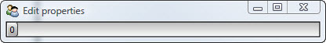

.. _tao_animate:

Animate
=======

From our own experience, we all have a pretty good idea of what *animation* is.
We know it includes things like:

* Saturday morning cartoons.
* Hyper-realistic transforming mechs in movies.
* Cut scenes and computer controlled characters in video games.
* Cute slide and bounce effects on web pages, smart phones and other gadgets.

And while animation in Facets can be used to create similar effects (albeit
usually on a more modest scale), the technical definition of animation in Facets
is: *program controlled modification of one or more object attributes over
time*.

Although that doesn't sound too interesting or sexy, proper use can achieve
results ranging anywhere from cute, to fascinating, all the way up to hypnotic
and mesmerizing.

Defining a Model
----------------

For now, let's start simple and just aim for mildly amusing::

    class Bouncer ( HasPrivateFacets ):
        bounce = Range( 0, 100 )

        view   = View( UItem( 'bounce' ), width = 400 )

    Bouncer().edit_facets()

We start with a simple Bouncer class which has a single facet *bounce*, which is
an integer in the range from 0 to 100, and a trivial view containing the
*bounce* facet rendered using its default editor. Since *bounce* is a Range, its
default editor is a RangeEditor.

Running this program results in:

Adding Animation
----------------

No animation is happening yet though (although we can drag the slider back and
forth with our mouse if we want). However, all that changes when we add the
following method to our Bouncer class::

    def facets_init ( self ):
        self.animate_facet( 'bounce', end = 100, repeat = 0 )

Recall from our previous discussion that the special *facets_init* method is
called once immediately after our default class constructor has finished
initializing the Bouncer object. In this case we take advantage of that to
start the animation when the object is created.

Now when we run the program the slider bounces side to side like a progress bar
gone mad (try squinting while looking at these screen shots and use your
imagination):

Loosely translated, the newly added code can be read as: animate our object's
*bounce* facet to count from 0 (its default initial value) to 100 over a period
of one second (the default animation time), and then count backward from 100 to
0 over the next second. Repeat this over and over again until the user stops the
program.

Note that this description exactly matches our Facets definition of animation
given earlier. If you try and drag the slider with your mouse now, you will find
that you can't, because the *bounce* facet is now *program controlled* by the
**FacetAnimation** object.

Why It Works
------------

If you've read all of the preceding sections carefully, you probably already
have a pretty good idea of why the slider appears to be *animated*:

* The Facets animation system (via a **FacetAnimation** object internally
  created by the *animate_facet* method) periodically updates the *bounce* facet
  with a new value.
* As a result of the update, Facets notifies all interested listeners of the
  change to the *bounce* facet.
* The **RangeEditor** in the **Bouncer** object's view, which has automatically
  registered itself as a listener to the *bounce* facet, handles the change
  notification by updating the appearance of the slider control appropriately.

And that's all there is to it...easy peasy, thanks to the Facets notification
and UI architecture.

Of course, there's a lot more to learn about the animation system, including all
of the different animation *types*, *paths* and *tweeners* available, some of
which will be covered in more detail in later chapters.

In the meantime, if you want to see more animation examples closer to the
fascinating and mesmerizing end of the spectrum, try firing up :ref:`ui_demo`
and exploring some of the examples in the *Graphics and Animation* folder.
