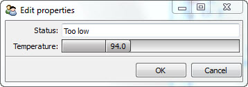
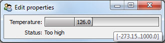
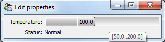
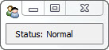

.. _tao_visualize:

Visualize
=========

Facets can support a wide variety of programming styles and approaches, but is
particularly adept at *model-based* programming.

In model-based programming, applications are created by defining one or more
classes which together model the salient aspects of the application domain.
As you'll see, Facets ability to *validate*, *initialize*, *delegate* and
*notify* are all well suited to building systems using this approach.

The ability of end users to visualize, interact with and edit the contents of
a model often creates the need for providing some kind of graphical user
interface (GUI). Over the years, several approaches for creating user interfaces
for model-based systems have evolved, such as the well-known MVC (Model, View,
Controller) design pattern.

Facets supports many of these UI design styles, including the author's personal
favorite: Model View-Model, where the user interface itself has its own set of
models which reflect the specialized user interface domain. By far the largest
portion of the Facets package is devoted to providing a wide variety of tools
for constructing user interfaces for application models.

In this introductory section however, we are only going to provide a brief
glimpse into the Facets approach to user interface construction.

Defining a Model
----------------

For this we will use a very simple model, that of a steam operated generator
or engine with a temperature sensor and an overall system status::

    class Generator ( HasFacets ):
        temperature = Range( -273.15, None, 100.0 )
        status      = Property

        @property_depends_on( 'temperature' )
        def _get_status ( self ):
            if 95.0 <= self.temperature <= 120.0:
                return 'Normal'
            return ('Too low' if self.temperature < 95.0 else 'Too high')

In this model we've used the Range facet to model the Celsius temperature
scale, and the Property facet and the Facets change notification system to
derive the system status from the current temperature.

The Default User Interface
--------------------------

At this point it's interesting to note that we already have a basic user
interface defined for our generator model, as you can see by adding the
following statement to the end of the code::

    Generator().edit_facets()

This creates a new Generator model and displays its default user interface:

Every Facets class or model has a *default* user interface that can be
synthesized on demand in situations where one is not explicitly defined. In many
cases, such as this one, the resulting UI is not exactly what we want, but it's
worth knowing that Facets has enough information about objects that it can
create default user interfaces for them on the fly if necessary.

Defining a User Interface
-------------------------

But for this example let's say we want to explicitly create a simple user
interface that shows both the current system temperature and status::

    class Generator ( HasFacets ):
        temperature = Range( -273.15, None, 100.0 )
        status      = Property

        view = View(
            Item( 'temperature' ),
            Item( 'status', style = 'readonly' )
        )

        @property_depends_on( 'temperature' )
        def _get_status ( self ):
            if 95.0 <= self.temperature <= 120.0:
                return 'Normal'
            return ('Too low' if self.temperature < 95.0 else 'Too high')

    Generator().edit_facets()

Running this we see:

Since we don't have an actual generator or engine connected to our model, we've
allowed the temperature section of the user interface to be represented by a
slider control so we can manually adjust the temperature of our model for
testing purposes.

Notice that what we've done is to:

* Add a class level View object, called *view*, containing two Item objects: one
  for the *temperature* facet, and one for the *status* facet.
* Create a new Generator instance and call its *edit_facets* method.

The View and Item objects together describe the user interface we are creating.
The View object represents the overall user interface, and all other user
interface elements are contained within the View. The Item objects represent
the parts of our model to include in the user interface.

The call to the Generator model's *edit_facets* method creates the user
interface and displays it to the user.

Now, if you've done user interface programming before, you've probably noticed
that nowhere in the code do we explicitly create any UI *widgets* or *controls*
and wire them up to the data parts of our model. Instead, we describe what we
want to appear in the user interface using View and Item objects and Facets does
the rest. This is very much in line with model-based development, with the user
interface simply referencing the elements of the model that should appear in the
UI.

Of course, as you can see from the screen shot, widgets do get created. This is
the main purpose of Item objects:

- Describe what model attributes appear in the UI.
- Describe how the model attributes are rendered or edited.

In this case, the Item objects only describe what model attributes to include in
the user interface. We are relying on another Facets feature to specify what
kind of controls or editors should be used. Every facet (such as Range) has a
default *editor* associated with it. Unless overridden, this is the editor used
in a user interface when an attribute of that type is included.

.. note::
   *Editor* is the standard term used in Facets to refer to the widget or
   control used to view, interact with or modify an object attribute. Facets
   comes with dozens of predefined editors and you can easily create your own.
   You'll be hearing a lot more about editors as you go through this manual.

In the case of a Range facet, the default editor is a RangeEditor, which is a
type of slider control shown in the top half of the screen shot. The Property
editor, being very generic, uses a TextEditor as its default editor. Some
editors, such as the TextEditor, support more than one usage style. In this case
we've indicated the editor should use the *readonly* style, since we don't want
the user to change the system status directly.

Adding an Editor
----------------

Looking at the previous screen shot closely, you'll notice the tooltip indicates
the slider range is from -273.15 to 1000.0, which agrees with our model
definition. Facets automatically gleans this information from our Range facet
declaration and uses it when creating the RangeEditor for the temperature. This
is actually a nice feature, but in this case, since we are not likely to
encounter temperatures anywhere near the actual extremes supported by the model,
it might be better to restrict the slider to a smaller range.

We do this by modifying our *temperature* Item to include an explicit editor
specification::

    Item( 'temperature',
          editor = RangeEditor( low = 50.0, high = 200.0 )
    )

Now when we run the example, we see:

Much better! So now we've seen an example of including explicit editor
information in an Item. Here we've done it simply to modify the default range of
the slider, but we could just as easily have replaced the slider with a
completely different type of editor.

Separating the Model and View
-----------------------------

Because our model and associated user interface are so simple, we have included
both of them in the same class definition. Adherents of the MVC design
methodology may be shaking their heads and muttering "tsk, tsk" since we've
combined the model and view in a single class. So in our next bit of code, we'll
redo the example using separate model and view classes::

    class Generator ( HasFacets ):
        temperature = Range( -273.15, None, 100.0 )
        status      = Property

        @property_depends_on( 'temperature' )
        def _get_status ( self ):
            if 95.0 <= self.temperature <= 120.0:
                return 'Normal'
            return ('Too low' if self.temperature < 95.0 else 'Too high')

    class GeneratorStatus ( HasFacets ):
        model = Instance( Generator, () )

        view = View(
            Item( 'object.model.temperature',
                  editor = RangeEditor( low = 50.0, high = 200.0 )
            ),
            Item( 'object.model.status', style = 'readonly' )
        )

    GeneratorStatus().edit_facets()

A quick glance shows this to be very similar to the original code, but now we
have separate Generator and GeneratorStatus classes, with the GeneratorStatus
class defining the view, or user interface, for its associated Generator *model*
instance. Two other things to note are:

- Use of an Instance facet to define a reference to a Generator model instance.
- Use of more complex object attribute references in the Item objects, such as
  ``'object.model.temperature'``.

.. note::
   You might wonder why we wrote ``'object.model.temperature'`` instead of
   ``'model.temperature'``. Items always reference fully qualified object
   attributes. As a shortcut, references of the form ``'foo'`` are automatically
   translated to ``'object.foo``', where ``'object'`` refers to the the default
   object for the view. In cases where we want to provide a reference like
   ``'model.temperature'``, we need to fully qualify the reference as
   ``'object.model.temperature'``, which can be read as *the temperature
   attribute of the model object of the default view object*.

   This seemingly unnecessary extra level of qualification is needed because a
   single view can actually edit attributes from a set of several different
   objects, referred to as the view's *context*. We'll be discussing view
   contexts in more detail in later chapters.

So now we have a cleaner MVC style set of classes which did not take much
refactoring to create.

Defining Multiple Views
-----------------------

Of course, we can create any number of different views for the same model. In
the next example we'll extend our GeneratorStatus class to include a new
*executive_view* which only shows the current system status::

    class GeneratorStatus ( HasFacets ):
        model = Instance( Generator, () )

        view = View(
            Item( 'object.model.temperature',
                  editor = RangeEditor( low = 50.0, high = 200.0 )
            ),
            Item( 'object.model.status', style = 'readonly' )
        )

        executive_view = View(
            Item( 'object.model.status', style = 'readonly' )
        )

    GeneratorStatus().edit_facets( view = 'executive_view' )

which results in a view like:

We could have split this new view out into a separate view class as well if we
wanted.

Summary
-------

At this point, saying we have only scratched the surface of the *visualize*
capabilities of Facets would be a massive understatement. But we'll leave
detailed exploration of Facets visualization tools to later chapters. The main
points we wanted to cover in this brief introduction are that creating user
interfaces in Facets:

* Is at a much higher level than traditional user interface toolkits like Qt or
  wxWindows.
* Is a direct extension of Facets model-centric approach.
