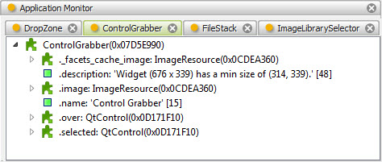
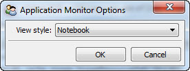

.. _tool_app_monitor:

AppMonitor
==========

The application monitor tool displays views of all application objects
associated with its containing tool window or any other DockWindow specified by
its input Control object.

An *application object* refers to a HasFacets object whose contents are
displayed in a DockWindow DockControl. The tool extracts and displays the
application objects for each DockControl contained in a particular DockWindow.

The tool displays each application object as a hierarchical tree view, with each
node representing an object facet value. Using the tool's options dialog,
available through the tool's feature toolbar, you can specify whether each
application object should be displayed in its own tab or organized into a single
tree with all of the application objects at the top level.

When each application object is displayed in its own tab, you can close
unneeded tabs by clicking the tab's *close* icon. You can also click the tool's
*refresh* icon on its feature toolbar to update the list of application objects
being displayed.

By default, the application monitor shows all of the application objects in its
own window. You can display the application objects for another window by
connecting another tool (e.g. the :ref:`tool_control_grabber`) to the tool's
*control* facet. When it receives a new control as input, it searchs the control
and its parent controls for a containing DockWindow, and then determines the set
of application objects associated with the DockControls contained in the
DockWindow.

Module
------

facets.extra.tools.app_monitor

Input Connections
-----------------

control
  A Control object used to determine the DockWindow containing the application
  objects to display.

Output Connections
------------------

None.

Options
-------

In addition to its input connections, the application monitor tool also supports
setting the following facets through the tool's options dialog available via the
tool's feature toolbar:

View style (*view_style*)
  Specifies how the tool should display its application objects:

  Notebook
    Place each application object in a separate notebook tab.

  Tree
    Organize all application objects into a single tree view.

Screenshots
-----------

Shows the application monitor tool displaying the application objects for its
own tool window.

A view of the options dialog for the application monitor tool.

