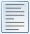

.. _tool_architecture:

Tool Framework Architecture
===========================

The centerpiece of the tool framework architecture is the concept of a
*feature*. A feature is an extension mechanism that imbues a tool that supports
the feature with new capabilities and facilities. A tool can support any number
of features at the same time.

Features work within a context that allows all tools operating within the
context to exchange information via their associated features. In the case of
the tool framework, the context is provided by a *DockWindow*. A DockWindow is
the Facets component that manages collections of controls, allowing you to
visually organize and resize them as needed. When used in the tool framework, a
DockWindow manages collections of tools. In addition, it manages a collection of
features. As new tools are added, the DockWindow creates feature instances for
each feature supported by the tool.

Feature Icon
------------

The visual indication that a tool supports one or more features is provided by
the *feature icon* appearing to the left of the tool's label in its DockWindow
tab. The icon has different appearances and shapes, depending upon the current
state of the tool, mouse pointer and feature environment. Normally the icon
appears *ghosted*, but as the mouse pointer moves into its tab, the icon
becomes fully opaque, as shown in the following screen shots:

.. image:: images/tool_feature_icon.jpg

The feature icon serves several purposes:

* It indicates that the tool associated with the DockWindow tab is feature
  enabled.
* It indicates the current state of the tool's features. We'll be describing
  the various states a little later.
* It provides a mouse pointer target for displaying the tool's *feature
  toolbar*.

Feature Toolbar
---------------

Some features require user interaction in order to use the feature. In such
cases the tool can provide an icon to facilitate the interaction. The set of all
feature provided icons for a given tool is collected together into a single
*feature toolbar* that appears when the mouse pointer hovers over the feature
icon on the tool's DockWindows tab. An example of a feature toolbar is shown in
the following screen shot:

..image:: images/tool_feature_toolbar.jpg

In this example we see four different icons, each contributed by a different
feature associated with the tool.

The feature provided icon can support different types of user interaction, such
as:

* Clicking to perform an action.
* Clicking to display a popup menu.
* Clicking to display a popup dialog.
* Clicking and dragging to perform an action.

A particular icon may support more than one style of interaction. For example,
in the previous screenshot, the leftmost *chain link* icon supports clicking to
display a popup menu as well as clicking and dragging to perform an action. The
style, or styles, of interaction supported is normally indicated by the icon's
tooltip.

Feature Metadata
----------------

The mechanism a tool uses to indicate that it supports a particular feature is
to attach feature specific *metadata* to one or more facets defined by the
tool.

When a tool is added to a DockWindow, the DockWindow notifies each feature in
the DockWindow's context that a new tool is being added. Each feature class then
uses standard Facets metadata queries to determine if the tool supports the
feature. If it does, the feature class typically creates one or more instances
of itself and returns them to the DockWindow, which adds them to the list of
other features supported by the tool. If the feature does not find any facets
containing metadata it recognizes, then it returns **None** to the DockWindow,
signifying that the tool does not support the feature.

Not all features rely on metadata to determine whether or not a given tool
supports the feature, but many do and in the following sections we'll
explicitly describe the metadata a tool needs to define in order to support the
feature.

Standard Features
-----------------

The Facets package includes a number of predefined features used by the various
tools included in the package and which you can also use when creating your own
tools.

The standard features are:

Connect Feature
^^^^^^^^^^^^^^^

Allows tools with compatible *connect* metadata to be connected together. For
more information on using this feature within the tools environment, refer to
the :ref:`using_tools_environment` section, which describes the user interface
for this feature in more detail.

To use this feature when creating a tool, simply add *connect* metadata to any
facet that can be connected as an input or output to another tool. The value of
the *connect* metadata is a string describing the type of connection that can be
made, and has the form: *direction[:[:]name]*, where:

direction
  The direction of the connection. It can be one of the following values:

  * *to*: Data can be sent to the facet from another tool.
  * *from*: Data can be sent from the facet to another tool.
  * *both*: Data to can be sent to or from the facet to another tool.

name
  A descriptive name or type for the connection. If the name is preceded by a
  single colon, it is a descriptive name for the connection. If it is preceded
  by a double colon (i.e. *::*), it is a description of the type of value that
  facet can be connected to.

If the direction is *to*, then the facet can be only be connected to another
tool's facet that has a direction of *from* or *both*. If the direction is
*from*, then it can be connected only to a tool facet with a direction of
*to* or *both*. And finally, a direction of *both* means that it can be
connected to any compatible tool facet (i.e. direction of *to*, *from* or
*both*).

Note the in addition to having a compatible direction, a facet can only be
connected to tool facets with a compatible type. If no explicit type
information is specified in the *connect* metadata, then the facet can only
be connected to another facet which is assignment compatible. That is, the
value of a *from* facet must be a legal value for the *to* facet.

If explicit type information is specified (e.g. *connect = 'to::image_file'*),
then the facet can only be connected to another facet with identical type
information (e.g. *connect = 'from:image_file'*). Using explicit type
information can help eliminate false positives on facets which are assignment
compatible, but should not logically be connected together. Note that the type
information is only a string that must match the connecting facet's type
information, not an actual data type.

If a descriptive name is supplied (e.g. *connect = 'to: image'*), the name is
used in the tools environment user interface to describe to the user what
types of connections can be made. Typically the name appears when a user
clicks on the *connect* feature icon and a popup menu describing what
connections can be made or broken is displayed and there is more than one
possible connection that can be made or broken to a particular tool. In this
case, the name is used to help differentiate the different facets involved
(e.g. *Connect to the image of the Image Zoomer*). Note that the name is only
used in cases where more than one facet is involved. For example, if the
connection in the previous example was unambiguous, it would be displayed as:
*Connect to the Image Zoomer*.

If no descriptive name is provided (e.g. *connect = 'to'), the name of the
facet is used to create the descriptive name for the user interface. For
example, if a tool includes the definition::

    image = Image( connect = 'to' )

then *image* is used in the connect feature user interface to describe any
connection to the facet. So in cases where a facet's name is descriptive, it is
not necessary to provide a descriptive name in the *connect* metadata.

Debug Feature
^^^^^^^^^^^^^

Adds a debugging icon to each tool's feature toolbar that allows the
developer to view different types of information about the current state of
the tool. The default icon added to the toolbar looks like:

.. image:: images/tool_feature_debug.jpg

Once this feature is added, it applies to all tools. Normally, this feature is
only available once it has been enabled by checking the *Debug* option in the
*Feature* section of a DockWindow's context menu displayed by right clicking
on any DockWindow surface such as a tab or splitter bar.

The debug icon supports all of the following actions:

Click
  Displays a popup VIPShell view which displays a **DebugInfo** object
  containing the following information:

  * *object*: The tool object itself.
  * *dock_control*: The **DockControl** object for the tool.
  * *control*: The **Control** object associated with the DockControl.
  * *ui*: The **UI** object associated with the tool.

Right click
  Displays a popup menu with options to select the type of object dragged when
  the user drags the debug icon to another tool. The possibilities are to drag
  the tool object or its associated DockControl, UI or Control object.
  Changing the object type also affects the appearance of the debug icon.

Drag
  Allows the user to drag an **ObjectInspector** whose payload is of the
  currently selected drag type (i.e. the tool object or its associated
  DockControl, UI or Control object). The default is to drag the tool object.

Control-drag
  Allows the user to drag an **ObjectInspector** whose payload is the tool
  object.

Shift-drag
  Allows the user to drag an **ObjectInspector** whose payload is the
  **DockControl** object for the tool.

Alt-drag
  Allows the user to drag an **ObjectInspector** whose payload is the
  **Control** object used to view the tool.

As an example of using the debug feature, the following screen shot shows the
results of clicking the *File Sieve* tool's debug icon to display a VIPShell
view with information about the tool:

DockControl Feature
^^^^^^^^^^^^^^^^^^^

Assigns the **DockControl** object associated with a tool to any facet of the
tool with *dock_control* metadata. This feature has no user interface.

The purpose of this feature is to give tools access to the tools environment
they are operating in by providing them with a link to the DockControl object
they are bound to. The DockControl object in turn can provide links to the
other DockControl objects, tools and features operating within the same
DockWindow context.

To use this feature, simply assign *dock_control = True* metadata to one or
more facets in a tool. For example::

    class MyTool ( Tool ):
        ...
        dc = Instance( DockControl, dock_control = True )
        ...

The feature will then automatically assign the tool's DockControl object as
the value of any such facet when the tool is added to the tools environment.

Drag and Drop Feature
^^^^^^^^^^^^^^^^^^^^^

Adds an icon to a tool's feature toolbar that allows a user to drag or drop
objects on the tool using the icon. The icon added to the toolbar looks like:

.. image:: images/tool_feature_drag_drop.jpg

The particular icon displayed depends upon whether the tools supports dragging
objects, dropping objects or both.

In order to support dragging, define *draggable* metadata on any facet
containing an object that can be dragged. If the value of the metadata is a
string, the string is used as the tooltip describing the object being dragged
when the user hovers the mouse pointer over the feature icon.

More than one facet can contain *draggable* metadata. If there are multiple
facet values that can be dragged, they are combined into a **MultiDragDrop**
object when the user drags the feature icon. If a particular *draggable* facet
has a value of **None** at the time the drag operation begins, it is not
included in the drag.

If multiple *draggable* facets have string metadata, the string values are
combined when creating the icon's tooltip. If no *draggable* facet has string
valued metadata, then the tooltip simply says *Drag this item.*.

In a similar manner, define *droppable* metadata on any facet that accepts
dropped objects. As with *draggable* facets, string metadata values are used
to define the tooltip displayed for the feature icon. If no *droppable* facet
has string metadata, the tooltip simply says *Drop an item here.*.

When objects are being dragged over the feature icon for a tool with
*droppable* facets, the feature determines whether the object can be dropped
on the tool by validating the object against the *droppable* facets. If at
least one facet can accept the object being dragged, the drag operation is
allowed to proceed.

If multiple objects are being dragged (i.e. in the case of another tool being
dragged that creates a **MultiDragDrop** object), then at least one of the
*droppable* facets must accept at least one of the dragged objects in order
for the drag operation to proceed.

When a valid object (or objects) or dropped on the tool, the feature attempts
to assign each dropped object to each *droppable* facet. Any errors raised by
failed assignments are ignored.

If the tool defines both *draggable* and *droppable* facets, the icon tooltip
is defined by grouping and merging together the tooltips for the *draggable*
and *droppable* facets.

Layout Feature
^^^^^^^^^^^^^^
Adds an icon to each tool's feature toolbar that allows the user to rearrange
all of the tools contained in the perspective by selecting from a palette of
standard layouts. The icon added to the toolbar looks like:

Once this feature is added, it applies to all tools. However the icon only
appears in a tool's feature toolbar if there is more than one tool in the
perspective, since there is nothing to lay out in the case of a single tool.

The palette of layouts that appears when the toolbar icon is clicked looks
something like:

The actual palette displayed is context sensitive and depends upon the number
of tools currently in the perspective.

Options Feature
^^^^^^^^^^^^^^^

Adds an icon to a tool's feature toolbar that displays the tool's *options*
dialog when clicked. The icon added to the toolbar looks like:

In order to use this feature, the tool must define a View called *options*.
This is the view displayed when the user clicks the options icon on the tool's
feature toolbar.

Popup Menu Feature
^^^^^^^^^^^^^^^^^^

Adds an icon to a tool's feature toolbar that displays the tool's *popup*
menu when clicked. The icon added to the toolbar looks like:

In order to use this feature, a tool must have a facet called *popup_menu*
whose value is a **Menu** instance from the *facets.ui.menu* module. This is
the popup menu displayed when the user clicks the popup menu icon on the
tool's feature toolbar.

Save Feature
^^^^^^^^^^^^

Adds an icon to a tool's feature toolbar that allows the user to save the
current state of the tool. The icon added to the toolbar looks like:

In order to use this feature, the tool must be a subclass of the **Saveable**
class, which can be imported from *facets.extra.api* and is defined in
*facets.extra.helper.saveable*. Saveable is a subclass of **HasPrivateFacet**
that defines a *needs_save* Boolean facet and an abstract *save* method which
has no arguments and returns no result.

The tool should set *needs_save* to **True** whenever the tool has modified
state the user has the option of saving. Once *needs_save* is set to **True**,
the save icon appears on the tool's feature toolbar. If *nneds_save** is
**False**, the save icon is not displayed.

When the user clicks the save icon, the feature calls the tool's *save*
method, which should take whatever action is required to save the tool's
state. Once saved, the tool should reset *needs_save* back to **False**.

Save State Feature
^^^^^^^^^^^^^^^^^^

Automatically saves the state of any tool's facets that have *save_state*
metadata specified. This is useful for saving user preference information
across sessions.

The feature automatically saves the value of any tool facet with *save_state*
metadata set to **True**. Previously saved values are automatically restored
the next time the tool is loaded. In addition, if the tool has a single
string valued facet with *save_state_id* metadata set to **True**, the value
of the facet is used as the key for saving the tool's state data in the Facets
user interface database. If no such facet is found, the state data is saved
under a key of the form: *unknown.plugins.name.state*, where *name* is the
tool's name.

The DockWindowFeature Class
---------------------------

Of course you are not limited to using just the features provided with the
Facets package. You can also create and use your own features when defining new
tools. There are four steps involved in creating and using custom features:

* Define a new feature by creating a custom subclass of **DockWindowFeature**,
  the base class for all Facets features.
* Create one or more tools making use of your new feature. Tools are just
  standard HasFacets subclasses annotated with feature metadata as needed. Refer
  to the *facets.extra.tools* package containing the standard Facets tools for
  numerous tool examples.
* Use the DockWindow *add_feature* function to add your feature to the Facets
  run-time environment.
* Use the *tool* function to define and display a toolbox containing your
  custom tools along with some, none or all of the standard Facets tools. Refer
  to the :ref:`tool_function` section for more information on using the *tool*
  function.

In the remainder of this section we'll be covering the details of creating your
own feature by subclassing DockWindowFeature.

DockWindowFeature Facets
^^^^^^^^^^^^^^^^^^^^^^^^

The DockWindowFeature class defines the following facets:

dock_control: *Instance(DockControl)*
  This is a *read-only* facet that contains the DockControl instance associated
  with the feature. Note that features are not directly associated with
  application components, but are instead associated with the DockControl object
  that manages the application component. The DockControl object provides the
  feature with access to information about the parent DockWindow object, other
  DockControl objects contained within the same DockWindow, as well as the
  application component. This facet is automatically set by the DockWindow when
  the feature instance is created and associated with an application component.

image: *Image*
  Specifies the image (icon) to display on the feature bar. If its value is
  **None**, no image is displayed. For images that never change, the value can
  be declared statically in the class definition. However, the feature is free
  to change the value at any time. Changing the value to a new image causes the
  associated image to be updated on the feature bar. Setting the value to
  **None** removes the image from the feature bar.

tooltip: *Str*
  Specifies the tooltip to display when the pointer hovers over the image. The
  value can be changed dynamically to reflect changes in the feature's state.

x: *Int*
  The x-coordinate of a mouse pointer event that occurred over the feature's
  image. This can be used in cases where the event-handling for a feature is
  sensitive to the position of the pointer relative to the feature image. This
  is not normally the case, but the information is available if it is needed.

y: *Int*
  The y-coordinate of a pointer event that occurred over the feature's image.

shift_down: *Bool*
  A boolean value that specifies whether the shift key was being held down when
  a mouse event occurred.

control_down: *Bool*
  A boolean value that specifies whether the control key was being held down
  when a mouse event occurred.

alt_down: *Bool*
  A boolean value that specifies whether the alt key was being held down when a
  mouse event occurred.

DockWindowFeature Methods
^^^^^^^^^^^^^^^^^^^^^^^^^

The DockWindowFeature class defines the following instance methods:

click()
  Handles the user left-clicking on a feature image.

  This method is designed to be overridden by subclasses. The default
  implementation attempts to perform a *quick drag* operation (see the
  *quick_drag* method). Returns nothing.

right_click()
  Handles the user right-clicking on a feature image.

  This method is designed to be overridden by subclasses. The default
  implementation attempts to perform a *quick drag* operation (see the
  *quick_right_drag* method). Returns nothing. Typically, you would override
  this method to display the feature's shortcut menu.

drag()
  Returns the object to be dragged when the user drags a feature image.

  This method can be overridden by subclasses. If dragging is supported by the
  feature, then the method returns the object to be dragged; otherwise it
  returns **None**. The default implementation returns **None**.

control_drag()
   Returns the object to be dragged when the user drags a feature image while
   pressing the *Control* key.

   This method is designed to be overridden by subclasses. If control-dragging
   is supported by the feature, then the method returns the object to be
   dragged; otherwise it returns **None**. The default implementation returns
   **None**.

shift_drag()
  Returns the object to be dragged when the user drags a feature image while
  pressing the *Shift* key.

  This method is designed to be overridden by subclasses. If shift-dragging is
  supported by the feature, then the method returns the object to be dragged;
  otherwise it returns **None**. The default implementation returns **None**.

alt_drag()
  Returns the object to be dragged when the user drags a feature image while
  pressing the *Alt* key.

  This method is designed to be overridden by subclasses. If Alt-dragging is
  supported by the feature, then the method returns the object to be dragged;
  otherwise it returns **None**. The default implementation returns **None**.

right_drag()
  Returns the object to be dragged when the user right mouse button drags a
  feature image.

  This method can be overridden by subclasses. If right dragging is supported by
  the feature, then the method returns the object to be dragged; otherwise it
  returns **None**. The default implementation returns **None**.

control_right_drag()
  Returns the object to be dragged when the user right mouse button drags a
  feature image while pressing the *Control* key.

  This method is designed to be overridden by subclasses. If right
  control-dragging is supported by the feature, then the method returns the
  object to be dragged; otherwise it returns **None**. The default
  implementation returns **None**.

shift_control_drag()
  Returns the object to be dragged when the user right mouse button drags a
  feature image while pressing the *Shift* key.

  This method is designed to be overridden by subclasses. If right
  shift-dragging is supported by the feature, then the method returns
  the object to be dragged; otherwise it returns **None**. The default
  implementation returns **None**.

alt_right_drag()
  Returns the object to be dragged when the user right mouse button drags a
  feature image while pressing the *Alt* key.

  This method is designed to be overridden by subclasses. If right Alt-dragging
  is supported by the feature, then the method returns the object to be dragged;
  otherwise it returns **None**. The default implementation returns **None**.

drop( object )
  Handles the user dropping a specified object on a feature image. *Object*
  specifies the object being dropped onto the feature image. It returns nothing.

  This method is designed to be overridden by subclasses. It is called whenever
  the user drops an object on the feature's tab or drag bar image. This method
  is called only if a previous call to *can_drop()* for the same object returned
  **True**. The default implementation does nothing.

can_drop( object )
  Returns whether a specified object can be dropped on a feature
  image. *Object* specifies the object being dragged onto the feature image. It
  returns **True** if *object* is a valid object for the feature to process ,and
  **False** otherwise.

  This method is designed to be overridden by subclasses. It is called whenever
  the user drags an icon over the feature's tab or drag bar image. The method
  does not perform any processing on *object*; it only examines it. Processing
  of the object occurs in the **drop()** method, which is called when the user
  releases the object over the feature's image, which typically occurs after the
  **can_drop()** method has indicated that the feature can process the object
  by returning **True**. The default implementation returns **False**,
  indicating that the feature does not accept any objects for dropping.

dispose()
  Performs any clean-up needed when the feature is removed from its associated
  application component (for example, when the user disables the feature).

  This method is designed to be overridden by subclasses. The method performs
  any clean-up actions needed by the feature, such as closing files, removing
  facet listeners, and so on. The method does not return a result. The default
  implementation does nothing.

popup_menu( menu )
  Displays the popup shortcut menu specified by *menu*, which should be a
  *facets.ui.menu.Menu* object. It returns nothing.

  This helper method displays the shortcut menu specified by *menu* at a point
  near the feature's current (x,y) value, as specified by the **x** and **y**
  facets. Normally, the (x,y) value contains the screen location where the user
  clicked on the feature's tab or drag bar image. The effect is that the menu is
  displayed near the feature's icon, with the pointer directly over the top menu
  option.

refresh()
  Refreshes the display of the feature image. This helper method requests the
  containing DockWindow to refresh the feature toolbar. It returns nothing.

disable( disable = True )
  Disables or enables the feature, depending upon the value of *disable*. If
  *disable* is **True** (the default), the feature is disabled; otherwise it is
  enabled. It returns nothing.

  This helper method temporarily disables the feature for the associated
  application component. The feature can be re-enabled by calling the
  **enable()** method (or by calling *disable* again with the *disable* argument
  set to **False**). Disabling the feature removes the feature's icon from the
  feature bar without actually deleting the feature (i.e., the **dispose()**
  method is not called).

enable( enable = True )
  Enables or disables the feature, depending upon the value of *enable*. If
  *enable* is **True** (the default), the feature is enabled; otherwise it is
  disabled. It returns nothing.

  This helper method re-enables a previously disabled feature for its associated
  application component. Enabling a feature restores the feature bar icon that
  the feature displayed at the time it was disabled.

is_enabled()
  Returns **True** if the feature is currently enabled, and **False** if it is
  disabled.

quick_drag()
  Performs a quick drag and drop operation by displaying a pop-up menu
  containing all targets that the feature's xxx_drag() method can be dropped on.
  Selecting an item drops the item on the selected target.

quick_right_drag()
  Performs a quick drag and drop operation with the right mouse button by
  displaying a pop-up menu containing all targets that the feature's
  xxx_right_drag() method can be dropped on. Selecting an item drops the item on
  the selected target.

DockWindowFeature Class Methods
^^^^^^^^^^^^^^^^^^^^^^^^^^^^^^^

The DockWindowFeature class defines the following class methods which are
called by the DockWindow when an application component is being added:

feature_for( dock_control )
  Returns a single new feature object or list of new feature objects for the
  DockControl object specified by *dock_control*. *dock_control* corresponds to
  the application component being added or for which the feature is being
  enabled.

  The method should return an instance or list of instances of this class to
  associate with the application component. Alternatively, **None** can be
  returned if the feature does not apply to the application component.

  This class method is designed to be overridden by subclasses. Normally, a
  feature class determines whether it applies to an application component by
  examining the component to see if it is an instance of a certain class,
  supports a specified interface, or has facet attributes with certain types of
  metadata. The application component being added is available through the
  *dock_control.object* facet attribute. Note that it is possible for
  *dock_control.object* to be **None** if the DockControl is not associated with
  an application object.

  The default implementation for this method calls the **is_feature_for()**
  class method to determine whether the feature applies to the specified
  DockControl. If it does apply, it calls the **new_feature** class method to
  create the feature instances to be returned. If it does not apply, it simply
  returns **None**.

new_feature( dock_control )
  Returns a new feature instance for the DockControl specified by
  *dock_control*. *dock_control* corresponds to the application component being
  added or for which the feature is being enabled.

  The method should return an instance or list of instances of this class to
  associate with the application component. If the feature does not apply to
  the application component, **None** should be returned.

  This method is designed to be overridden by subclasses. The method is called
  by the default implementation of the **feature_for** class method to create
  the feature instances to associate with the application component
  specified by *dock_control*. The default implementation returns the result of
  calling the class constructor as follows::

      return cls( dock_control = dock_control )

  where *cls* is the feature class.

is_feature_for( dock_control )
  Returns whether this class is a valid feature for the application object
  corresponding to the DockControl specified by *dock_control*.

  The method should return **True** if the feature applies to the application
  object associated with *dock_control* and **False** otherwise.

  This class method is designed to be overridden by subclasses. It is called by
  the default implementation of the **feature_for** class method to determine
  whether the feature applies to the application object specified by
  *dock_control*. The default implementation always returns **True**.

DockWindowFeature Class Variables
^^^^^^^^^^^^^^^^^^^^^^^^^^^^^^^^^

There are several class-level variables that are also available for use:

feature_name
  Set this to the string value name of the feature as it should appear in the
  DockWindow Features sub-menu (e.g., 'Connect'). An empty string (the default)
  means that the feature does not appear in the Features sub-menu and cannot be
  enabled or disabled by the user. Try to avoid using feature names that
  conflict with other, known features.

state
  An integer that specifies the current state of the feature:

  * 0: uninstalled
  * 1: active
  * 2: disabled

  You do not usually need to set this value explicitly. The DockWindows code
  normally manages the value automatically, setting it when the user enables or
  disables the feature.

instances
  An automatically maintained list of weak references to all current feature
  instances.

A Sample Feature Class
^^^^^^^^^^^^^^^^^^^^^^

To illustrate a working feature class implementation, we present an edited
version of the source code for the standard *Options* feature, which allows the
user to display the options dialog for any tool defining a view called
*options*::

    from facets.core_api import HasFacets
    from facets.api import View
    from facets.ui.dock.api import DockWindowFeature
    from facets.ui.pyface.image_resource import ImageResource

    class OptionsFeature ( DockWindowFeature ):

        # Class Constants:

        # The user interface name of the feature:
        feature_name = 'Options'

        # Facet Definitions:

        # The current image to display on the feature bar:
        image = ImageResource( 'options_feature' )

        # The tooltip to display when the mouse is hovering over the image:
        tooltip = 'Click to set view options.'

        # Event Handlers:

        def click ( self ):
            """ Handles the user left clicking on the feature image.
            """
            dc                = self.dock_control
            object            = dc.object
            view              = object.facet_view( 'options' )
            sx, sy            = dc.owner.control.screen_position
            bx, by, bdx, bdy  = dc.drag_bounds
            view.popup_bounds = ( bx + sx, by + sy, bdx, bdy )
            self.dock_control.object.edit_facets(
                view   = view,
                kind   = 'popup'
            )

        # Overridable Class Methods:

        @classmethod
        def is_feature_for ( self, dock_control ):
            """ Returns whether or not the DockWindowFeature is a valid feature
                for a specified DockControl.
            """
            object = dock_control.object
            return (isinstance( object, HasFacets ) and
                    isinstance( object.facet_view( 'options' ), View ))

This simple feature overrides the *is_feature_for* class method to indicate that
the feature only applies to application object's that derive from **HasFacets**
and which have a View called *options* defined.

It also overrides the *click* handler for the feature's toolbar icon to display
the tool's *options* dialog whenever the icon is clicked. The dialog is
displayed as a popup dialog that appears directly under the tool's tab.

There are also several additional lines of code used to:

* Define the feature name (*feature_name = 'Options'*)
* Define the toolbar icon to use (*image = ImageResource( 'options_feature' )*)
* Define the tooltip to display when the mouse hovers over the toolbar icon
  (*tooltip = 'Click to set view options.'*)

For other examples of DockWindowFeature subclasses, refer to any of the modules
with names of the form *xxx_feature.py* in the *facets.extra.features* package.

Making a Feature Available
--------------------------

In order for a tool to use a feature, the Facets run-time environnment must
first be notified that the feature is available.

There are two ways to do this:

* To make all standard Facets features available, use the
  *add_standard_features* function::

      from facets.extra.features.api import add_standard_features
      add_standard_features()

  This makes all standard Facets features available in all DockWindow contexts.
  Note that this function is automatically called by the *tool* function.
* To add a single, specific feature, use the *add_feature* function::

      from facets.ui.dock.api import add_feature
      add_feature( feature_class )

  where *feature_class* is the **DockWindowFeature** subclass defining the
  feature to be added. It is not an error to call *add_feature* with the same
  feature class more than once.

  Note that the *add_standard_features* function is simply a convenience
  function that invokes *add_feature* once for each of the standard Facets
  feature classes.

If you opt not to use the *tool* function, but instead create your own custom
view containing one or more tools and don't see the feature icon displayed in
any of their tabs, chances are good that you forgot to add the necessary
features to the run-time environment prior to creating the view.

