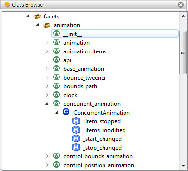

.. _tool_class_browser:

ClassBrowser
============

The class browser tool displays a hierarchical tree view of all packages,
modules, classes and methods containing in the application's *PYTHONPATH*.

Selecting any item in the class browser hierarchy assigns a PythonFilePosition
object describing the contents of the selected item to the tool's
*file_position* facet, making it available to any connected tools.

The tool runs a background analysis thread that maintains the database used to
create the display. As a result, there may be an initial delay the first time
the tool is used while an analysis of the entire PYTHONPATH contents is being
performed. Thereafter the delays should be short as only the changed Python
files need to be updated.

Module
------

facets.extra.tools.class_browser

Input Connections
-----------------

None.

Output Connections
------------------

**file_position**
  A PythonFilePosition object describing the most recently selected package,
  module, class or method item selected.

Screenshots
-----------

Shows a view of the class browser tool with the
facets.animation.concurrent_animation module's ConcurrentAnimation class
expanded to show its defined methods.

