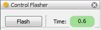

.. _tool_control_flasher:

ControlFlasher
==============

The control flasher tool causes any input Control object to flash briefly on the
screen.

The input Control object is flashed briefly when first received by the tool. You
can make it flash again by clicking the tool's *Flash* button. You can also
adjust the length of the flash, in seconds, by adjusting the value of the *Time*
control located next to it.

Module
------

facets.extra.tools.control_flasher

Input Connections
-----------------

control
  The input Control object to flash.

Output Connections
------------------

None.

Screenshots
-----------

A view of a control flasher tool in use.
