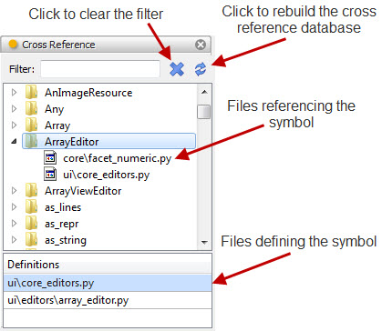
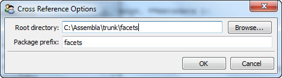

.. _tool_cross_reference:

CrossReference
==============

Defines a cross reference tool for displaying and selecting information about
the various module-level symbols defined and referenced within a specified
Python source code tree. Module-level symbols typically include classes,
functions and constants defined with module-level scope. Only statements used to
import module-level definitions are included in the reference information.

The cross reference tool automatically constructs a cross reference database
whenever a path is assigned to its *root* facet and the database does not
already exist. Once the database has been created, it is not updated unless
explicitly requested to do so by clicking on the *update* button in the tool's
user interface (see the screenshot below).

The cross reference database is stored in the root directory of the path
assigned to the *root* facet with a name of the form: *package_xref.data*, where
*package* is the package prefix assigned to the tool's *package* facet. The
database will only contain cross-reference information for symbols imported from
packages starting with *package*. For example, if the value of *package* is
*facets*, then the database is called *facets_xref.data* and only contains
cross-reference information for symbols imported from *facets* (e.g. *from
facets.api import ...*).

The top part of the tool's user interface shows a tree view of all symbols
contained in the cross reference. Expanding a symbol displays all files in the
source tree containing at least one reference to the symbol. Selecting a
particular symbol displays the list of all modules in the source tree which
define the symbol. This list may have zero, one or more entries. If the symbol
is not defined in the source tree, it will not have a definition. And in some
cases, a symbol may be defined more than once in the source tree, in which case
it will have multiple definition files listed.

You can restrict the symbols displayed in the tool by typing a string into the
*Filter* field located at the top of the tool's user interface. Only symbols
containing the specified string using a *case insensitive* match are displayed

Note that the *file_name* output of the tool is driven by the most recently
selected item in the tool's user interface as follows:

* If a symbol is selected from the top part of the user interface and there is
  at least one definition for the symbol in the database, then the first such
  definition is output as the value of *file_name*.
* If a symbol definition is explicitly selected from the bottom part of the user
  interface, the definition file is output as the value of *file_name*.
* If a symbol reference entry is selected, the reference file is output as the
  value of *file_name*.

Module
------

facets.extra.tools.cross_reference

Input Connections
-----------------

symbol
  A string containing the name of a symbol to look up or use as a filter. The
  cross-reference tool will only display symbols whose name contains the
  specified string.

Output Connections
------------------

file_name
  A **FilePosition** object describing the most recently selected
  cross reference file or definition. A FilePosition object contains both the
  fully qualified file name and line number of the reference or definition.

Options
-------

In addition to its input and output connections, the cross reference tool also
supports setting the following facets through the tool's options dialog
available via the tool's feature toolbar:

Root directory (*root*)
  The path to the root of Python source tree to be cross-referenced.

Package prefix (*package*)
  A string containing the package prefix of all symbols to be included in the
  cross-reference information. It may be the empty string if you do not want to
  restrict the cross-reference information to a particular package.

Screenshots
-----------

Shows the cross reference tool with the *ArrayEditor* symbol selected.

The cross reference tool's options dialog.

