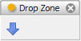

.. _tool_drop_zone:

DropZone
========

Defines a drop zone tool that allows you to drag and drop objects onto the tool.
Any dropped objects are automatically forwarded to all connected tools.

To use the tool, simply drag and drop items onto the downward pointing arrow
icon.

If multiple objects (e.g. a list of files) are dropped onto the tool, each
individual object is assigned to the tool's *item* facet sequentially.

Module
------

facets.extra.tools.drop_zone

Input Connections
-----------------

None.

Output Connections
------------------

**item**
    The item most recently dropped onto the tool.

Screenshots
-----------

