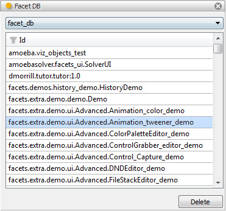

.. _tool_facet_db:

FacetDB
=======

The Facet DB tool allows you to view the contents of, and optionally delete,
items contained in a Facets database.

By default, the tool displays the Facets database used to persist user
preference settings. However, you can select from any other available Facet
database using the dropdown list at the top of the tool's view. Note that the
selected database is persisted across sessions as well.

The main part of the tool's view contains a list of all keys contained in the
current database being viewed. You can filter the list by clicking on the list's
header and entering a text string. Only keys containing the specified text,
using a case sensitive or insensitive match, are displayed in the list.

Selecting a key in the list also assigns a HasPayload object containing the
selected key's value to the tool's *value* facet, making it available to any
connected tools. You can also drag the same HasPayload object to another tool or
application by dragging the drag (upward pointing arrow) icon on the tool's
feature bar.

You can delete the currently selected key from the database by clicking the
*Delete* button located in the lower right hand corner of the tool's view.

Module
------

facets.extra.tools.facet_db

Input Connections
-----------------

None.

Output Connections
------------------

value
  The HasPayload object containing the value associated with the currently
  selected Facets database key.

Screenshots
-----------

Shows the Facet DB tool displaying keys from the default Facets user preference
database.

