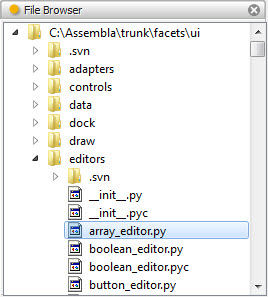
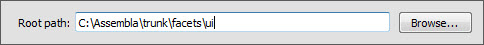

.. _tool_file_browser:

FileBrowser
===========

The file browser tool displays a hierarchical tree view of a specified portion
of your file system and allows you to select directories or files within the
hierarchy.

By default, the tool displays the root of your file system (or the root of your
current drive on Windows). You can change the root either using the tool's
options dialog, available from the tool's feature toolbar, or by connecting a
source of file name paths to the tool's *root_path* facet. The specified root is
persisted across sessions.

Selecting a directory or file in the tool's tree view assigns the selected item
to various tool facets as follows:

* If the selected item is a directory, the name of the directory is assigned
  to the tool's *directory* and *path* facets.
* If the selected item is a file, the name of the file is assigned to the
  tool's *file_name* and *path* facets. In addition, a FilePosition object
  describing the file is assigned to the tool's *file_position* facet.

Any other tools connected to one of these facets will update accordingly. The
file or path most recently assigned to the tool's *path* facet can also be
dragged and dropped using the drag (upward pointing arrow) icon on the tool's
feature bar.

Module
------

facets.extra.tools.file_browser

Input Connections
-----------------

root_path
  The directory to use as the root of the displayed portion of the file system.

Output Connections
------------------

directory
  The name of the most recently selected directory.

file_name
  The name of the most recently selected file.

path
  The name of the most recently selected directory or file.

file_position
  A FilePosition object describing the most recently selected file.

Options
-------

In addition to its input and output connections, the file browser tool also
supports setting the following facets through the tool's options dialog
available via the tool's feature toolbar:

Root path (*root_path*)
  Specifies the directory to use as the root of the displayed portion of the
  file system.

Screenshots
-----------

Shows the file browser tool browsing a portion of the Facets source code tree.

Shows the file browser tool's options dialog.

