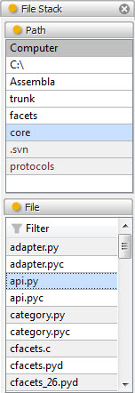

.. _tool_file_stack:

FileStack
=========

The file stack tool allows you to select files using a FileStackEditor. Refer
to the :ref:`file_stack_editor` section for more information on how a
FileStackEditor works.

The currently selected file is remembered across sessions.

Module
------

facets.extra.tools.file_stack

Input Connections
-----------------

file_name
  The currently selected file name.

Output Connections
------------------

file_name
  The currently selected file name.

Screenshots
-----------

Shows the file stack tool with the Facets core api.py file selected.
