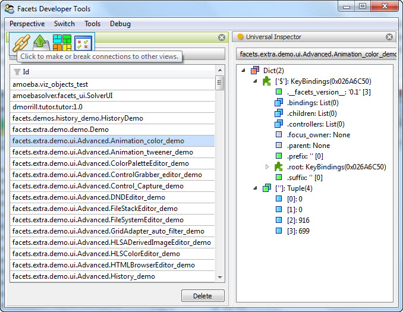

The Tool Framework
==================

The Facets *tool framework* is both an architecture and an extensible collection
of Facets classes called *tools*. When used within the context of the tool
framework, the tool classes create a rich graphical equivalent to the well
known \*nix shell pipe which allows creating powerful command line tools by
stringing commands together with the output of one acting as input to the next.

The Facets tool framework equivalent to the \*nix shell pipe consists of a
graphical view called a *perspective* which allows tools to be added from a menu
and then laid out using standard window docking and splitter bar controls. Tools
can be connected together and operated on in various ways using the *feature*
toolbar that appears when the mouse is hovered over a tool's tab. A sample
perspective is shown in the following figure:

This example shows a perspective containing an instance of the *FacetDB* and
*UniversalInspector* tools with the mouse pointer hovering over the feature
toolbar for the *FacetDB* tool.

The tool framework can be divided into three main sections:

:ref:`tool_architecture`
  The framework itself, which defines an open-ended architecture for defining
  and creating tools.

:ref:`tool_function`
  A function that allows a developer to graphically create and manage custom
  toolboxes of standard or custom tools.

:ref:`tool_tools`
  A collection of dozens of predefined tools included as part of the Facets
  package.

A Quick Introduction
--------------------

You can also get a quick introduction to using the tool framework to create a
custom tool by watching this video:

.. youtube:: X1tFypz0Bcs

.. toctree::
   :hidden:
   :maxdepth: 1

   tool_architecture
   tool_function
   tool_tools

