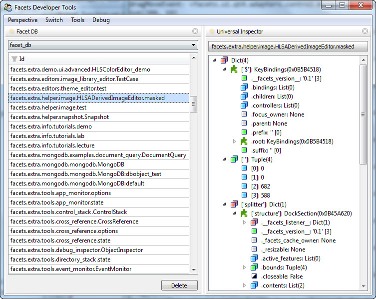
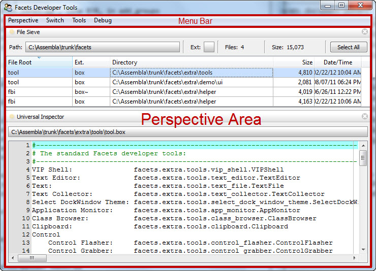
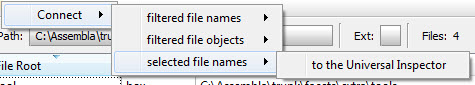
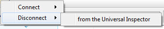

.. _tool_function:

The tools Function
==================

The Facets package provides a high-level *tools* function that takes all of the
capabilities of the low-level tools framework and wraps them in an easy to use
user interface that allows you to create a customizable tools environment that
can be invoked from the command line or embedded within your application.

A screen shot of a typical tools environment in use is shown below:

A Quick Overview
----------------

We'll start the discussion of the tools function by providing a quick overview
of some of the key facilities that it provides:

Toolbox
  A tools environment created using the *tools* function makes available a
  collection of tools for you to choose from. This collection of tools is
  (somewhat unsurprisingly) referred to as a *toolbox*. You can either use one
  of the standard toolboxes supplied with Facets or create your own custom
  toolboxes including any of the standard Facets tools or any custom tools you
  create or acquire.

  A toolbox is defined using a simple text file, usually with a *.box*
  extension, that describes:

  * The set of tools included within the toolbox.
  * The hierarchical organization of the tools for presentation within the
    tool environment's user interface.

  Defining a toolbox using an external text file makes it easy to update the
  contents of the toolbox and to share the toolbox across multiple tool
  environments.

Perspective
  A *perspective* (a term borrowed from the Eclipse framework) is simply a named
  canvas containing zero, one or more tools organized to work together as a
  composite whole. The tools environment allows you to create any number of
  perspectives and switch between them at any time. A perspective provides you
  a means of easily creating task oriented tool clusters oriented toward
  particular workflows.

Connection
  A *connection* is the thing that allows one tool to talk to another. Nearly
  all Facets tools expose one or more *connection points* for communicating with
  other tools. Connection points can either be inputs, outputs or both and are
  defined by adding *connect* metadata to one or more of a tool's facet
  definitions. The tools environment provides a simple graphical mechanism for
  creating and breaking connections between compatible tools. Connections are
  persistent and associated with the perspective and tools they are created for.

Export
  Perspectives provide a nice scratchpad for quickly putting together and
  testing new composite tools made from component tools connected together using
  connections. Every now and then though you create a really nifty little tool
  that you would like to use standalone or share with other people. The tools
  environment faciliates this by providing an *export* option that allows you to
  convert any perspective into a custom, standalone Python source module tool
  that can easily be invoked from the commahd line or shared with other
  developers. The resulting source module is nicely formatted, well commented,
  compact and can easily be hand tweaked to add new features or elements not
  directly supported by the tools environment.

.. _custom_toolbox:

Defining a Custom Toolbox
-------------------------

As mentioned previously, the collection of tools supported by a particular tools
environment is defined by a toolbox whose description is contained in a simple
text file, usually with a *.box* file extension. The Facets package includes
several toolbox files:

facets/extra/tools/tool.box
  Defines the default toolbox used by the tools environment.

facets/extra/tools/helper/fbi.box
  Defines a debugging toolbox used by the FBI debugger.

facets/extra/demo/ui/tool.box
  Defines a custom tool box containing just Facets UI demos that can be fun to
  play around with interactively within a tools environment.

A valid toolbox file can contain the following three types of lines:

Comment
  Any blank line or line whose first non-blank character is *#* is considered
  to be a comment and is ignored.

Tool
  Any line of the form: *name: package.module.class* defines a tool. *Name* can
  be any non-empty string that does not contain a *:* character or start with
  *#* and specifies the name of the tool as it will appear in the tool
  environment's user interface. Following the first *:* is a string defining the
  package, module and class defining the tool (e.g.
  *facets.extra.tools.text_editor.TextEditor*).

Section
  Any non-comment line which does not contain a *:* defines a section. The
  contents of the line define the name of the section as it will appear in the
  tool environment's user interface. Sections are used to help organize the
  presentation of tools within the user interface.

Like Python, the contents of a toolbox file are sensitive to leading white
space. Lines with greater levels of indenting that follow a section are
considered to be part of the preceding section. Sections can also be nested by
increasing the amount of indenting used to start a new level.

To illustrate these rules, the following example shows the beginning part of the
default Facets toolbox file::

    #-------------------------------------------------------------------------------
    # The standard Facets developer tools:
    #-------------------------------------------------------------------------------
    VIP Shell:               facets.extra.tools.vip_shell.VIPShell
    Text Editor:             facets.extra.tools.text_editor.TextEditor
    Text:                    facets.extra.tools.text_file.TextFile
    Text Collector:          facets.extra.tools.text_collector.TextCollector
    Select DockWindow Theme: facets.extra.tools.select_dock_window_theme.SelectDockWindowTheme
    Application Monitor:     facets.extra.tools.app_monitor.AppMonitor
    Class Browser:           facets.extra.tools.class_browser.ClassBrowser
    Clipboard:               facets.extra.tools.clipboard.Clipboard
    Control
        Control Flasher:     facets.extra.tools.control_flasher.ControlFlasher
        Control Grabber:     facets.extra.tools.control_grabber.ControlGrabber
        Control Stack:       facets.extra.tools.control_stack.ControlStack
    Cross Reference:         facets.extra.tools.cross_reference.CrossReference
    Drop Zone:               facets.extra.tools.drop_zone.DropZone
    Debugging
        Event Monitor:       facets.extra.tools.event_monitor.EventMonitor
        FBI Viewer:          facets.extra.tools.fbi_viewer.FBIViewer
        Breakpoints:         facets.extra.tools.breakpoints.Breakpoints
        Heap Browser:        facets.extra.tools.heap_browser.HB_HeapBrowser
        Listener:            facets.extra.tools.listener.Listener
        Traceback Viewer:    facets.extra.tools.traceback_viewer.TracebackViewer
        Wiretap:             facets.extra.tools.wiretap.Wiretap
    ...

Most of the lines in the example define tools, with the two lines containing
*Control* and *Debugging* defining the beginning of user interface sections.
Note the use of indenting to define the contents of a section.

Using the tools Function
------------------------

There are several ways to create a tools environment using the *tools* function.
If you just want to use the standard Facets toolbox, you can create a tools
environment directly from the command line using::

    python -m facets.extra.tools.run

However, if you want full control you can create a standard or custom tools
environment in your own code by directly invoking the *tools* function
contained in the *facets.extra.tools.tools* module. The signature for the
*tools* function is as follows:

*tools( object = None, application = 'Facets', tools = None, toolbox = None,
show = True )*

As you can see, all arguments are optional, with a call to *tools()* simply
creating a tools environment using the standard Facets toolbox. The meaning of
the various arguments are as follows:

object
  Specifies an optional application object that is made available to any
  *Universal Inspector* tool added to a perspective. This can be useful when you
  are creating a tools environment specifically for help in debugging or testing
  a particular object in your application.

application
  Specifies a name for the tools environment being created. The name is used as
  a key for saving and restoring user preference information for the created
  tools environment. This can be useful when creating several custom tools
  environments used for different purposes or application, by allowing the
  perspectives created for each environment to be stored using different
  application names.

tools
  Specifies an optional list of default tools to automatically add to each new
  perspective created. If not specified or **None**, each new perspective starts
  off empty. If a value is provided, it should be a list of strings containing
  the user interface name of tools in the environment's toolbox (e.g. *['File
  Sieve', 'Universal Inspector']*). The specified tools are added to each new
  perspective in the order specified.

toolbox
  Specifies a **Toolbox** object describing the set of tools (i.e. *toolbox*)
  made available to each perspective in the environment. If not specified or
  **None**, the default Facets toolbox is used. To use a custom toolbox, create
  a text file containing a description of the toolbox as described in the
  :ref:`custom_toolbox` section, and then pass a value of the form: *Toolbox(
  file_name = file_name )* as the *toolbox* argument, where *file_name* is the
  name of the toolbox text file you created. The Toolbox class is defined in the
  *facets.extra.tools.tools* module.

  In order to make specifying the toolbox file easier, you can leave the path
  information off of the file name if the file is in the same directory as the
  module creating the Toolbox object or one of its callers. The Toolbox class
  automatically searches for the toolbox file in the directories referenced by
  modules in the Python call stack.

show
  If **True** (the default), the created tools environment is automatically
  displayed. If **False**, it is up to your application to display the tools
  environment when needed. You can do this simply by calling the *edit_facets*
  method on the **Tools** object returned by the function.

The result of calling the *tools* function is a **Tools** object representing
the tools environment. If you specified *show = False*, you will need to
explicitly call the *edit_facets* method on the result to display the tools
environment.

.. _using_tools_environment:

Using the Tools Environment
---------------------------

The user interface for the tools environment is divided into two areas, as
shown in the following screen shot:

Menu Bar
  Contains menu actions that allow you to manipulate the current perspective in
  various ways.

Perspective Area
  Contains the set of tools you have added to the current perspective.

When you first start a tools environment it automatically loads the last
perspective used. If this is the first time starting a particular environment,
the *Default* perspective is loaded. If you want to use a different perspective,
simply click on the *Switch* menu bar item and select a different perspective
from the drop-down menu list.

If you want to create a new perspective, select the *Perspective/New...* entry
from the menu and enter a name for your new perspective in the pop-up dialog
that appears.

Depending upon the arguments passed to the *tools* function, a newly created
perspective may be initially empty or populated with a default set of tools
which you can either use, add to or delete. To delete a tool, click the *X*
icon on the right side of its tab. To add a new tool to the perspective, click
the *Tools* menu bar item and select the tool you want to add from the drop-down
menu list. The contents of the menu list directly reflect the contents and
structure of the toolbox file provided to the *tools* function.

If you want, you can add more than one copy of a particular tool to the
perspective. Additional copies have a numeric suffix appended to their tab name
(e.g. *Universal Inspector 2*).

Connecting Tools
^^^^^^^^^^^^^^^^

Once tools have been added to the perspective area you can visually organize
them any way you want using standard tab dragging, docking and splitter bar
adjustments. The layout you create is automatically persisted as part of the
perspective definition.

In most cases you will also want to create connections between the tools you
have added. This can be done in one of two ways.

**Method 1**: Hover the mouse pointer over the feature icon for one of the two
tools to connect and click on the tool's *connection* icon:

Then select the connection you want to make from the pop-up menu that appears.
For example:

The popup menu reflects the available connections that can be made between the
selected tool and all other tools currently in the perspective.

**Method 2**: Hover the mouse pointer over the feature icon for one of the two
tools to connect then click and drag on the tool's *connection* icon. As you
drag, the other tools within the perspective that you can connect to update
their feature icon to indicate that they are valid drop targets:

Position your pointer over a tool showing the drop target and release it to make
a connection. If the two tools have more than one possible connection that can
be made between them, a pop-up menu allowing you to choose the connection you
want appears. Select the desired item to complete the connection. If only one
legal connection is possible, the connection is made automatically without
displaying a pop-up menu.

Note that if you do not see the connection icon when you hover over a tool's
feature icon it means that the tool does not support the connection feature.

Disconnecting Tools
^^^^^^^^^^^^^^^^^^^

You can break existing connections between tools using two different approaches
as well.

**Method 1**: Hover the mouse pointer over the feature icon for one of the two
tools to disconnect and click on the tool's *connection* icon, just as if you
were going to make a connection. If the tool already has existing connections,
the pop-up menu that appears will also have a section for breaking connections:

Select the connection you want to break to complete the disconnection.

**Method 2**: If you no longer need one of the tools you want to disconnect,
simply close it by clicking its tab's *X* icon. Closing a tool breaks all
connections it has with other tools in the same perspective.

Perspective Menu
^^^^^^^^^^^^^^^^

In addition to the *New...* option for creating a new perspective, the
*Perspective* menu bar item also contains several other useful options:

Rename...
  Displays a pop-up dialog that allows you to enter a new name for the current
  perspective.

Delete
  Deletes the current perspective and switches to the *Default* perspective.
  Note that the *Default* perspective cannot be deleted or renamed.

Clone...
  Creates a new window containing a copy of the current perspective. You can
  use this to have more than one perspective open at once.

Export as stand-alone tool..
  Displays a pop-up dialog that allows you to create a new Python source module
  which implements the current perspective as a stand-alone tool. Refer to the
  next section for more information on using this option.

Mode/Unlocked
  Sets the current perspective into the *unlocked* mode. When unlocked, the
  perspective's tools display their tabs and can be dragged, closed, docked and
  reorganized as desired.

Mode/Locked
  Sets the current perspective into the *locked* mode. When locked, the tool's
  tabs are not displayed (unless they are part of a notebook group), and they
  cannot be dragged, closed or reorganized. However, splitter bars are still
  active, allowing the relative size of tools to be changed as needed.

Mode/Frozen
  Sets the current perspective into the *frozen* mode. When frozen, all tools
  in the perspective are completely locked down, with no adjustment to a tool's
  organization, position or size allowed.

Exporting a Perspective
^^^^^^^^^^^^^^^^^^^^^^^

As mentioned in the previous section, selecting the *Perspective/Export as
stand-alone tool..* menu option allows you to create a new Python source module
which implements the tools contained in the current perspective, along with
their layout and connections, as a completely stand-alone tool that can be
invoked from the command line or shared with other developers.

When you select this menu option, a dialog similar to the following appears:

The bottom half of the dialog shows you the source code for the module being
exported. The top half contains a number of fields allowing you to specify
various options for the exported code:

Class name
  Specifies the name of the class that defines the exported tool. It must be a
  string that can be used as a valid Python class name. The specified name is
  also used as part of the persistent id for the tool in the Facets user
  interface database.

File name
  Specifies the name of the file the exported tool is saved in. By default, this
  name is derived automatically from the specified *Class name* value.

Path
  Specifies the directory the exported tool is saved in.

Title
  Specifies the title that appears in the exported tool's window title bar.

Width
  Specifies the default width of the exported tool's window. This may be an
  integer pixel width or a fractional screen width. For example, a value of
  500 means the window should be 500 pixels wide, while a value of 0.5 means
  the window should be half of the screen's width.

Height
  Specifies the default height of the exported tool's window. This may be an
  integer pixel width or a fractional screen height. For example, a value of
  750 means the window should be 750 pixels high, while a value of 0.75 means
  the window should be three quarters of the screen's height.

When you have adjusted the values as needed, click the *Save* button to save the
the exported tool to the specified file. The following shows an example of the
code generated when the *Save* button is clicked::

    """
    --------------------------------------------------------------------------------
    FileSieve: A Facets component tool.
    --------------------------------------------------------------------------------
    Generated by:       facets.extra.tools.tools
    Perspective:        File Sieve
    Date/Time:          Thursday, March 01, 2012 at 04:56:09 PM

    Component Tools:    FileSieve
                        UniversalInspector

    Supported Features: DebugFeature
                        DragDropFeature
                        OptionsFeature
                        SaveStateFeature
    --------------------------------------------------------------------------------
    """

    #-------------------------------------------------------------------------------
    #  Imports:
    #-------------------------------------------------------------------------------

    from cPickle \
        import loads

    from facets.api \
        import HasPrivateFacets, List, Any, Instance, View, Item, NotebookEditor

    from facets.extra.tools.file_sieve \
        import FileSieve

    from facets.extra.tools.universal_inspector \
        import UniversalInspector

    from facets.extra.features.debug_feature \
        import DebugFeature

    from facets.extra.features.drag_drop_feature \
        import DragDropFeature

    from facets.extra.features.options_feature \
        import OptionsFeature

    from facets.extra.features.save_state_feature \
        import SaveStateFeature

    #-------------------------------------------------------------------------------
    #  'FileSieve' class:
    #-------------------------------------------------------------------------------

    class FileSieve ( HasPrivateFacets ):

        #-- Class Constants --------------------------------------------------------

        # The pickled string form of the layout template used by the tool contents:
        _template = "cfacets.core.facet_defs\n..."

        #-- Facet Definitions ------------------------------------------------------

        # The component tools:
        tool_1 = Instance( FileSieve, { 'name': 'File Sieve' } )
        tool_2 = Instance( UniversalInspector, { 'name': 'Universal Inspector' } )

        # The list of all component tools:
        tools = List

        # The layout template for the tools:
        template = Any

        #-- Facet View Definitions -------------------------------------------------

        def default_facets_view ( self ):
            """ Returns the View to use with this perspective.
            """
            return View(
                Item( 'tools',
                      style      = 'custom',
                      show_label = False,
                      id         = 'tools',
                      editor     = NotebookEditor(
                          features = [
                              DebugFeature,
                              DragDropFeature,
                              OptionsFeature,
                              SaveStateFeature
                          ],
                          dock_style = 'tab',
                          page_name  = '.name',
                          template   = 'template'
                      )
                ),
                title     = 'File Sieve Tool',
                id        = 'facets.extra.tools.tools.generated.FileSieve',
                resizable = True,
                width     = 0.5,
                height    = 0.328
            )

        #-- HasFacets Method Overrides ---------------------------------------------

        def facets_init ( self ):
            """ Initializes all of the inter-tool connections.
            """
            self.tools = [
                self.tool_1,
                self.tool_2
            ]

        #-- Facet Default Values ---------------------------------------------------

        def _template_default ( self ):
            return loads( self._template )

    #-- Start the tool (if invoked from the command line) --------------------------

    if __name__ == '__main__':
        FileSieve().edit_facets()

    #-- EOF ------------------------------------------------------------------------

Note that the generated code is set up so that it can be invoked directly from
the command line. For example::

    python file_sieve.py

It can also easily be embedded and invoked from other applications. For example,
the following code could be used to display a pop-up version of the tool::

    from file_sieve import FileSieve
    ...
    FileSieve().edit_facets()

It can also be included as part of another application view::

    from file_sieve import FileSieve
    ...
    class MyApp( HasFacets ):
        ...
        sieve = Instance( FileSieve, () )
        ...
        view = View(
            ...
            UItem( 'sieve', style = 'custom' ),
            ...
        )

