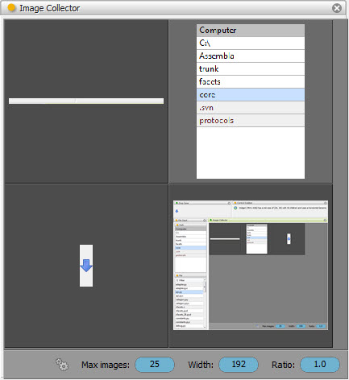

.. _tool_image_collector:

ImageCollector
==============

Defines a tool for collecting, organizing, displaying and selecting images.

Each time a new image is received by the tool via its *input_image* facet it is
added to the image collection. The collection is displayed using a
LightTableEditor. Refer to the :ref:`light_table_editor` section for more
information on using a LightTableEditor.

Selecting any image in the tool view assigns the image to the tool's
*output_image* facet, making the image available to any connected tools.

You can temporarily prevent new images from being added to the collection by
clicking the gears icon in the toolbar located at the bottom of the tool's view.
The icon is a toggle, so you can click it again to re-enable collection updates.

The toolbar also contains three other controls you can use to modify the
behavior of the tool:

Max images
  Specifies the maximum number of images the collection can contain before
  starting to discard the oldest images received.

Width
  Specifies the maximum width in pixels of each image displayed.

Ratio
  Specifies the aspect ratio (width/height) of each image tile. Note that the
  ratio does not affect the aspect ratio of the images themselves, but only the
  ratio of each image tile.

Module
------

facets.extra.tools.image_collector

Input Connections
-----------------

input_image
  An image to add to the collection.

Output Connections
------------------

output_image
  The currently selected image in the collection.

Screenshots
-----------

Shows an image collection tool being used to collect a series of Control screen
grabs made using the :ref:`tool_control_grabber` tool.

