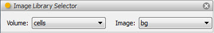

.. _tool_image_library_selector:

ImageLibrarySelector
====================

The image library selector tool allows you to select any image contained within
the Facets ImageLibrary. Refer to the :ref:`image_library` section for more
information about the ImageLibrary and its uses.

The tool contains two dropdown list boxes:

Volume
  Allows you to selected any *image volume* contained within the ImageLibrary.

Image
  Allows you to select any image contained within the currently selected image
  volume.

Selecting an image assigns it as the value of the tool's *image* facet, making
the image available to any connected tools.

See also the :ref:`tool_image_library_viewer` for a related tool which also
allows you to select images from the ImageLibrary and provides more detailed
display, filtering and selection capabilities.

Module
------

facets.extra.tools.image_library_selector

Input Connections
-----------------

None.

Output Connections
------------------

image
  The currently selected image.

Screenshots
-----------

Shows an image library selector tool with the *bg* image from the *cells* image
volume selected.

