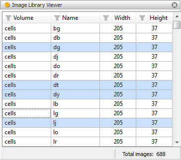
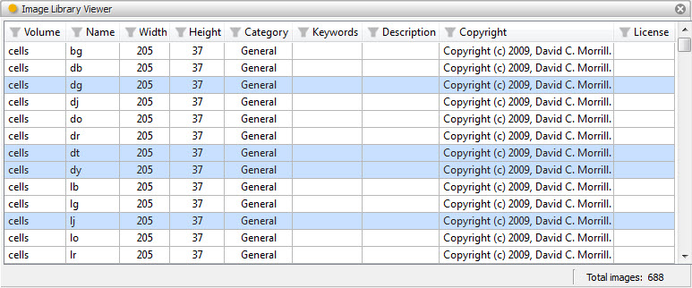

.. _tool_image_library_viewer:

ImageLibraryViewer
==================

The image library viewer tool allows you to display, filter and select multiple
images contained within the Facets ImageLibrary. Refer to the
:ref:`image_library` section for more information about the ImageLibrary and its
uses.

The tool view contains a table with a row for each image contained in the
ImageLibrary. Using the tool's options dialog, available through the tool's
feature toolbar, the view can also be configured to show either four or nine
columns of information about each image:

Volume (*Basic view*)
  The image volume the image is contained in.

Name (*Basic view*)
  The name of the image.

Width (*Basic view*)
  The width of the image in pixels.

Height (*Basic view*)
  The height of the image in pixels.

Category (*Expanded view*)
  The category, if any, the image is classified under.

Keywords (*Expanded view*)
  Any keywords associated with the image.

Description (*Expanded view*)
  A description of the image.

Copyright (*Expanded view*)
  The copyright information for the image.

License (*Expanded view*)
  The licensing information for the image.

Selecting one or more images in the table assigns the list of image names (in
the form: *@volume:name*) to the tool's *image_names* facets, making the image
names available to any connected tools.

You can also filter the contents of the table by clicking on any column header
and entering some filter criteria. For columns containing text, a case sensitive
or case insensitive match of the filter text anywhere within the column value is
performed. For columns containing numbers, you can specify numeric values along
with a relation (e.g. *<=16*). If no relation is specified, then the column
value must exactly match the filter value specified.

See also the :ref:`tool_image_library_selector` for a related tool which also
allows you to select images from the ImageLibrary and provides a more compact
user interface without any filtering or multi-selection capabilities.

Module
------

facets.extra.tools.image_library_viewer

Input Connections
-----------------

new_volume
  The name of a path or .zip file containing images to add to the ImageLibrary.

new_directory
  The name of a directory to add to the ImageLibrary.

Output Connections
------------------

image_names
  The list of currently selected image names in the form: *@volume:name*.

Options
-------

In addition to its input and output connections, the image library viewer tool
also supports setting the following facets through the tool's options dialog
available via the tool's feature toolbar:

Show all columns (*show_all_columns*)
  Specifies whether all nine image information columns should be displayed or
  only the four basic information columns.

Screenshots
-----------

Shows a view of the image library viewer tool with a number of images selected.
In this view, only the four basic image information columns are shown.

The same view, but this time with all nine image information columns displayed.

