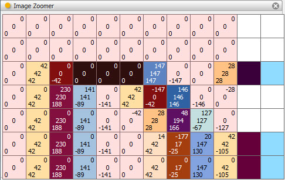
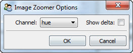

.. _tool_image_zoomer:

ImageZoomer
===========

Displays an input image as a zoomable image using the standard Facets
*ImageZoomEditor*. Refer to the :ref:`image_zoom_editor` section for more
information on using an image zoom editor.

Module
------

facets.extra.tools.image_zoomer

Input Connections
-----------------

value
  The image to view. It can either be an ImageResource object or the name of a
  file containing an image in one of the supported image formats. Any other
  value displays a small error icon.

Output Connections
------------------

None.

Options
-------

Drag selecting a region in the image zoom editor overlays color information
about each selected pixel, provided you are sufficiently zoomed into the image
to display the information.

You can specify the channel and style of color information to display using the
tool's options dialog available via the tool's feature toolbar:

Channel (*channel*)
  Specifies which color channel information should be displayed. The possible
  values are:

  *none*
    Do not display any color channel information.

  *red*
    Display the RGBA red channel.

  *green*
    Display the RGBA green channel.

  *blue*
    Display the RGBA blue channel.

  *alpha*
    Display the RGBA alpha channel.

  *hue*
    Display the HSV hue channel.

  *saturation*
    Display the HSV saturation channel.

  *value*
    Display the HSV value channel.

Show delta (*delta*)
  Should *delta* information about the color channel change from pixels left of
  and above the pixel be displayed.

Screenshots
-----------

Shows the image zoomer tool displaying an image captured using the ImageGrabber
tool.

The image zoomer tool's options dialog.
