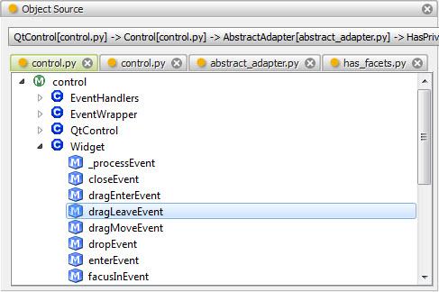

.. _tool_object_source:

ObjectSource
============

This tool displays a series of tabs, one for each Python source module used to
implement any HasFacets object it receives. Each tab in turn displays a
hierarchical tree view of all classes and methods defined by the source module.

Selecting any module, class or method in any of the tree views sends a
**FilePosition** object describing the selected item to the tool's
*file_position* facet.

At the top of the tool's view is a horizontal bar showing the inheritance
hierarchy for the current input object, starting with the object's class on the
left and proceeding to the right showing each preceding class's superclass.
Each item shows both the class name and the module the class is defined in.

You can also drag any HasFacets object and drop it on the drop icon in the
tool's feature toolbar to display its object source information.

Module
------

facets.extra.tools.object_source

Input Connections
-----------------

item
  The current HasFacets object to inspect.

Output Connections
------------------

file_position
  The FilePosition object for the most recently selected tree view module, class
  or method item.

Screenshots
-----------

This view shows the object source tool displaying object source information for
the QtControl class.

