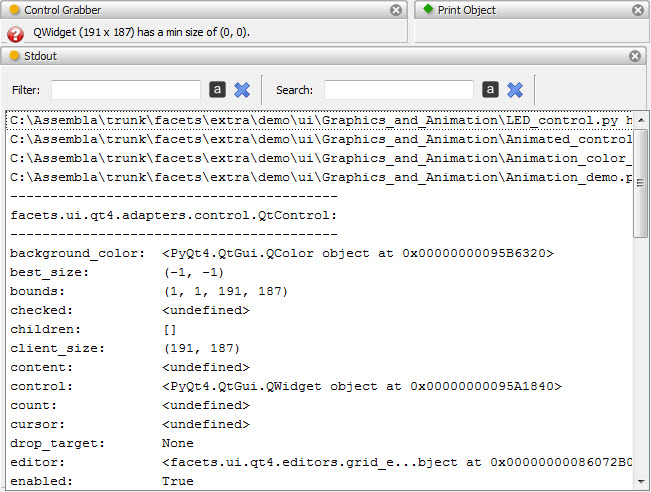

.. _tool_print_object:

PrintObject
===========

Defines a tool which attempts to print the contents of any input object it
receives to *stdout*.

The tool attempts to print any object received in an intelligent manner, based
on the object's type and content as follows:

file_name
  If the input object is a string representing a valid text file, the contents
  of the file, preceded by a banner line identifying the file, is sent to
  *stdout*.

PythonFilePosition
  If the input object is a **PythonFilePosition** object, the Python module,
  class or method it describes it sent to *stdout*, preceded by a banner line
  identifying the contents. PythonFilePosition objects are output by other
  tools, such as the :ref:`tool_class_browser` tool.

FilePosition
  If the input object is a **FilePosition** object, the section of the file
  desribed by the object is sent to *stdout*, preceded by a banner line
  describing the file and section. FilePosition objects are output by other
  tools, such as the :ref:`tool_cross_reference` tool.

HasFacets
  If the input object is a subclass of **HasFacets**, but is not one of the
  preceding object types, a banner line identify the object type is sent to
  *stdout*, and then the *print_facets* method is invoked on the object.

For all other object types received, the tool simply prints the object directly
to *stdout*.

Module
------

facets.extra.tools.print_object

Input Connections
-----------------

object
  The object to be printed to *stdout*.

Output Connections
------------------

None.

Screenshots
-----------

Since the print object tool is only used to print input objects to *stdout*, its
visual representation is minimal, consisting only of the tab that provides
access to its feature toolbar.

In the preceding figure we show an example of the PrintObject tool being used in
conjunction with the :ref:`tool_control_grabber` tool and the :ref:`tool_stdout`
tool. The ControlGrabber tool has been connected to the PrintObject tool and the
ConntrolGrabber tool has just been used to select one of the Control objects in
the view.

