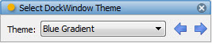

.. _tool_select_dock_window_theme:

SelectDockWindowTheme
=====================

Provides a tool for selecting a new default DockWindow theme from the list of
available factory defined themes.

This tool allows you to audition the various factory defined themes that ship
with the Facets package by overriding the current default DockWindow theme for
the application.

Simply select one of the available themes from the drop down list of all
factory defined themes, or click the left or right arrow buttons to cycle to the
next available theme in the sequence.

Note that this tool does not affect any view which has explicitly specifyied the
DockWindow theme to use. It only affects those views using the default theme.

Module
------

facets.extra.tools.select_dock_window_theme

Input Connections
-----------------

None.

Output Connections
------------------

None.

Screenshots
-----------

