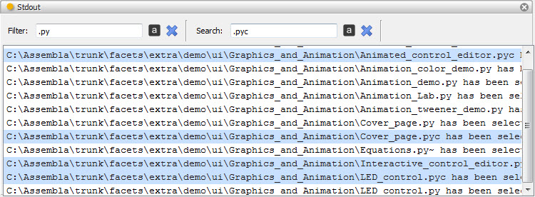
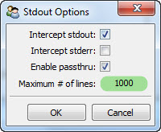

.. _tool_stdout:

Stdout
======

Defines a tool for intercepting, displaying, filtering and searching text sent
to the application's *stdout* and/or *stderr* files.

Using the various options in the tool's options dialog, avaiable from the
tool's feature toolbar, you can specify:

* Whether output send to *stdout* should be intercepted by the tool.
* Whether output sent to *stderr* should be intercepted by the tool.
* Whether any intercepted output should also be forwarded to the original stdout
  and/or stderr file handles.
* The maximum number of lines the tool should handle. Once the maximum number of
  lines is exceeded, the tool will start discarding the earliest lines captured.

The stdout tool also allows you to filter and search the intercepted output
using either case sensitive or case insensitive matching. Filtering output
removes non-matching lines from the display. Searching output selects all
matching lines in the display. You can perform either operation by typing the
text to match on in either the *Filter* or *Search* input fields located at the
top of the tool's view.

Module
------

facets.extra.tools.stdout

Input Connections
-----------------

None.

Output Connections
------------------

selected_text
  The currently selected lines within the tool are sent as a single string to
  any connected tools.

Options
-------

The stdout tool supports setting the following option facets through the tool's
options dialog available via the tool's feature toolbar:

Intercept stdout (*stdout_enabled*)
  Specifies whether output to *stdout* should be intercepted.

Intercept stderr (*stderr_enabled*)
  Specifies whether output to *stderr* should be intercepted.

Enable passthru (*passthru*)
  Specifies whether intecepted output should also be forwared to the original
  stdout and/or stderr file handles.

Maximum # of lines (*max_lines*)
  Specifies the maximum number of lines the tool should handle before beginning
  to discard the earliest lines captured.

Screenshots
-----------

Shows the stdout tool filtering and searching for particular lines in the stdout
output.

The stdout tool's options dialog.
