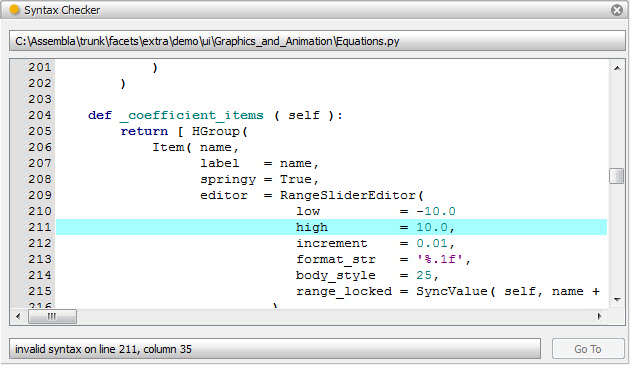
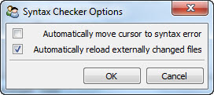

.. _tool_syntax_checker:

SyntaxChecker
=============

Defines a tool that performs syntax checking on an input Python source file.

The Python source file to be syntax checked can be specified either by
connecting a Python source file name to the tool's *file_name* input or by
dropping the source file onto the drop icon on the tool's feature toolbar.

Using the options dialog available from the tool's feature toolbar, you can set
up the tool to automatically position the cursor at the first syntax found in
the current input source file. You can also configure the tool to automatically
reload the source file any time the file is changed, which can be handy when
using an external text editor to correct errors found by the tool.

If automatic cursor positioning is turned off, you can click the *Go To* button
located in the lower right hand corner of the tool's view to update the cursor
position to the most recently found error.

Module
------

facets.extra.tools.syntax_checker

Input Connections
-----------------

file_name
  The name of a Python source file to be syntax checked.

Output Connections
------------------

None.

Options
-------

In addition to its input connections, the syntax checker tool also supports
setting the following facets through the tool's options dialog available via the
tool's feature toolbar:

Automatically move cursor to syntax error (*auto_goto*)
  Specifies whether the tool should automatically position the cursor on the
  line containing a syntax error.

Automatically reload externally changed files (*auto_load*)
  Specifies whether the tool should automatically reload the current input
  Python source file whenever the file is changed.

Screenshots
-----------

The view tester tool displaying a syntax error in a source file.

The syntax checker tool's options dialog.
