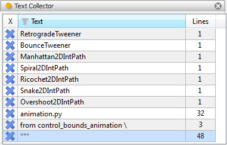
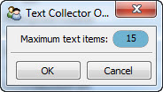

.. _tool_text_collector:

TextCollector
=============

Defines a tool for organizing, filtering, displaying and selecting a collection
of input text strings.

Any input string received by the tool is added to the end of the current
collection. The collection is displayed as a table with each line containing:

* A delete icon. Click the icon to delete the text item from the collection.
* A string displaying the contents of the text item up to the first newline
  character, if any.
* A count of the total number of lines contained in the text item.

Selecting any item in the table sends the item's text to the **output_text**
facet of the tool, making it available to any connected tool.

You can click on the text field table header to display a filter dialog. Only
text items containing any text entered there are displayed in the table. The
match can either be case sensitive or case insensitive.

The contents of the text collection are remembered across sessions. You can
control the maximum number of text items allowed in the collection using the
tool's option dialog, available through the tool's feature toolbar.

Module
------

facets.extra.tools.text_collector

Input Connections
-----------------

input_text
  A string to add to the current text string collection.

Output Connections
------------------

output_text
  The most recently selected text collection string.

Options
-------

In addition to its input and output connections, the text collector tool also
supports setting the following facets through the tool's options dialog,
available on the tool's feature toolbar:

Maximum text items (*max_texts*)
  The maximum number of text items allowed in the collection before starting to
  discard the oldest entries.

Screenshots
-----------

This view shows the text collector tool after it has been used to collect a
number of text strings.

The text collector tool's options dialog.
