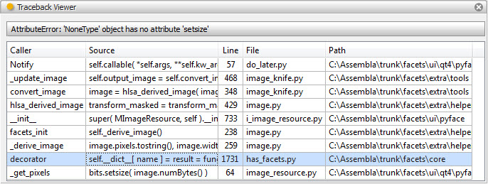

.. _tool_traceback_viewer:

TracebackViewer
===============

The traceback viewer tool helps you to display and select information about
Python tracebacks. The tool accepts traceback information copied and pasted into
the tool using the paste button on the tool's feature toolbar or received from
another tool connected to the tool's *buffer* facet.

Once a string containing traceback information is received, it is parsed and
displayed in a table with one row for each traceback stack frame. Each table
row contains the following columns:

Caller
  The name of the executing function or method.

Source
  The source code for the line being executed.

Line
  The line number within the source file of the line being executed.

File
  The name of the file containing the function or method being executed.

Path
  The name of the directory containing the file being executed.

Selecting any line in the traceback table assigns a FilePosition object
describing the source code line being executed by the selected stack frame to
the tool's *file_position* facet, making it available to any connected tools.
You can also drag the same FilePosition object to another tool or application
using the drag (upward pointing arrow) icon on the tool's feature toolbar.

The tool also intercepts output being sent to *stderr*, allowing it to analyze
and display tracebacks occurring in the running application.

Module
------

facets.extra.tools.traceback_viewer

Input Connections
-----------------

Output Connections
------------------

Options
-------

Screenshots
-----------

Shows the traceback viewer tool displaying information about a traceback that
was copied and pasted from a command shell.
