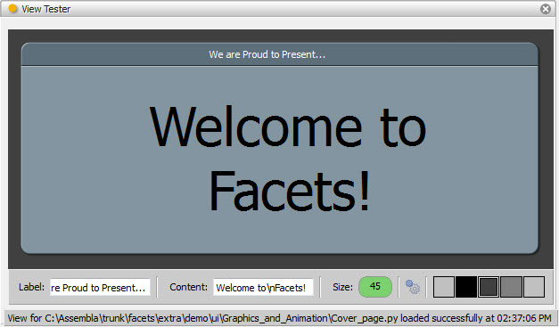
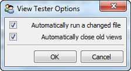

.. _tool_view_tester:

ViewTester
==========

Defines a tool for displaying and/or testing the Facets UI View associated with
an input source file.

You can use the tool either by connecting a Python source file to the tool's
*file_name* facet or by dropping the Python source file containing the view to
be tested onto the file drop icon on the tool's feature toolbar.

In order for a source file to work with the view tester, it must have a
module-level *view* or *demo* symbol defined whose value is either a
**HasFacets** subclass or subclass instance. The tool will then display the
default view associated with the subclass or instance. In the case of a
subclass, the tool will also attempt to create an instance of the class to use
when creating the view.

If the source file contains syntax errors, or does not define a valid *view* or
*demo* module-level variable, an appropriate error message is displayed at the
bottom of the tool's view.

Using the tool's options dialog, you can also configure the tool so that it
automatically attempts to reload the source file's view any time the source file
is changed. This can be handy for testing a view being developed, since you can
simply save the file in your text editor to see the changes to the view
reflected in the view tester tool.

Using the options dialog you can also configure the tool to keep copies of
previous views open when a new version of the view is created. Again, this can
be useful while developing a view to quickly see which version of a view looks
or works better.

Module
------

facets.extra.tools.view_tester

Input Connections
-----------------

file_name
  The name of a source file containing the view to be tested.

Output Connections
------------------

None.

Options
-------

In addition to its input connections, the view tester tool also supports setting
the following facets through the tool's options dialog available via the tool's
feature toolbar:

Automatically run a changed file (*auto_load*)
  Specifies whether the view associated with the current input source file
  should automatically be reloaded whenever the source file changes.

Automatically close old views (*auto_close*)
  Specifies whether old views should automatically be closed each time a new
  version of the view is created from the current input source file. If not,
  then each new view is displayed in a separate tab, and you can close
  views manually by clicking the close icon on each view's tab.

Screenshots
-----------

Shows the view tester tool displaying the view for one of the Facets UI demos.

The view tester tool's options dialog.
