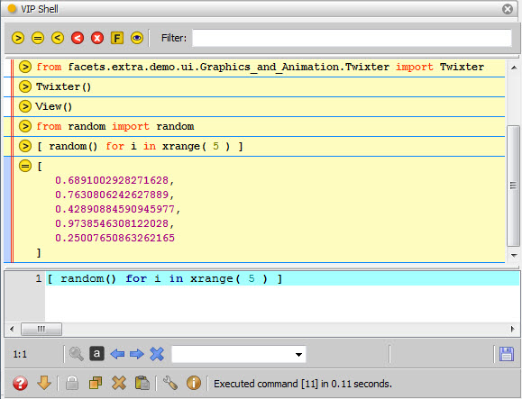

.. _tool_vip_shell:

VIPShell
========

Displays an instance of the standard Facets VIP Shell, a graphical, interactive
Python shell. Refer to the :ref:`vip_shell` section for a detailed description
of using the VIP Shell.

Module
------

facets.extra.tools.vip_shell

Input Connections
-----------------

**input**
  Any received value is assigned as the value of the *_* variable in the shell.

**receive**
  Any history item received from another VIPShell tool, using that shell's
  *send* facet, is added to the end of the shell's history list.

Output Connections
------------------

**output**
  Sends the current value of the shell's *_* variable to other connected tools.

**export**
  Sends any history item data exported by the user to other connected tools.

**send**
  Sends any history item sent by the user to other connected tools. Note that
  *send* differs from *export* in that *export* sends the actual data associated
  with a history item, not the history item itself.

**profile**
  Sends the name of the most recently generated profiler data file to other
  connected tools.

Screenshots
-----------

