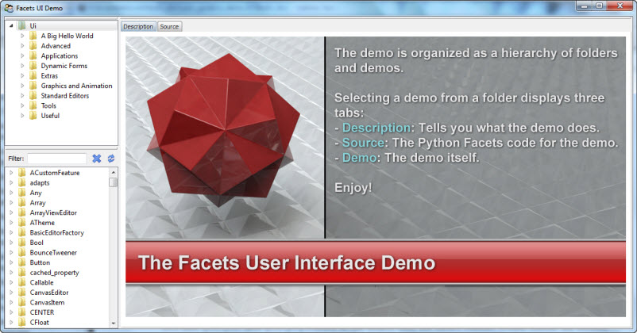
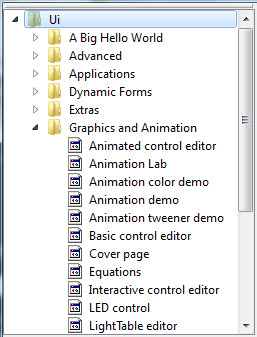
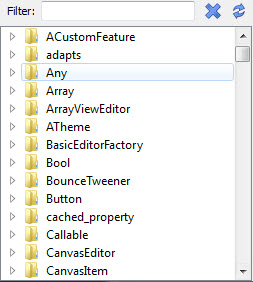
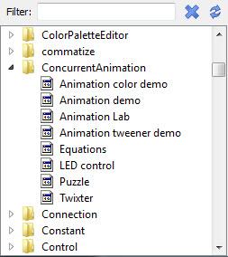
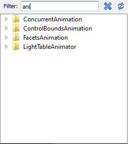
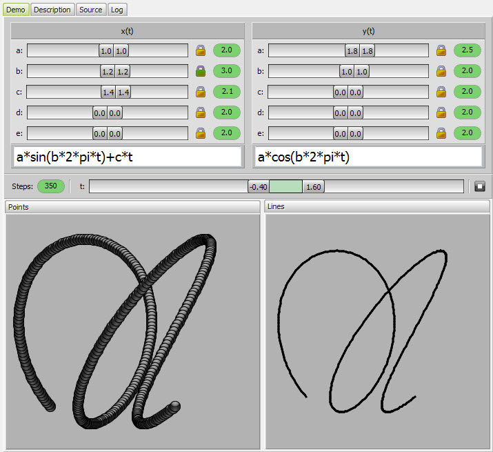
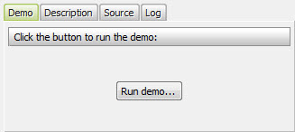
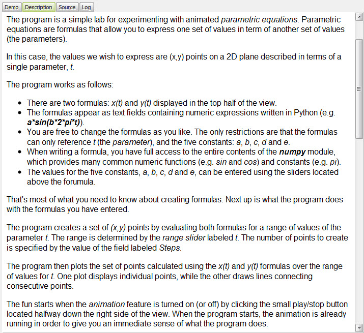
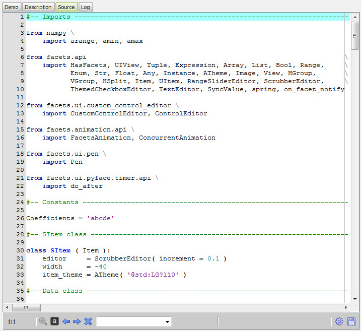
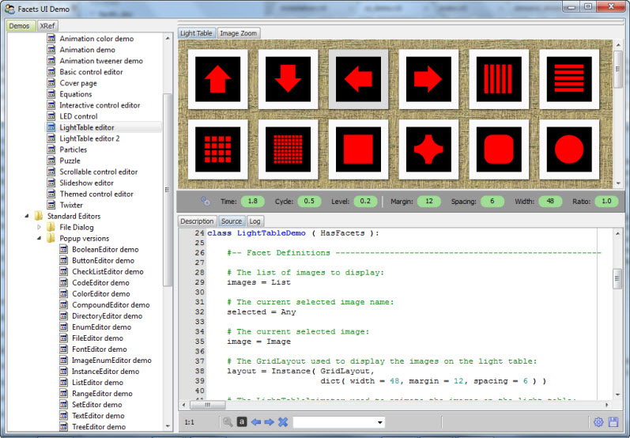

.. _ui_demo:

The Facets UI Demo
==================

Facets includes an extensive set of user interface (UI) demonstration programs
that are provided both to inspire you and to provide you with useful starting
points for your own coding flights of fancy.

Each demonstration can either be invoked individually from the command shell or,
more commonly, run under control of the Facets UI demo program, which can
be started using the command::

    python -m facets.extra.demo.ui.demo

When you first start the UI demo program, you should see a window like the
following:

The Demo Selector
-----------------

The top-left hand corner of the demo window contains a hierchical view of all
available demos:

The view is organized as a nested series of folders. Select any item in a folder
to launch the corresponding demo.

The Symbol Cross Reference
--------------------------

The bottom left hand corner of the demo window contains a list of all Facets
package symbols referenced by any of the demos:

Each symbol entry can be opened to display the list of demo files that reference
the symbol:

Selecting one of the referencing demo files will launch the selected demo. This
can be a useful feature if you are looking for an example of how to use a
particular Facets item, such as a Facets type or UI editor.

To help speed your search, you can enter a full or partial symbol name into the
**Filter** field at the top. The list automatically updates to show all matching
symbols as you type:

The search is case insensitive and matches any part of the symbol name. You
can clear the current filter by clicking the **X** icon just to the right of
the filter text field.

Selecting a Demo
----------------

Once a demo has been selected from the folders or symbols view, the demo is
started, creating four new tabs in the main part of the UI demo on the right
side of the window:

* :ref:`ui_demo_demo_tab`
* :ref:`ui_demo_description_tab`
* :ref:`ui_demo_source_tab`
* :ref:`ui_demo_log_tab`

.. _ui_demo_demo_tab:

The Demo Tab
------------

The *Demo* tab is where the demo program's Facets UI appears:

In some cases, where a large or popup user interface is being demonstrated, you
will see a button instead:

In this case, click the button to display the demo's popup view.

.. _ui_demo_description_tab:

The Description Tab
-------------------

The *Description* tab contains descriptive information which usually covers one
or both of the following topics:

* How to use the demo.
* How the demo code works.

If it is not clear how a particular demo is supposed to work, try clicking the
description tab to see if any help on using the demo is available.

.. _ui_demo_source_tab:

The Source Tab
--------------

The *Source* tab displays the source code for the demo:

The source tab contains a full blown text editor which allows you to try out
(and optionally save) changes to the demo. This can be useful for quickly
experimenting with variations of the original code to see *what if?*.

To try out a change, modify the source code then click the *gear* icon located
in the lower right hand corner of the source tab view. If no syntax errors are
found, the new version of the demo replaces the original version shown on the
demo tab.

If the code contains a syntax error, information about the error apears in the
status message area just to the left of the *gear* icon, and the line where
the error was encountered is highlighted in the source code editor. Correct the
error, then click the *gear* icon to try again.

Note that it is not necessary to save any changes prior to clicking the *gear*
icon, but if you do make changes you want to keep, click the *diskette* icon to
the right of the *gear* icon. A standard file dialog prompting for the name of
the file to save to will appear. Fill this out and click the *OK* button. Each
time you run a demo, make changes, then save, you will be prompted for a new
file name to prevent you from accidentally overwriting the original demo source
code.

.. _ui_demo_log_tab:

The Log Tab
-----------

The *log* tab displays the results of any *print* statements executed by the
demo program. Since most demos do not contain print statements, this tab is
usually empty.

Reorganizing the UI Demo Window
-------------------------------

Each of the views and tabs contained in the UI demo window can be dragged about
and reorganized as desired:

If a tab is visble, drag the tab to its new location. If no tab is visible,
drag the narrow horizontal bar above the view to the desired location. The
results of your reorganization are automatically saved across UI demo program
sessions.
