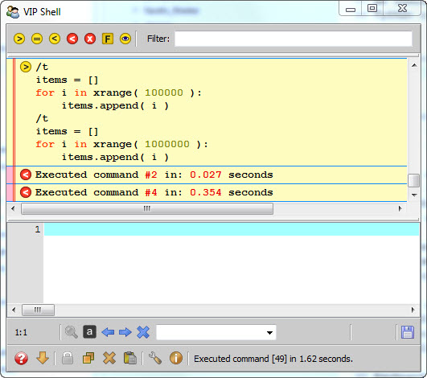

.. _vip_code_editor:

Using the Code Editor
=====================

The code editor is where you enter Python code or shell commands to be executed.
When entering Python code, you can enter any amount of text, ranging from a
single Python expression up to a complete Python module containing thousands of
lines of code.

Unlike some Python interpreter shells, the VIP Shell does not restrict you to
entering a single line of code at a time. You have a complete text editor at
your disposal for entering as much code as you like. The only restriction is
that you must press the *Ctrl-Enter* key rather than just the *Enter* key when
you want your code to be executed.

The reason for this should be fairly obvious. Since you can enter any number of
lines of code at once, the *Enter* key performs the function it normally
performs in a text editor. That is, it simply inserts a new line and allows you
to keep entering text. In order to preserve this standard editor behavior, the
shell's *execute* action has been moved to the *Ctrl-Enter* key. This may take a
bit of getting used to, but after a short break-in period this should quickly
become second nature to you.

In addition to entering Python code, you can also enter *shell commands*. Shell
commands always start with a leading forward slash character ('/') and perform
shell specific actions. We'll be discussing all of the various shell commands in
later sections.

We should also note that you can freely mix shell commands and executable
Python code within the code editor, as shown in the following example::

    /t
    items = []
    for i in xrange( 100000 ):
        items.append( i )
    /t
    items = []
    for i in xrange( 1000000 ):
        items.append( i )

In this example, we are trying to find out if the performance of appending to a
list is roughly linear with respect to the size of the list. So we have created
two short Python blocks, one which appends to an initially empty list 100,000
items, and another which appends 1,000,000 items.

Before each of these Python code blocks we have inserted a */t* (Execution Time)
shell command which times how long it takes to execute the immediately following
Python code block.

When we press the *Ctrl-Enter* key, the VIP Shell parses the contents of the
code editor buffer into its constituent shell commands and Python code blocks,
and executes each in turn. The results of the execution are then displayed in
the shell's history items area, as shown below:

Some additional things worth noting are:

* The contents of the code editor buffer where we entered the shell commands and
  Python code blocks has been copied to a *Command* item in the history items
  area of the shell.
* The result of measuring the execution time of each Python code block has been
  added to the history items list as two *Error output* items (the /t command
  sends its output to *stderr*).
* The code editor buffer we entered the shell commands and Python code into has
  been cleared.

The history items list can contain quite a few different types of data, such
as *Command* and *Error output* items, which we'll be discussing in more detail
in the section on history items.

The fact that the code editor buffer is cleared after executing the commands is
normal. The shell does so in order to prepare the editor for the next command or
code you want to enter. But don't worry, if you want to edit or change your code
and retry it, it's easy to reload the code back into the editor by:

* Right clicking the history item entry containing the commands or code you want
  to re-edit.
* Pressing the *Ctrl-Up arrow* key while the code editor had keyboard focus.
  Each time you press *Ctrl-Up arrow* it recalls the next oldest command you
  entered. Similarly, you can press the *Ctrl-Down arrow* key to recall the next
  newest command if you go too far back in the history items list. You'll note
  as you do this that the corresponding *Command* item in the history list is
  highlighted as you cycle through the history.

If the command or code you execute has a syntax error or generates an exception,
the code editor buffer is not cleared automatically. The erroneous code remains
in the code editor buffer to allow you to correct the code and retry execution.

If you don't like the *auto-clear* behavior of the editor, you can change it
using one of the *status bar* tool icons we'll be discussing in the section on
using the status bar.

Keyboard Commands
-----------------

The code editor provides are number of useful commands and actions available
through the following keyboard shortcuts:

**Ctrl-Enter**
    Executes the contents of the code editor as a series of one or more Python
    code blocks or shell commands.

**Ctrl-Shift-Enter**
    Inserts a new blank line after the current line with the same indenting.

**Ctrl-Tab**
    Performs code completion based on the text preceding the cursor.

**Ctrl-Up**
    Copies the previous history command into the code editor.

**Ctrl-Down**
    Copies the next history command into the code editor.

**Ctrl-Shift-Up**
    Moves the contents of the current line up one line.

**Ctrl-Shift-Down**
    Moves the contents of the current line down one line.

**Alt-Ctrl-Shift-Up**
    Copies the previous history item into the code editor.

**Alt-Ctrl-Shift-Down**
    Copies the next history item into the code editor.

**Ctrl-Delete**
    Deletes all hidden history items.

**Ctrl-Shift-Delete**
    Deletes all history items.

**Ctrl-B**
    Hides the bottommost history item and its related items.

**Ctrl-Shift-B**
    Unhides the bottommost hidden history item and its related items.

**Ctrl-F**
    Finds the currently selected text, or symbol near the current cursor
    position if no text is selected.

**Ctrl-N**
    Finds the next occurrence of the current search string.

**Ctrl-O**
    Displays the shell options dialog.

**Ctrl-P**
    Finds the previous occurrence of the current search string.

**Ctrl-Q**
    Copies all code editor text to the system clipboard and then deletes it from
    the editor's buffer.

**Ctrl-S**
    Saves the current contents of the code editor to a file.

**Ctrl-Shift-S**
    Saves the current contents of the code editor to a file after prompting you
    for the name of the file.

**Ctrl-T**
    Creates a new, empty code editor tab.

**Ctrl-Shift-T**
    Creates a new code editor tab containing a copy of the current code editor's
    text.

**F2**
    Same as Ctrl-S.

**F3**
    Toggles the filter bar on or off.

**F4**
    Toggles the status line on or off.

Special Shell Variables
-----------------------

In addition to whatever values you define by executing or importing Python code,
the shell also provides two additional values you can access and use within the
code editor:

**_**
    The underscore variable is always bound to the most recent result returned
    by the shell. Normally this occurs as the result of evaluating a Python
    expression, but it can also be set in other ways, such as by clicking on an
    underlined value link in an *Exception* or *CalledFrom* item.

    For example, if you evaluate the expression::

        'Hello world!'[:5]

    the shell displays the result::

        'Hello'

    Now, if you evaluate::

        _ + ' and goodbye'

    the shell displays::

        'Hello and good-bye'

**__**
    The double underscore variable provides access to the shell history items.
    Each history item has an associated numeric *id*. You can use the *__*
    variable to retrieve the value of a particular shell item by using the shell
    item's id as the index of *__*.

    .. note::

       You can display shell item ids by toggling the *id decorator* on. The ids
       display in square brackets on the left side of the top line of each shell
       item.

    For example, continuing on from our previous example for the *_* variable,
    the last result displayed might look like:

    .. image:: images/vip_ids2.jpg

    We could then further manipulate this result as follows::

        __[129] + '...'

    which would display::

        'Hello and good-bye...'

    You can also retrieve multiple history item values using standard Python
    slice notation. For example::

        __[10:15]

    The result is a list containing the values of the shell items whose ids are
    in the specified range.

    .. note::

        You can use the *__* variable to retrieve the value of any shell history
        item (or items), not just results. In each case the value returned is
        appropriate for the type of shell item referenced.

        For example, a *Command* item returns the text of its Python code or
        shell command. Any file or directory item returns its fully qualified
        file or path name, and so on.
