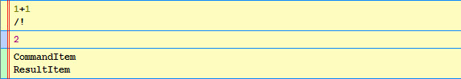
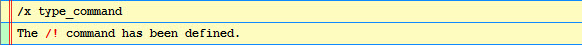
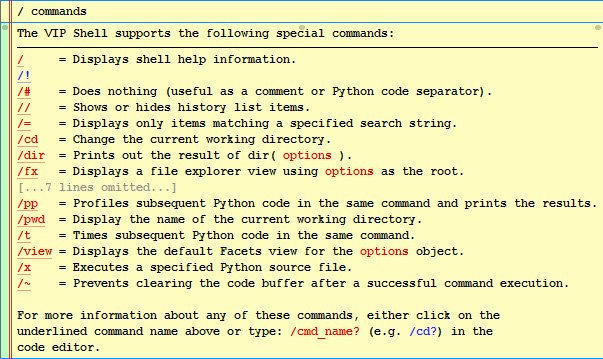
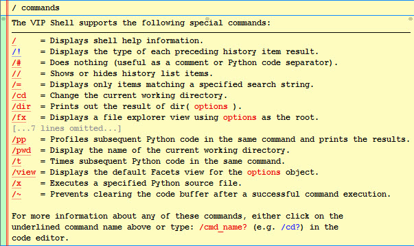
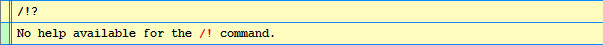
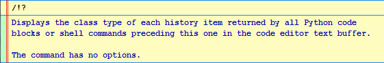

.. _vip_extending_shell:

Extending the Shell
===================

Since the source code for the VIP Shell is included, enterprising developers are
free to extend it in whatever way they want. However, in this section we will be
covering three specific, architected ways of extending the shell:

* Creating new commands
* Creating new history items
* Creating new themes

Creating New Commands
---------------------

A shell command is an action that can be executed directly from the code editor
that extends the capabilities of the shell in some useful way. You create a
shell command by defining a new Python class that derives from the ShellCommand
base class and registering that class with the shell.

Let's start with a simple example::

    from facets.ui.vip_shell.commands.api import ShellCommand

    class TypeCommand ( ShellCommand ):

        def execute ( self ):
            for item in self.items:
                print item.__class__.__name__

    __.shell.register( '!', TypeCommand )

The purpose of this command is to display the history item type of each result
returned by all Python code blocks or shell commands executed prior to this
command in the same code editor execution. To see what we mean by this, let's
try executing the following::

    1+1
    /!

which should display:



The last block in this figure is the output from our command, indicating that
the ``1+1`` Python expression preceding it returned two history items: a
CommandItem instance used to represent the Python expression (and our /!
command), and a ResultItem object representing the result of evaluating the
```1+1``` expression (i.e. *2*).

Now let's go back to our command definition and provide some comments about how
the code works:

* We create the command by defining TypeCommand as a subclass of ShellCommand.
* The ``__.shell.register( '!', TypeCommand )`` statement registers our command
  with the shell under the name *!*. Since we know this code is executed within
  a VIP Shell instance, we use the *__* shell variable to get access to the
  shell's *register* method, which takes the name of the command and the class
  implementing the command as arguments.

  Also note that the name the command is registered under can be any string
  which does not contain a blank and which is not the name of one of the shell's
  built-in commands.
* The command's logic is provided by the *execute* method, which all commands
  should override. This method has no arguments. The reason is that all the
  information the command needs to operate is provided as part of the command's
  state. This is illustrated in the example by the ``self.items`` reference,
  which provides the list of history items returned by all previously executed
  commands.

Because we entered and executed the command definition directly within the shell
itself, the command is not automatically persisted across shell sessions. To
create a persistent definition we need to save the definition to a file and then
execute the file from the shell.

For example, if we save the TypeCommand definition to a file called
*type_command.py*, we can create a permanent command for it by executing::

    /x type_command

which should display the following result:



If you now exit and restart your shell session, you'll find that the /!
command is already defined. Remember that you can always unregister any command
you've previously defined using the *-* modifier. For example::

    /!-

which should display:


If you need to change the definition of a command, simply update its definition
file and re-execute it from the shell as shown previously. This time you'll get
a message indicating that the command has been redefined:


One nice feature of the shell's command system is that any shell commands you
add are automatically integrated into the shell's help system:



The */!* command we defined is shown in blue to indicate that it is a user-
defined command. You'll note that it does not have a helpful command summary
displayed next to its name like the other commands do. In order to support this
feature, we need to define a value for the command's *summary* facet. For
example::

    class TypeCommand ( ShellCommand ):

        summary = 'Displays the type of each preceding history item result.'

        def execute ( self ):
            ...

Having made and executed this change, we should now see:



This looks good, but if we click on the /! link, we see the following message:



In order to provide the full-length help for the command we either need to:

* Assign the help text as the value of the command's *help* facet, or
* Override the *show_help* method to return the appropriate help description
  string.

Setting the *help* facet is the easiest solution in the case where the help text
is a constant. Overriding the *show_help* method works better in cases where the
help text is dynamic, depending upon other values in the command object's state,
such as the name the command was invoked with or the options provided with the
command.

In this case, we'll set the *help* facet in the TypeCommand class definition::

    TypeHelp = """
    Displays the class type of each history item returned by all Python code
    blocks or shell commands preceding this one in the code editor text buffer.

    The command has no options.
    """[1:-1]

    class TypeCommand ( ShellCommand ):

        summary = 'Displays the type of each preceding history item result.'
        help    = TypeHelp

        def execute ( self ):
            ...

Now when we click on the link for the /! command in the help commands list we
get the following result:



Nice! So now you've seen how with just a few lines of code you can create your
own custom shell command fully integrated with the shell's built-in help system.

Command Facets
^^^^^^^^^^^^^^

As we mentioned previously, a shell command's *execute* method is not passed
any arguments because all information it needs is available from its object
state. The following list describes the state elements in more detail:

summary
    A string you provide containing a short, one-line summary of what the
    command does. The value is used in creating the help command list of all
    available shell commands.

help
    A string you provide containing the full description of what the command
    does. The value is used when the user requests help for the command, either
    by clicking on the command's link in the help command list, or by executing
    the command with the ? suffix (e.g. /!?).

    This value is returned by the default implementation of the *show_help*
    method.

options_type
    An enumerated value you provide which describes what type of *options* data
    the command accepts. The possible values are:

    none
        The command does not have any options.

    path
        The command accepts a path (i.e. directory). Setting this value enables
        *path tab completion* when the user presses the *Ctrl-Tab* key in the
        code editor.

    file
        The command accepts a file. Setting this value enables *file name tab
        completion* when the user presses the *Ctrl-Tab* key in the code editor.

    source
        The command accepts a Python source file. Setting this value enables
        *Python source file name tab completion* when the user presses the
        *Ctrl-Tab* key in the code editor.

    expression
        The command accepts a Python expression. Setting this value enables
        *Python tab completion* when the user presses the *Ctrl-Tab* key in the
        code editor.

    Setting the correct value for the options type makes your command more user
    friendly when the user is typing it in the shell's code editor. The default
    value is **none**, meaning that the shell does not provide any special user
    assistance for the command when the user presses the *Ctrl-Tab* key.

shell
    A reference to the VIP Shell instance the command is invoked from. This
    value is set by the shell prior to calling *execute*. The shell provides
    access to many useful helper methods and values, such as the history item
    list and history item factory methods.

command
    A string containing the name the command was invoked with. This value is set
    by the shell prior to calling *execute*. This value is useful in cases where
    you register your command under more than one name, since it allows you to
    use the command name to specify additional information about the operation
    to be performed.

    For example, the built-in *p* and *pp* commands both reference the same
    shell command class, which uses the *command* name to determine whether the
    profiler results should be displayed in the shell or not.

options
    A string containing the options passed to your command. This value is set by
    the shell prior to calling *execute*.

items
    The list of history items returned by prior sub-commands executed in the
    same code editor command execution. This value is set by the shell prior to
    calling *execute*.

is_help
    A boolean value indicating whether this is a help request (True) or
    execution request (False). This value is set by the shell prior to calling
    *execute*, but you do not need to check it since the *execute* method is
    only called if it is False. The value is mainly used by the shell itself
    as part of managing the command's life cycle.

Command Override Methods
^^^^^^^^^^^^^^^^^^^^^^^^

The ShellCommand class also defines two methods you might need to override:

execute
    Called when the command is executed. It has no arguments, but can return
    several different result types:

    None
        No result. Usually returned by commands executed for their side effects.

    history item (or a list of history items)
        Each history item returned is appended to the results for the code
        editor command the shell command is part of. The command's *shell*
        reference provides access to factory methods for creating new history
        items.

    string
        The string is converted to an OutputItem history item and appended to
        the results for the code editor command the shell command is part of.

        Note that the string can contain substrings wrapped in [[...]] (for
        emphasis) or <<...>> (for examples). For example::

            return ("Result: [[%s]]" % result)

    callable
        The callable is invoked after all Python code blocks and other shell
        commands in the same code editor command have been executed. This can
        be useful for commands which need to perform post-processing after all
        other commands have executed. For example, the *lod* command uses this
        feature to adjust the level of detail setting for all command history
        items, even the ones executed following the *lod* command. In effect, it
        allows you to divide your command into a pre-processing phase performed
        when *execute* is called, and a post-processing phase performed when the
        callback is called.

        The callback receives no arguments and the value it returns is processed
        like the result of the *execute* method, except that the result cannot
        be another callback.

show_help
    Called when the command is executed with the ? help request suffix. It has
    no arguments and should return a text string containing the full help
    description for the command. The default implementation simply returns the
    value of the *help* facet.

    Note that the string can contain substrings wrapped in [[...]] (for
    emphasis) or <<...>> (for examples). For example: *"Hello, [[world]]!"*.

Command Helper Methods
^^^^^^^^^^^^^^^^^^^^^^

The ShellCommand class also has several helper methods you can use:

has_no_options()
    Used for commands that have no options. It raises a SyntaxError exception
    if the command's *options* string is not empty. It has no arguments and no
    result.

bad_options()
    Used for commands that you have determined to have invalid options. It
    raises a generic SyntaxError exception containing the invalid options
    string. It has no arguments and no result.

evaluate( [expression] )
    Used for evaluating Python expressions in the shell's context. It accepts an
    optional string argument containing the Python expression to evaluate. If
    the argument is omitted, the command's *options* string is evaluated
    instead.

    The Python expression is evaluated using the shell's current local
    variables. If the expression evaluates successfully, the result of the
    evaluation is returned as the result. Otherwise a SyntaxError is raised
    indicating that the command's options string could not be evaluated.

