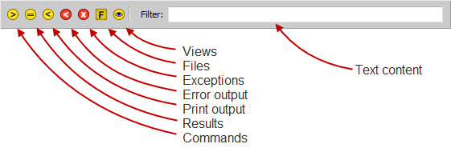

.. _vip_filter_bar:

Using the Filter Bar
====================

The *filter bar* displayed at the top of the view allows you to control which
item in the shell history are visible by filtering out items you are not
currently interested in viewing.

Each of the icons on the left side of the filter bar controls the display of a
particular type of history item, as shown in the above figure. Click on an icon
once to hide all history items of that type. Click it once more to make all
items of that type visible again.

You can also type into the *Filter* text entry field to only show history items
whose content contains the matching text. The match performed is case
insensitive and can occur anywhere within the item's content.

If you don't need or use it, you can hide the filter bar by pressing the *F3*
key when the shell text editor has input focus. Pressing *F3* again will re-
display the filter bar. You can also toggle the filter bar on or off from the
shell's *options* dialog by checking or unchecking the *Show filter bar* item on
the *Options* tab.

The current visibility status of the filter bar is persistent and is retained
across future shell sessions.
