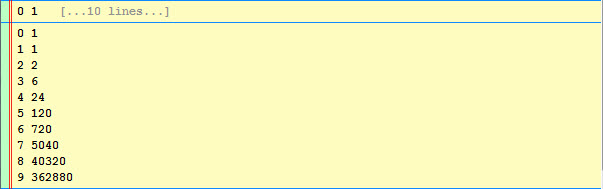

.. _vip_history_items:

History Items
=============

The *history items* portion of the shell user interface contains a history of
all the commands you have executed in your shell session along with their
associated results, outputs and exceptions.

Unlike the default Python interpreter shell, which only displays text, history
items in the VIP Shell are objects which can display as text, graphics or even
complete user interfaces. Being objects, they are also *smart* and support a
wide variety of actions that manipulate them in various ways, as you shall soon
see.

Level of Detail (LOD)
---------------------

Each history item has associated with it an attribute called *level of detail*
(LOD for short). Basically, the LOD setting controls how much of the information
associated with the history item is displayed at any given instant, and has one
of the following three values:

**Collapsed**
    Displays the item's information collapsed down to a single line.

**Expanded**
    Displays an expanded form of the item's information. The expanded form can
    display more than one line of text, but has an upper bound specified by a
    shell option you control.

.. image:: images/vip_lod1.jpg

**Full**
    Displays all of the item's information in full detail. Their is no
    predefined upper bound for the amount of information that can be displayed
    for an item.

Each history item has its own individual LOD setting, so you have complete
control over how much information is displayed on an item by item basis. There
are a number of keyboard, mouse and toolbar controls that affect the level of
detail setting for a single history item, or all history items at once. We'll be
covering these shortly.

Item Decorators
---------------

History items also have a number of optional visual decorators that provide
additional information about the items:

**Id**
    Each history item has an associated numeric *id* which uniquely identifies
    the item within your shell session. You can also use the id to
    programmatically refer to a history item from Python code executed in the
    shell using the special *__* variable described previously.

    History item ids are assigned sequentially starting from 0. They may or may
    not always appear sequentially in the history list however since it is
    possible to move, hide and delete items in the list.

    When the id decorator is enabled, the item id appears at the beginning of
    the top line of each history item:

**Icon**
    Each type of history item also has an associated icon that helps identify
    the kind of data it represents. When the icon decorator is enabled, the icon
    is displayed at the beginning of the top line of each history item:

.. image:: images/vip_icons.jpg

**Line numbers**
    When the line numbers decorator is enabled, each line of a history item with
    the *expanded* or *full* level of detail setting is prefixed with its line
    number:

There are a number of ways to turn the item decorators on or off which we'll be
discussing shortly.

Item Types
----------

As mentioned previously, shell items can be of several different types (i.e.
classes). While they all share many common characteristics and actions, each
class also has its own unique characteristics, even if only a slightly different
appearance or icon.

The following is a list of all standard shell history item types along with a
brief description of their function and typical appearance:

**Command Item**
    Represents one or more previously executed blocks of Python code and/or
    shell commands from the current shell session.

.. image:: images/vip_item_command.jpg

**Persisted Command Item**
    Represents one or more previously executed blocks of Python code and/or
    shell commands from a previous shell session. Unlike other shell items,
    commands are normally persisted from session to session until explicitly
    deleted, helping to support a workflow involving ongoing debugging or code
    development.

**Result Item**
    Represents the result obtained by evaluating a Python expression in the
    shell.

**Output Item**
    Represents printed output produced as a result of executing a block of
    Python code in the shell.

**Error Item**
    Represent printed output sent to *stderr* as a result of executing a block
    of Python code in the shell.

**Exception Item**
    Represents an exception generated as a result of executing a block of Python
    code in the shell.

.. image:: images/vip_item_exception.jpg

**Directory Item**
    Represents a directory and its contents.

.. image:: images/vip_item_directory.jpg

**File Item**
    Represents a file of a type not specifically supported by the shell.

.. image:: images/vip_item_file.jpg

**Python File Item**
    Represents a Python source file and its contents.

.. image:: images/vip_item_pyfile.jpg

**Image File Item**
    Represents an image file (e.g. a .png or .jpg file)

**View Item**
    Represents a user interface view of a Facets-based object.

.. image:: images/vip_item_view.jpg

**Log Item**
    Represents the information associated with a *debug*, *info*, *warning*,
    *error*, *critical* or *log* function call from the ``facets.core.debug``
    module.

.. image:: images/vip_item_log.jpg

**Locals Item**
    Represents the local variables and their values active at the time the
    *show_locals* function from the ``facets.core.debug`` was called.

**Called From Item**
    Represents the set of stack frames active at the time the *called_from*
    function from the ``facets.core.debug`` module was called.

.. image:: images/vip_item_calledfrom.jpg

Item Mouse Commands
-------------------

The history item list supports a number of mouse commands that can be invoked
when the mouse pointer is over a history item:

**Click**
    Executes the current item. The meaning of *execute* can vary from one
    history item type to the next. This command is most commonly used with
    *Command* items in order to re-execute their associated Python code blocks
    and/or shell commands.

**Ctrl-click**
    Selects the current item, causing it to be highlighted. The selected item
    can be used with several keyboard shortcuts to establish a target or range
    of items.

**Shift-click**
    Executes the current and all following visible history items.

**Right-click**
    Copies the contents of the current item to the code editor text buffer,
    completely replacing its previous contents.

**Ctrl-right-click**
    Appends the contents of the current item to the end of the code editor text
    buffer.

**Shift-right-click**
    Appends the contents of the current item and all following visible history
    items to the end of the code editor text buffer.

**Alt-right-click**
    Appends a reference to the current item (e.g. __[11]) to the end of the
    code editor text buffer.

**Alt-Shift-right-click**
    Appends references to the current item and all following visible history
    items (e.g. __[11], __[13],__[27]) to the end of the code editor text
    buffer.

Item Keyboard Shortcuts
-----------------------

Each history item supports a number of actions available via keyboard shortcuts.
The remainder of this section lists and describes each such shortcut. Please be
aware that all shortcuts are pointer context sensitive, meaning that the
keyboard action always applies to the history item immediately under the mouse
cursor (referred to as the *current item*).

.. note::

   Many of the actions are shared across all history item types, but a few are
   particular to a specific type. In those cases, the applicable type is shown
   in square brackets immediately following the shortcut key name.

**'** (single quote)
    Hides all duplicate items in the history list. A duplicate item is any
    history item having the same type and content as another item.

**,** (comma)
    Hides all items in the history list preceding the current item.

**-** (minus sign)
    Hides the current item and any associated items in the history list. A
    command, and all items it produces, form a set of associated items.

**.** (period)
    Hides all items in the history list following the current item.

**/** (forward slash)
    Show all currently hidden items in the history list.

**0**
    Hides all items produced by this item's associated command, but does not
    hide the command itself.

**1**
    Toggles the display of item id decorators for all items.

**2**
    Toggles the display of item icon decorators for all items.

**3**
    Toggles the display of item line number decorators for all items.

**4**
    Cycles to the next available theme.

**=** (equal sign)
    Shows only the non-hidden history items of the same type as the current
    item.

**E**
    Creates a new window containing a copy of the current item.

**T**
    Transfers the current item to another shell and keeps the item in this
    shell.

**[** (left square bracket)
    Hides all history items preceding the current item with the same type as the
    current item.

**\\** (backward slash)
    Hides all history items between the current item and selection.

**]** (right square bracket)
    Hides all history items following the current item with the same type as the
    current item.

**b**
    Hides the bottommost visible history item and its associated items.

**c**
    Copies the contents of the current item to the system clipboard.

**d** [Python File]
    Displays the default view associated with the current Python source file.

**e**
    Adds a new tab containing a copy of contents of the current item to the
    shell.

**e** [Python File]
    Creates a tab containing the contents of the Python source code file for the
    current item.

**f**
    Filters out wanted or unwanted lines from the current item by displaying a
    popup dialog where you can enter the text the filter must match (or not
    match).

**i** [Image File]
    Creates an inline image transformer view for the current image file.

**i** [Result]
    Displays the implementation source files for the current result item.

**l** [Directory]
    Lists the Python source files in the current directory item.

**n**
    Shows the first hidden item (and its associated items) after the last
    visible history item.

**o**
    Shows the shells options dialog.

**q**
    Clears the current contents of the code editor buffer.

**s**
    Saves the contents of the current item to a file.

**t**
    Transfers the current item to another shell and then deletes it from this
    shell.

**x**
    Exports the current item to an external program or tool.

**z** [View]
    Changes the vertical height of the current view item using a pop-up slider.

**z** [Image File]
    Creates an inline image zoom view for the current image file.

**Backspace**
    Hides all items like the current one in the history list.

**Ctrl-Delete**
    Deletes all currently hidden items from the history list.

**Ctrl-End**
    Moves the current item and all associated items to the bottom of the history
    list.

**Ctrl-Home**
    Moves the current item and all associated items to the top of the history
    list.

**Ctrl-Shift-Delete**
    Deletes all items from the history list.

**Ctrl-c**
    Copies the contents of the current item to the system clipboard.

**Delete**
    Hides the current item in the history list.

**Down**
    Moves the current item down one item in the history list if possible.

**End**
    Moves the current item to the bottom of the history list.

**Enter**
    Executes the current item.

**F3**
    Toggles the shell's filter bar on or off.

**F4**
    Toggles the shell's status bar on or off.

**Home**
    Moves the current item to the top of the history list.

**Left**
    Decreases the level of detail of the current item if possible.

**Right**
    Increases the level of detail of the current item if possible.

**Up**
    Moves the current item up in the history list if possible.

Using the Item Toolbar
----------------------

Each history item has associated with it a number of contextual toolbars
containing one or more tools for manipulating the item in some way. The toolbars
are located on the left, right and center of each history item, but do not
appear until you move the mouse pointer near the toolbar's *home* position.

The home position for each toolbar is indicated by a small marker dot that
appears when you first move the mouse pointer over the item:

As the mouse pointer approaches the toolbar's home position, the associated
toolbar gradually fades into view:

If you move the mouse pointer away from the home position, the toolbar fades out
again.

However, if you move the mouse pointer close to the toolbar's home position it
*locks* the toolbar into place so that it does not fade out as you move the
mouse pointer away. This is to allow you to select a tool not located near the
toolbar's home position. In this case, you will have to move the mouse pointer
completely out of the toolbar to make it disappear again.

The VIP Shell provides a default set of tools for the three toolbars. However,
you can use the shell's options dialog to organize the toolbars as you like. If
you remove all tools from a particular toolbar, its home position marker does
not appear when you move the mouse pointer over a history item.

There are a core set of tools that apply to all history items. However, there
also a number of tools that only apply to certain item types. The shell options
*Toolbar* tab groups all of these item specific tools into a single category
referred to as: *Display custom item actions*. The shell displays all custom
item tools at the right end of whatever toolbar positions you select.

You invoke a tool simply by clicking on it. The core set of tools are as
follows:

All Items
^^^^^^^^^

**Hide item**
    Hides the item in the history item list.

**Increase item level of detail**
    Increases the item's level of detail setting by one level. If the item is
    already at the *full* setting, the tool appears greyed out in the toolbar.

**Decrease item level of detail**
    Decreases the item's level of detail setting by one level. If the item is
    already at the *collapsed* setting, the tool appears greyed out in the
    toolbar.

**Execute item**
    Performs the item's *execute* action. The effect of *execute* varies between
    item types. For example, for a *Command* item the code associated with the
    item is re-executed. For a *Python File* item, an *execfile* is performed on
    the file.

    If the item does not support the *execute* action, the tool appears greyed
    out in the toolbar.

**Display item in a new window**
    Removes the item from the history list and displays it in a new window.

**Display item in a new tab**
    Leaves the item in the history list and also displays it as a new tab in
    the code editor section of the shell.

**Save item to a file**
    Saves the contents of the item to a file after prompting for the name of the
    file.

**Copy item to the clipboard**
    Copies the contents of the item to the system clipboard.

**Display shell options**
    Displays the shell options dialog.

**Toggle item ids**
    Toggles the item *id* decorator on or off for all history items.

**Toggle item icons**
    Toggles the item *icon* decorator on or off for all history items.

**Toggle item line numbers**
    Toggles the item *line numbers* decorator on or off for all history items.

In addition, the following history item type specific tools are also available:

Result Item
^^^^^^^^^^^

**Show the complete structure of the item**
    Adds a new *View* item containing a ValueEditor view of the item's value.

**Show the Python source files for the item**
    Adds a *Python File* item for each source file used in the implementation
    of the item's value. If no source files can be found, the tool does not
    appear in the toolbar.

.. image:: images/vip_toolbar_impl.jpg

**Display the default view for the item**
    Adds a new View item containing the default Facets view for the item's
    value. If the value is not an instance of the HasFacets class, the tool
    does not appear in the toolbar.

Directory Item
^^^^^^^^^^^^^^

**List Python source files in the directory**
    Adds a *Python File* item for each Python source file in the directory.

.. image:: images/vip_toolbar_src.jpg

Image File Item
^^^^^^^^^^^^^^^

**Create an image zoom view for the item**
    Adds a *View* item containing an ImageZoomEditor view of the image. You can
    use this to zoom in or out of the image and to examine the various color
    attributes of the image's pixels.

**Create an image transformer view for the item**
    Adds a *View* item containing an image transformer view of the image. You
    can use this to manipulate the appearance of the image in various ways and
    to define HLSATransform values and masks that can be used in Facets-based
    image manipulation code.

Python File Item
^^^^^^^^^^^^^^^^

**Display the view for the source file**
    Attempts to display the default Facets view for the demo or popup value
    defined by the module. This is intended mainly for use with Python source
    modules adhering to the Facets *demo* protocol.

    If the module defines a *demo*, a *View* item for the demo's default Facets
    view is created. If the module defines a *popup*, a popup view of the
    popup's default Facets view is displayed.

**Edit the source file inline**
    Adds a *View* item containing a TextEditor for editing the module source
    code.

**Edit the source file in an editor tab**
    Adds a new code editor tab editing the module's source code.

**Edit the source file in a separate window**
    Creates a separate window containing a CodeEditor editing the module's
    source code.

.. image:: images/vip_toolbar_window.jpg
