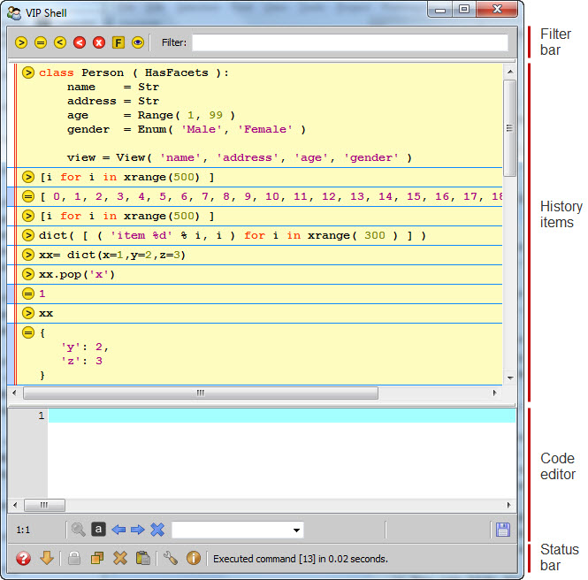

.. _vip_shell:

The VIP Shell
=============

The VIP (Visual Interactive Python) Shell is a Facets editor that allows you to
interact with your application using a graphical Python interpreter shell. The
shell view is divided into four main areas as shown in the following figure:

The main purpose of each area is as follows:

**Filter bar**
    Filters history items based on item type or content.

**History items**
    Displays all executed Python code or shell commands and their results.

**Code editor**
    Allows you to enter and edit Python code and shell commands.

**Status bar**
    Provides a toolbar of useful actions and the status of the most recently
    executed command.

The VIP Shell is different from some Python interpreter shells in that entry of
Python code and expressions occurs in a different area (code editor) than
the display of the results (history items).

There are several ways you can use or invoke the VIP Shell:

* You can use it just like any other Facets editor in your application. The
  value it edits should be a dictionary whose contents form the set of local
  variables exposed and manipulated by the shell.

* You can use it via the VIPShell *tool*, a tool framework component that
  includes a VIP Shell editor view and allows you to connect various shell
  elements to other tool components. The VIPShell tool can also be invoked as a
  stand-alone application::

      python -m facets.extra.tools.vip_shell

* You can use the VIPShell tool as a debugging aid by setting the *FACETS_DEV*
  environment variable to 1. Doing so enables a Facets run-time feature that
  displays a VIP Shell window whenever:

  * You right-click a Facets user interface label.
  * You select the *Display>VIP Shell* option from the context menu displayed
    when you right-click any DockWindow tab or splitter bar.

  You can use this feature to quickly explore the run-time state of your
  application.

Although the VIP Shell is just one of many Facets editors, its capabilities are
extensive enough that we have split information on using it into several
sections:

.. toctree::
   :maxdepth: 1

   vip_code_editor
   vip_shell_commands
   vip_history_items
   vip_status_bar
   vip_filter_bar
   vip_shell_options
   vip_themes
   vip_extending_shell
