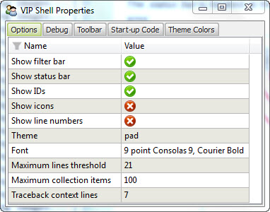
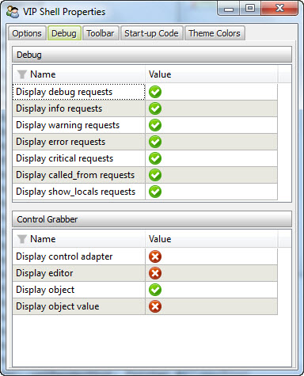
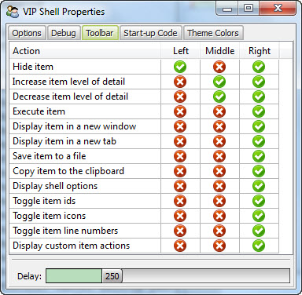
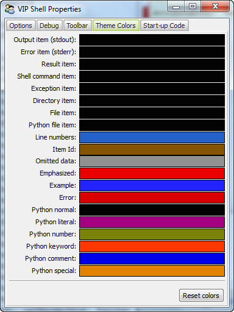
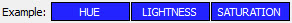
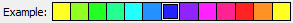
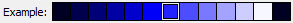
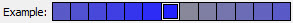
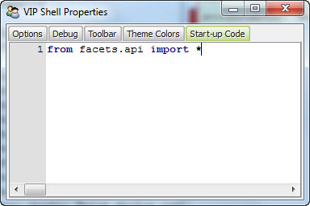

.. _vip_shell_options:

Shell Options
=============

The VIP Shell has a large number of settings that can be configured to suit your
own personal preferences. Some of these can be modified via keyboard shortcuts
or toolbar icons in various parts of the shell user interface. But all of the
options can be viewed and set in one place using the shell's *options* dialog.

The options dialog can be displayed in several ways:

* Press *Ctrl-O* when the code editor has keyboard focus.
* Press *o* (without the Control key) when the mouse pointer is over any history
  list item.
* Click the *wrench* icon on the status bar's toolbar.
* Click the *wrench* icon in any history item's contextual tool bar.
* Execute the */o* shell command from the code editor (displays the shell
  dialog as a history list *View* item).

The dialog itself is divided into five sections or *tabs*:

**Options**
    Allows setting many of the shell's user interface preference options.

**Debug**
    Allows setting options related to the various code debugging features of the
    shell.

**Toolbar**
    Allows configuring which history item contextual toolbar icons are displayed
    on the three available toolbars: left, middle, right.

**Theme Colors**
    Allows fine tuning the text colors used with the currently selected shell
    theme.

**Start-up Code**
    Allows entering Python code or shell commands to be run each time the shell
    is started.

The next few sections cover each of the option dialog's tabs in more detail.

.. note::

   It is important to note that the shell option settings are persistent, but
   not global. That is, the VIP Shell is a Facets editor, and like any editor,
   its user preference items depend on its View and Item *id* facet's values.

   Thus, based on how the VIP Shell is invoked, it may not support saving
   preference options at all, or it may save its setting under a different name
   than those of other VIP Shell instances.

   For example, Facets includes a VIP Shell *tool* for use with the *tools*
   framework. It has a specific *id* for its shell settings which includes the
   tool's *name* (normally *VIP Shell*). Changing the tool's name results in a
   set of preference settings different than the default ones. The DockWindow's
   *Display>VIP Shell* context menu action takes advantage of this by setting
   it's VIP Shell tool instance's *name* to something different than the
   default, allowing you to have a different set of shell preferences when using
   the DockWindow action than you would if you had invoked the VIP Shell tool
   directly from the command line: ``python -m facets.extra.tools.vip_shell``.

Options Tab
-----------

**Show filter bar**
    If checked, the *filter bar* at the top of the shell view is displayed. If
    not checked, the filter bar is hidden.

**Show status bar**
    If checked, the *status bar* at the bottom of the shell view is displayed.
    If not checked, the status bar is hidden.

**Show IDs**
    If checked, each history item displays its *id*. If not checked, history
    item ids are hidden.

**Show icons**
    If checked, each history item displays its identifying item type icon. If
    not checked, history item icons are hidden.

**Show line numbers**
    If checked, each history item displays a line number on each line as long
    when the item is not in *collapsed* mode. If not checked, line numbers are
    not displayed.

**Theme**
    Allows you to select which of the available VIP Shell themes to use. Click
    the name of the current theme to display a drop-down list of available
    themes. Once the list has focus, use the up and down arrow keys to visually
    cycle through the available themes. Click the list again to expand the drop
    down list and select a theme by name.

    Once you select a theme, you can continue to fine tune its appearance using
    the controls on the *Theme Colors* tab.

**Font**
    Allows you to select the history item font used by the VIP Shell. Clicking
    the name of the current font displays a pop-up dialog allowing you to select
    a different font.

**Maximum lines threshold**
    Allows you to specify the maximum number of lines of text to display in a
    history item when the item is in *expanded* mode. If an item has more than
    the specified number of lines, items will be elided from the display (with
    a line indicating how many lines were omitted inserted in their place).

    Click on the current maximum to display a pop-up slider used to adjust the
    maximum number of lines. Note that changing the value does not affect
    current history items already in the *expanded* state. The value is only
    used when an item enters the *expanded* state.

**Maximum collection items**
    Allows you to specify the maximum number of list, dict, set or tuple values
    to display in a *Result* history item. If a collection contained in a
    Result item has more than the specified maximum, items will be elided from
    the display (with a line indicating how many items were omitted inserted
    in their place.)

    Click on the current maximum to display a pop-up slider used to adjust the
    maximum number of items. Note that changing the value does not immediately
    affect current Result items. The value is only used when preparing an item
    for display when its content or state changes.

**Traceback context lines**
    Allows you to specify the maximum number of lines of source code *context*
    to display on either side of the currently executing line when formatting an
    *Exception* history item for diplay. Fewer lines may be displayed if not
    enough contextually related source code is available.

    Click on the current number of lines to display a pop-up slider used to
    adjust the line count. Note that changing the value does not affect existing
    Exception items. The value is only used when creating a new Exception
    history item.

Debug Tab
---------

The *Debug* tab displays a number of options useful for debugging your
application code. The options are dividied into two categories:

**Debug**
    The *debug* options are used in conjunction with the following debugging
    functions from the ``facets.core.debug`` module:

    * debug
    * info
    * warning
    * error
    * critical
    * log
    * called_from
    * show_locals

    Each option controls the creation and display of history items associated
    with each of these functions as follows:

    **Display debug requests**
        If checked, calls to the *debug* function create *Log* history items. If
        not checked, calls to *debug* are ignored.

    **Display info requests**
        If checked, calls to the *info* function create *Log* history items. If
        not checked, calls to *info* are ignored.

    **Display warning requests**
        If checked, calls to the *warning* function create *Log* history items.
        If not checked, calls to *warning* are ignored.

    **Display error requests**
        If checked, calls to the *error* function create *Log* history items. If
        not checked, calls to *error* are ignored.

    **Display critical requests**
        If checked, calls to the *critical* function create *Log* history items.
        If not checked, calls to *critical* are ignored.

    **Display called_from requests**
        If checked, calls to the *called_from* function create *CalledFrom*
        history items. If not checked, calls to *called_from* are ignored.

    **Display show_locals requests**
        If checked, calls to the *show_locals* function create *Locals* history items. If not checked, calls to *show_locals* are ignored.

**Control Grabber**
    The *control grabber* options are used with the *Control grabber* tool on
    the status bar's toolbar and are used to specify what values are added to
    the history list when the tool is used to *grab* a control:

    **Display control adapter**
        If checked, the abstract control the tool is dropped on is added to the
        history list. If no checked, no abstract control information is
        displayed.

    **Display editor**
        If checked, the editor that created the control the tool is dropped on
        is added to the history list. If no checked, no editor information is
        displayed.

    **Display object**
        If checked, the object containing the facet edited by the control the
        tool is dropped on is added to the  history list. If not checked, no
        object information is displayed.

    **Display object value**
        If checked, the value of the facet edited by the control the tool is
        dropped on is added to the history list. If not checked, no value
        information is displayed.

Toolbar Tab
-----------

Each history list item has three contextual toolbars: left, center and right.
The *toolbar* tab shows the name of each tool and allows you to select which
toolbars each tool appears in. Simply check or uncheck the toolbar you want each
tool to appear in.

.. note:: Each tool can appear in a single, no or multiple toolbars.

.. note::

   Although you can the select the toolbar(s) that a particular icon appears in,
   you cannot control the order of their appearance within a toolbar. The order
   is controlled by the shell.

Theme Colors Tab
----------------

Each VIP Shell theme defines the background colors and overall appearance of the
various shell history item types. It also includes a default set of text colors
used for various purposes within the theme. You can use the color selectors on
the *theme colors* tab to modify those default text colors to suit your own
taste.

.. note::

   Changing the text colors on the *theme colors* tab only affects the text
   colors for the current theme. If you change themes, the new theme's text
   colors are used. If you later switch back to your earlier theme, the colors
   you specified previously are restored.

   If you want to discard all changes you have made to the current theme's
   colors, click the *Reset colors* button located near the bottom of the tab.
   This restores the colors to the default colors for the current theme.

To change a color, hover your mouse pointer over the current color swatch for a
particular item. The words *HUE*, *LIGHTNESS* and *SATURATION* overlay the
current color:

Click within one of the three regions to modify the corresponding color
attribute. Select a new hue, lightness or saturation value as desired:

Right-click to return to the original color swatch to select a different color
attribute.

.. note::

   Each color swatch uses an HLSColorEditor. Refer to the section on that editor
   for more details on using it to select colors.

The purpose of each theme color is as follows:

**Output item (stdout)**
    Text color for *Output* history items.

**Error item (stderr)**
    Text color for *Error* history items.

**Result item**
    Base text color for *Result* history items.

**Shell command item**
    Base text color for *Command* history items.

**Exception item**
    Base text color for *Exception* history items.

**Directory item**
    Base text color for *Directory* history items.

**File item**
    Base text color for *File* history items.

**Python file item**
    Base text color for *Python source file* history items.

**Line numbers**
    Text color for history item line numbers.

**Item Id**
    Text color for history item ids.

**Omitted data**
    Text color used for history item lines indicating the number of lines or
    items omitted.

**Emphasized**
    Text color of *emphasized* text within a history item.

**Example**
    Text color of *example* text within a history item.

**Error**
    Text color of *error* text within a history item.

**Python normal**
    Text color for normal Python tokens in a block of Python source code
    contained within a history item.

**Python literal**
    Text color for a literal string in a block of Python source code contained
    within a history item.

**Python number**
    Text color for a literal number in a block of Python source code contained
    within a history item.

**Python keyword**
    Text color for a Python keyword in a block of Python source code contained
    within a history item.

**Python comment**
    Text color for a comment in a block of Python source code contained within a
    history item.

**Python special**
    Text color for a special symbol or token in a block of Python source code
    contained within a history item.

Start-up Code Tab
-----------------

Enter any Python code or shell commands you want executed before each VIP Shell
session begins. For example, you can use this to import frequently used modules
or packages.

.. note::

   Any code or commands entered here are not executed until the next time the
   shell is started.
