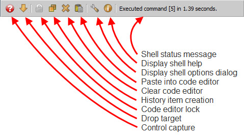

.. _vip_status_bar:

Using the Status Bar
====================

The *status bar* is located at the bottom of the shell view and consists of a
toolbar and a status message area:

The purpose and use of the items on the status bar are as follows:

**Shell status message**
    Displays status information about the most recently executed shell command,
    including its id (e.g. [5]) and the amount of time it took to execute the
    command.

**Display shell help**
    Clicking this toolbar icon executes the shell help command which creates and
    displays a shell history item containing information and links on how to use
    the VIP Shell.

**Display shell options dialog**
    Clicking this toolbar icon displays the VIP Shell options dialog where you
    can modify and adjust many aspects of the shell behavior. Refer to the
    section on :ref:`vip_shell_options` for more information.

**Paste into code editor**
    Clicking this toolbar icon pastes the contents of the system clipboard into
    the code editor at the editor's current cursor position.

**Clear code editor**
    Clicking this toolbar icon clears the contents of the code editor after
    first copying its contents to the system clipboard.

**History item creation**
    This toolbar icon is a toogle that controls how *Command* history items are
    created when a command is executed. Normally, each command executed creates
    a new *Command* history item containing the text of the command. This allows
    you to re-execute or re-edit any command previously executed by simply
    clicking or right-clicking the *Command* item in the shell history.

    However, there may be times when this is not the behavior you want. Say you
    are interatively developing a new module in the shell and testing each
    change you make as you go. You may not want a long list of Command items,
    one for each version of the code you've tested, in the history list. In this
    case, by clicking this toolbar icon, you place the shell in *update* mode.
    Now each execution of your module simply updates its associated history
    Command item (if it already exists) with the current version of the code. In
    *update* mode you only have a single Command item in your history
    representing the most recently executed version of the code. You lose your
    development history, but gain a less cluttered history list. The choice is
    yours.

    Clicking the icon again toggles the behavior back to its original *create*
    mode setting where new Command items are created each time the code is
    executed.

    Note that if you are in *update* mode and execute a new command, a new
    Command item will still be created. Subsequent executions will update the
    new Command item as previously described. You create a new command by
    clicking the *Clear code editor* icon previously described. Besides clearing
    the code editor, it also signals the shell that you are starting a new
    command.

    .. note::

       You can use this behavior to your advantage when creating a variation of
       a module you are working on. If you have been editing and testing your
       module in *update* mode, you have only a single Command item in your
       history representing the latest version you've tested. Now say you have
       an idea for an interesting variant of the code you would like to try. You
       could save the current version in the code editor to a file, then start
       making your changes. But, alternatively, you can also click the *Clear
       code editor* icon followed by clicking the adjacent *Paste into code
       editor* icon and begin making your changes.

       Clicking the *Clear code editor* icon copies your current code version to
       the system clipboard, clears the code editor, and signals to the shell
       that you are starting a new command. Clicking the *Paste into code
       editor* icon pastes your original code back into the code editor. Now,
       when you start making changes and testing them, the shell creates a new
       Command item, since you are working on a new command. Subsequent
       executions update the new Command item. Consequently, you end up with two
       versions of your code in the history list: the original and the new
       variant. This can be very handy, since you can test either version simply
       by clicking on its Command item in the history list.

       If you later decide you want to resume work on the original version,
       simply right-click its Command item. This replaces the code editor
       contents with the contents of the original Command item. Also note that
       subsequent edits and executions update the original Command item since
       right-clicking its Command item reassociated the item with the code
       editor.

       You can use this technique to create any number of active versions of
       your code before finally deciding to save one (or more) of them to a file
       permanently.

**Code editor lock**
    Clicking this toolbar icon toggles the code editor clearing behavior of the
    shell. As explained earlier, the shell normally clears the contents of the
    code editor each time you successfully execute a command. Clicking this icon
    toggles this behavior so that the code editor buffer is never automatically
    cleared. Clicking it again toggles it back to its original *auto-clear*
    behavior.

    The automatic clearing behavior of the editor is usually best suited to
    situations when you are doing a lot of experimenting with different commands
    or expressions. However, if you are doing heavier code development, such as
    creating a new module from scratch in the shell, you probably want the code
    editor contents left unchanged after each test cycle. In this case, click
    this icon to toggle the *auto-clear* behavior of the code editor off. This
    mode also works well in conjunction with the *History item creation* icon's
    *update* mode previously described, since it can prevent cluttering up you
    history list with too many versions of the code you are developing.

**Drop target**
    To use this tool, drag any mouse draggable object or item and drop it on the
    toolbar icon. The shell will add an item appropriate for the dropped object
    to the history list.

    Note that this tool can be used both with draggable items within your
    application as well as external items, such as files dragged from one of
    your operating system's file system explorer or finder windows.

**Control grabber**
    This toolbar icon allows you quickly get access to the models, controls,
    editors and values displayed in your application's user interface. To use
    it, place the mouse pointer over the icon, then click, drag and release the
    mouse pointer over one of the controls in your user interface. Depending
    upon your current shell option settings, the shell will add zero, one or
    more *Result* history items for the following values:

    * The control you released the mouse pointer over.
    * The editor that created the control.
    * The object attribute value the editor is editing.
    * The object containing the attribute being edited.

    Which values are displayed in the history list depend upon which items are
    enabled in the *Control Grabber* section on the *Debug* page of the shell
    options dialog. Refer to the :ref:`vip_shell_options` section for more
    information.

    Using this tool can be useful for getting a quick peek at what is happening
    in your application. Once the tool provides you with access to some of your
    key application objects, you can use the full power of the shell to probe
    their current state and behavior.

    One good way to use the tool is in conjunction with the FACETS_DEV
    environment variable and the DockWindow context menu's *Display>VIP Shell*
    action as follows:

    * Set the FACETS_DEV environment variable to 1. This will add several
      *display* menu actions to the DockWindow context menu when a Facets-based
      application is run.
    * Run your application normally.
    * Once your application user interface is visible, right-click any
      DockWindow tab or splitter bar and select the *Display>VIP Shell* menu
      action. This opens a VIP Shell window.
    * Drag the status bar's *Control capture* icon and release the mouse pointer
      over a control editing a part of your application you want to know more
      about.
