.. _vip_themes:

Shell Themes
============

The VIP Shell supports customization of the appearance of history list items
through the use of *themes* and *theme text colors*. You customize your history
list's appearance by:

#. Selecting a theme using the shell options dialog. The *Theme* option on the
   dialog's *Options* tab allows to you to select from the available themes
   provided with the shell. You can also press the *4* key when hovering your
   mouse pointer over a history item to cycle to the next available theme.
#. Optionally customize the text colors for your selected theme using the
   *Theme Colors* tab of the shell options dialog.

Refer to the :ref:`vip_shell_options` section for more information on using the
shell options dialog.

The remainder of this section is devoted to providing graphical illustrations of
each of the standard shell themes.

All Black
^^^^^^^^^

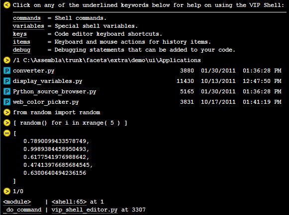

All White
^^^^^^^^^

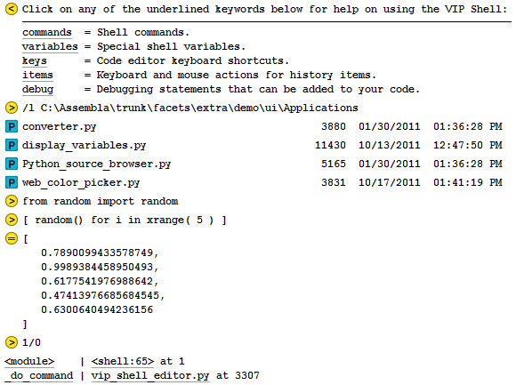

Bee
^^^

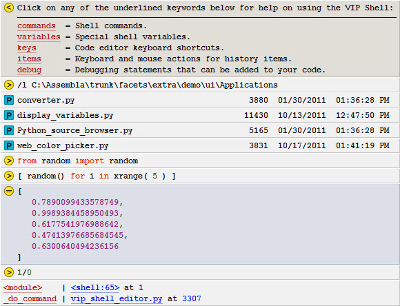

Core: Thor
^^^^^^^^^^

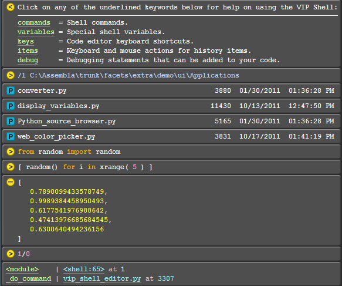

Dark
^^^^

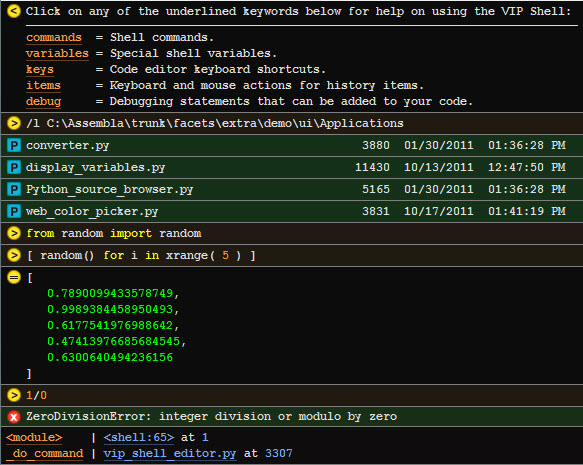

Default
^^^^^^^

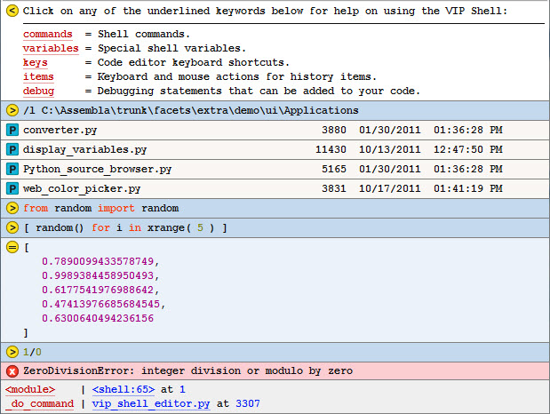

Grey 3D
^^^^^^^

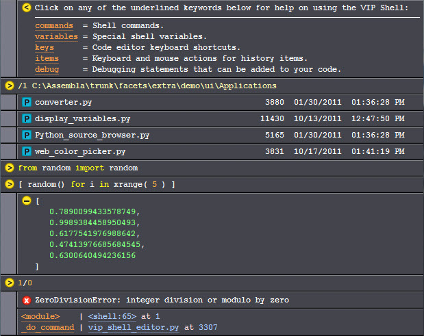

Light
^^^^^

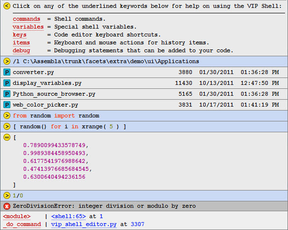

Pad: Black
^^^^^^^^^^

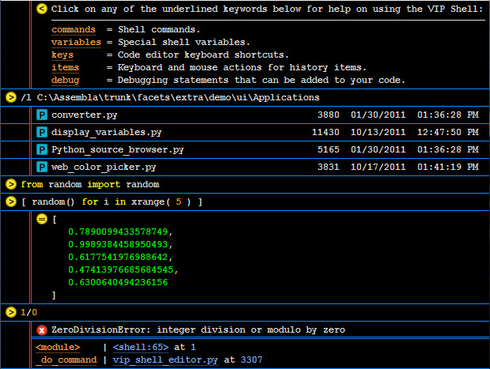

Pad: Grey
^^^^^^^^^

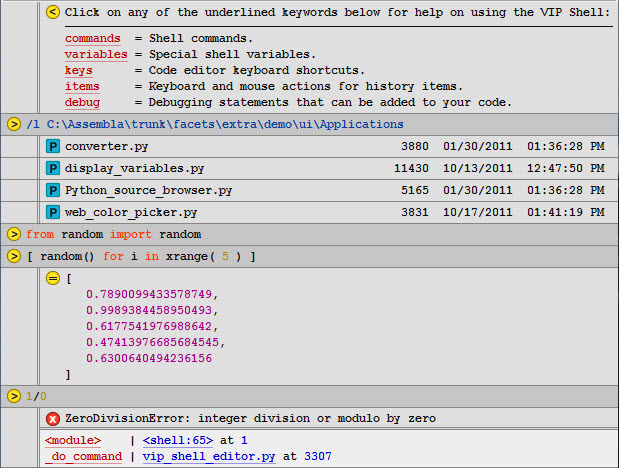

Pad: Legal
^^^^^^^^^^

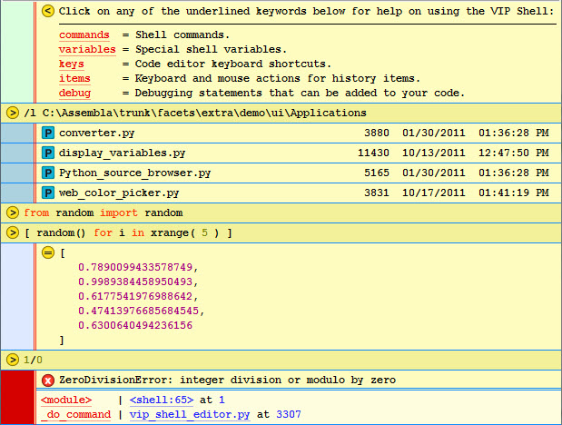

Pad: White
^^^^^^^^^^

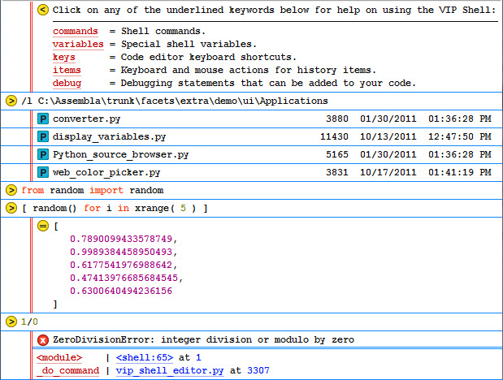

Pad: Yellow
^^^^^^^^^^^

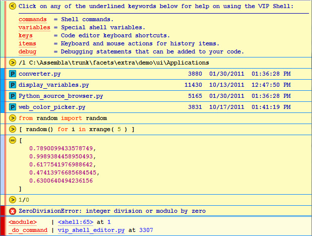

Rounded
^^^^^^^

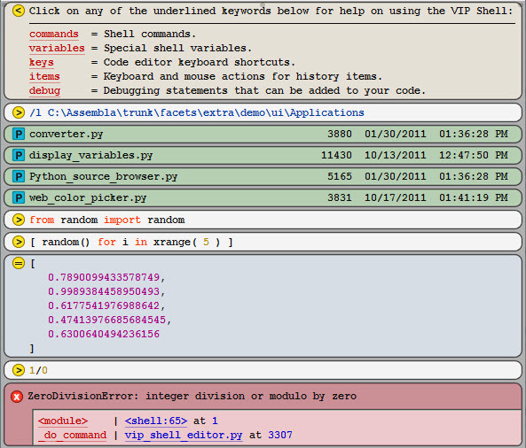

Shadow
^^^^^^

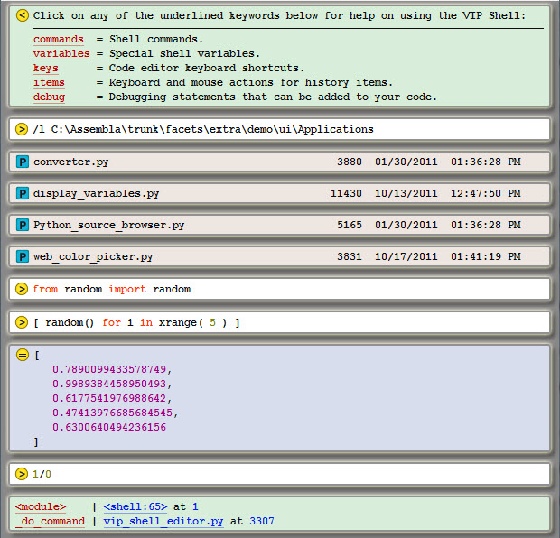

Simple Black
^^^^^^^^^^^^

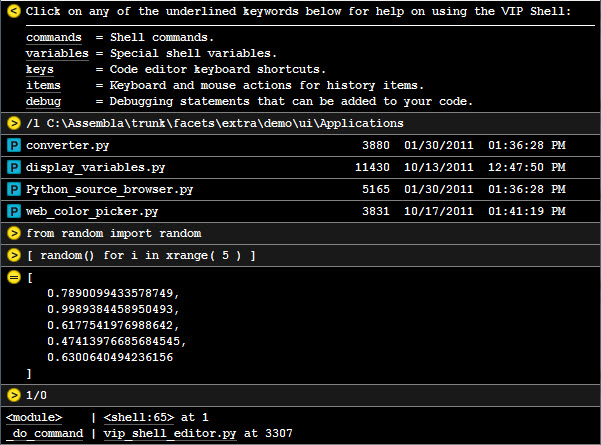

Simple White
^^^^^^^^^^^^

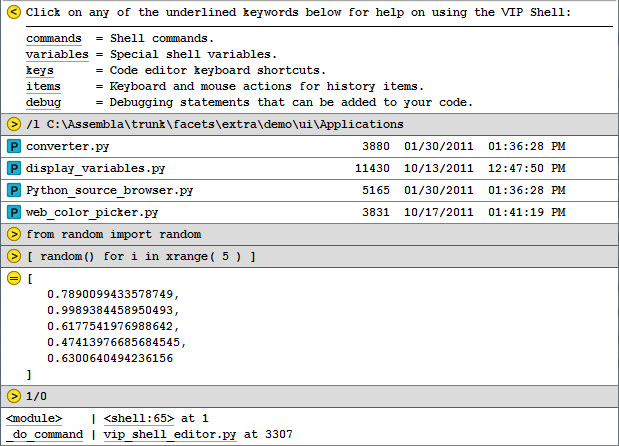

Smooth
^^^^^^

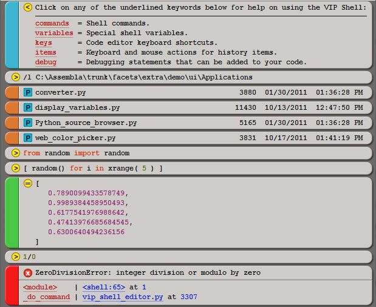
